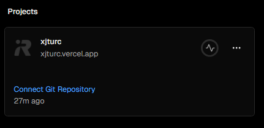
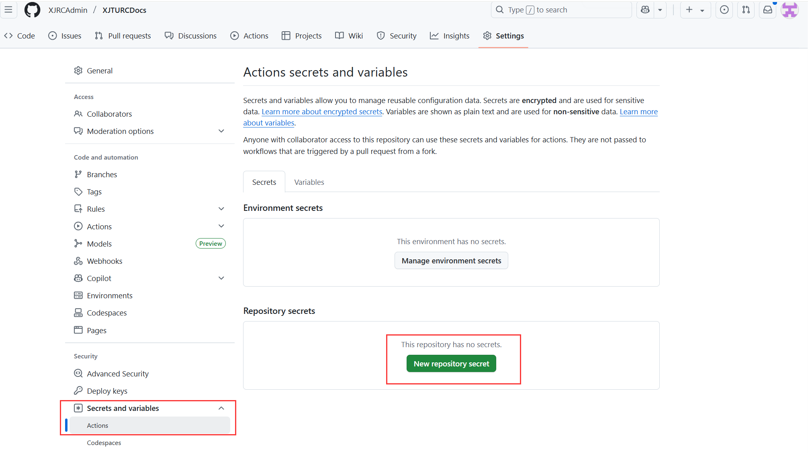
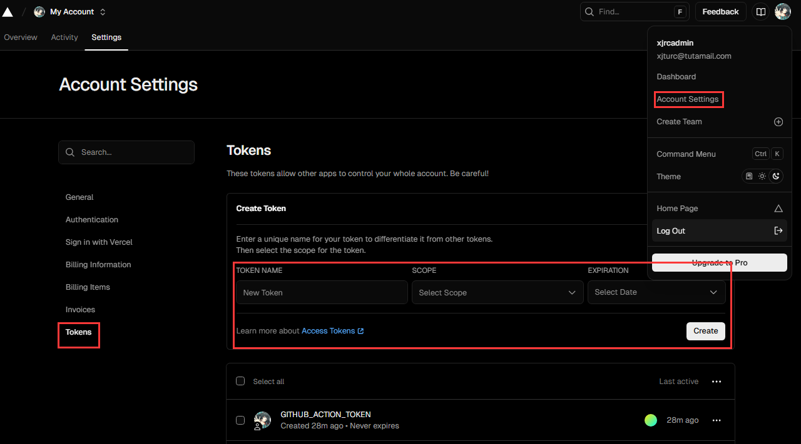
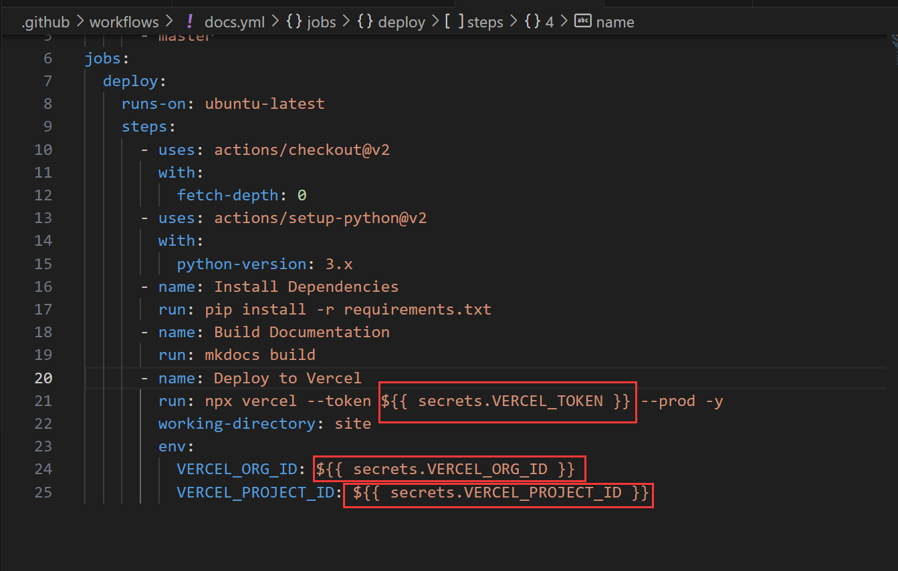

# 贡献指南
> 欢迎贡献代码，我们非常欢迎您的贡献。

本项目部署到vercel上，遵循xx协议。

# 部署指南

!!! blue "Tips"
    参考了[vercel部署参考指南](https://mkdocs.celsiusnarhwal.dev/)，不过这里面不是很详尽，下文是对其的补充。

## 获取 Vercel 项目 ID 和组织 ID
首先，在你的computer上安装`Vercel CLI`
```bash
npm install -g vercel
```
接着注册一个vercel账号，[点击这里](https://vercel.com/signup)。

登录vercel账号
```bash
vercel login
```
将您的项目直接链接到vercel的project中。注意，您不需要自行创建project，vercel会自动创建一个project。
```bash
vercel link --yes
```
上一步命令执行完成后，会看到如图：



此时，您的项目下会出现`.vercel`文件夹，打开.vercel/project.json 文件。你会看到其中的 projectId 和 orgId 字段。
!!! green-info "Tips"
    需要注意的是，每次 vercel link --yes后，`.vercel/`目录下的`orgid`和`projectid`会发生变化，因此您需要手动将其更新到github repo对应的secret中。
## 将 Vercel 项目 ID 和组织 ID 添加为 GitHub 仓库的 Secrets
进入你的GitHub仓库页面,点击 Settings（设置） > Secrets and variables > Actions。点击 New repository secret，分别添加以下两个 Secrets：

- Name: VERCEL_PROJECT_ID 
- Value: 你从 .vercel/project.json 中复制的 projectId 值。
- Name: VERCEL_ORG_ID
- Value: 你从 .vercel/project.json 中复制的 orgId 值。


为了方便，可以将`TOKEN`的有效时间设置为永久。
!!! blue-info "Tips"
    您也可以通过命令行完成上述内容，具体命令参考下文。
```bash
gh secret set VERCEL_PROJECT_ID
gh secret set VERCEL_ORG_ID
```

## 生成 Vercel 账户访问令牌

- 登录你的 Vercel 账户，进入 Settings（设置） > Tokens。
- 点击 Create Token，为令牌命名，选择适当的作用域和过期时间，点击 Create。
- 复制生成的令牌。

接着，回到github repo的settings页面，点击Secrets and variables > Actions。
- 点击 New repository secret，添加以下 Secrets：
    - Name: VERCEL_TOKEN
    - Value: 你从 Vercel 账户中复制的令牌。
目前一共是三个secrets，名称需要与下文github actions中使用的名称一致。


