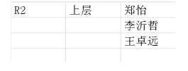
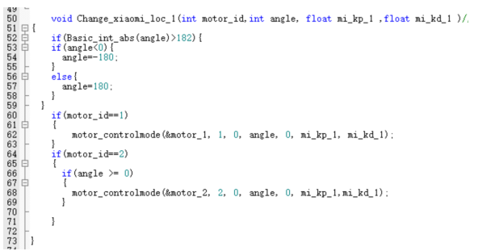
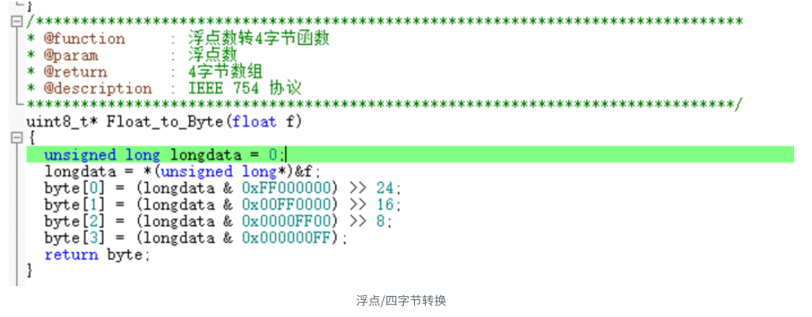
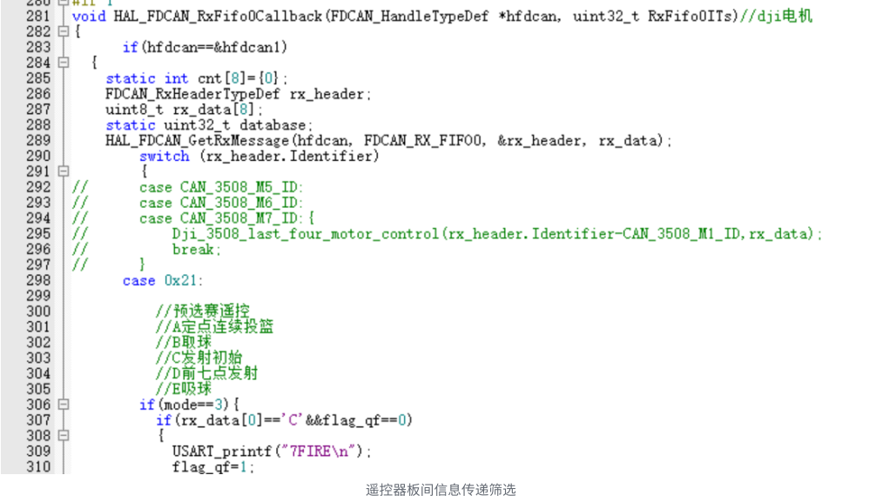
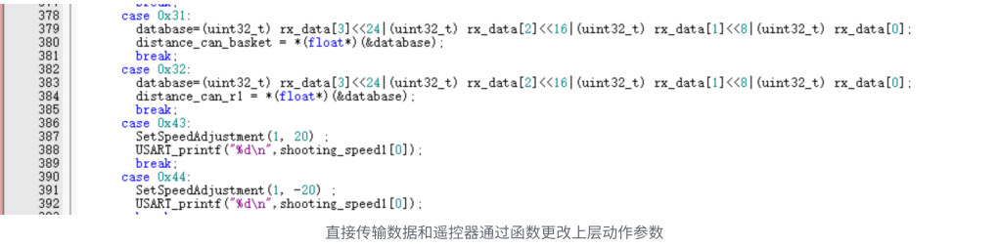
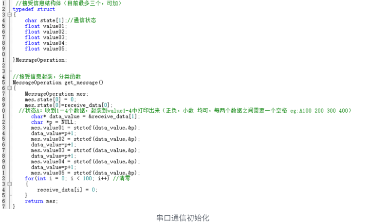
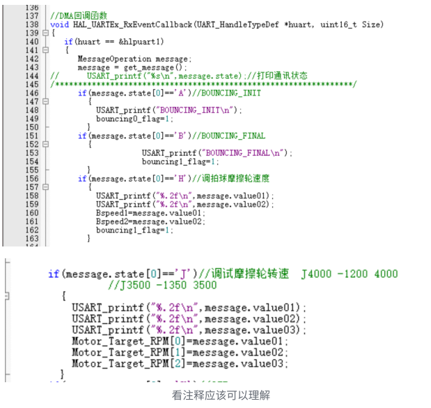
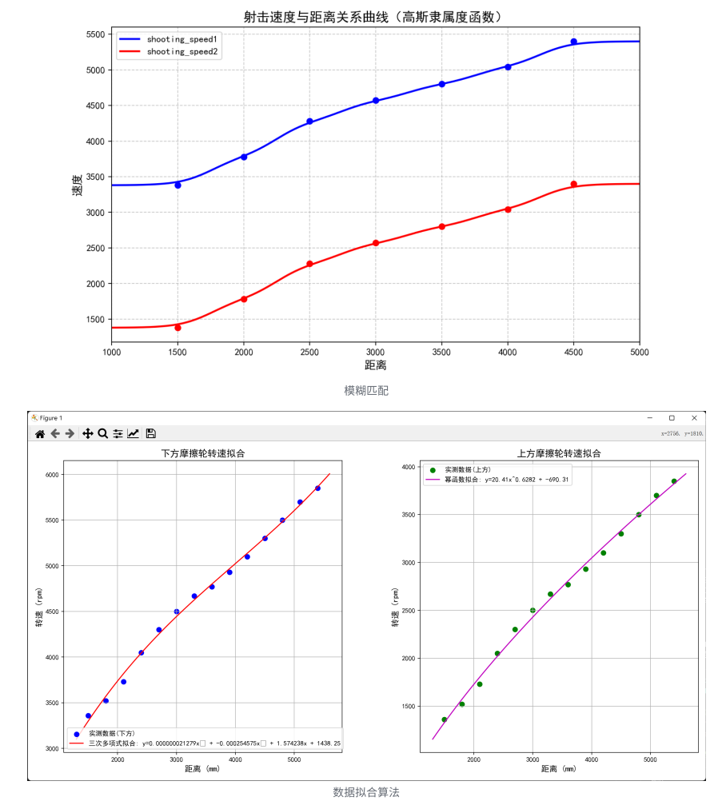
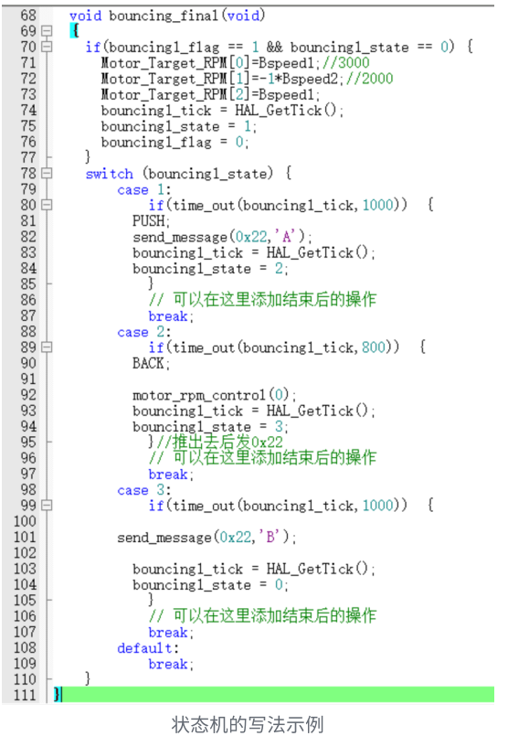

# R2 上层电控代码说明

!!! blue-note "前言"
	现在是 2025 年 7 ⽉ 18 日，⽐赛结束的三天后，R2 上层电控⼈员现以本次 ROBOCON ⽐赛中 R2 机器⼈的上层代码为依托，对电控做粗略的分析总结，以供未来的 RCer 学习。

首先，本次的代码是基于 FreeRTOS 框架下的裸机代码（虽然有 FreeRTOS 的形式，但因为种种原因，并未使⽤其中的精髓写法如互斥量，任务队列，优先级等），本质来讲，这次的代码还是以标志位之间的信息传递为主。

# 先从电机讲起

这份代码包含了多个电机的控制，AK80，⼩⽶电机，T-Motor，VESC 等。电机的上位机⼀定要熟悉使⽤，后期要做到可以不看指导⽂档就可以完成全部配置。

## 1. AK80

此电机的主要注意事项绝对是零点问题，AK80 上电会回到零点，确保零点位置安全可以减少很多问题。本次⽐赛主要⽤的是伺服模式下的位置速度环模式，在代码初始化中设置最⼤速度和加速度，给位置后会以最⼤加速度加速/最⼤速度运⾏⾄指定位置，其他的⼀些功能如读取角度等在 ak80.c ⽂件中有详细说明。

配零点：如果电机被拆下或者零点位置未知，则需要重新归位到零点位置。可以使⽤ Rlink 重新配零点，也可以将代码中改变 ak80 角度的代码注释掉，重新烧录后上电，等 ak80 ⾃⼰回到零点，再重新安装连接件即可。

## 2. ⼩⽶电机

是⼀款⽐较有意思的电机，它可以在每⼀次给电机赋位置的时候赋以不同的 PID 值，所以可以实现在烧进去⼀次代码后，在运动中实现不同的 PID 控制，但这也是⼀把双刃剑，你必须时刻关注 TA 的 PID 参数。此外，使⽤这种关节电机的时候，要提前写好合适的限幅，在这⼀年的调试过程中，也发⽣过因为限幅⼤于 CAN 线的⻓度，导致线被扯断的情况，所以应格外注意。此外，⼩⽶电机⾃带闭环的电调，所以不需要像 3508 ⼀样回传报⽂计算 PID，但倘若需要查看⼩⽶电机的角度，我们也在前辈的代码上加上了查看⼩⽶当前角度的函数，可供使用。

⼩⽶位控代码，根据⼊参即可看出，每次可以⽤不同的 kp,kd 来让单独的⼀个电机转动：

**xiaomi 电机常⽤玩法**是：先⽤较⼩的 kp 值（⼤概 13）执⾏动作，再⽤较⼤ kp（50）将电机固定在末尾⻆度。此外要注意，⼩⽶电机 init 后并不会锁住，但会将此刻位置设置为零点，此时如果⽤较⼤ kp 设置 xiaomi 电机⻆度为 0，电机才会锁住，所以⼀般上电后要扶稳机构，等到感应到电流振动，并能明显感到 xiaomi 电机锁住时，再放⼿。

所以试想这样⼀种情况：在上电 init 后直接赋给 xiaomi 电机 kp50，⻆度为 0。正常情况 xiaomi 电机会锁住。但如果中间板⼦断电重启了，断电的⼀瞬间机构会失锁，⽽快速上电后⼜会将某⼀位置设置为零点，这时执⾏赋位置指令时，电机会以 50kp 到达零点，巨⼤的超调量⾜以将⻋上的⽅铝⼲断并甩⻜四五⽶远（⾎的教训）在江阴的⼀次试运⾏中，由于⼤疆电池电池架的短暂甩出和重连，导致所有电机重启，就造成了以上结果，好在没有伤到⼈。所以，⼤疆电池电池架的魔术贴尽量扣紧，电池位置也要固定好。在初始化之后，可以先⽤ 10 左右 kp 让电机到达零点，再⼀定延时后再赋较⼤ kp 让电机锁死。

此外，本⼈曾经试图写过⼀个 for 循环函数，以控制 xiaomi 电机丝滑得实现转动（类⽐ ak80，⽽不是像正常情况那样，输⼊多少值就猛地到达这个⻆度）不过效果⼀坨，可能 xiaomi 电机⽣来就是⽤来实现⼒矩控制的，所以多⽤于关节电机（四⾜⼩⽶狗）。

## 3. T-Motor/5065

这类电机⽆电调，需要配合 VESC 使⽤，这⾥主要看前辈的 VESC ⽂档即可，不再赘述。实际过程中，可能出现电机转速不对/反转等情况，检查参数重新配置即可（虽然有⼀些感觉还是很奇怪的问题），但重配+查线可以解决 95%以上的问题。

> 在与其他学校的交流中，我们还发现⾃⾝对于电机的开发运⽤还是不够，⽐如如何设置电流限幅等参数可以最⼤地开发电
> 机性能，是否可以实现单⼀电调对多个电机的控制，很多功能我们现在⽤的还是太保守了，有待以后的开发。

## 4. 3508/2006

这俩电机⽐较常规，看看官⽅提供的驱动⽂件⼤概也能玩转。有以下注意的点：

- 注意电调闪灯数是 id 数+1
- 注意将当前 id 电机改成 speed/loc 模式
- 失能函数有妙⽤：你可以先让电机失能，然后⼿动将电机转到所需⻆度，再⽤ getinformation 读取当前值，即可知道控制时要输⼊多少（就不⽤⼀点⼀点⽤串⼝加值转电机了）
- 相⽐其他⾼级电机（即 pid 控制逻辑在电机内⾃主实现），3508/2006 ⽂件中有相关计算过程，因此可以 DIY 控制算法。⽐如：之前⼀直以为两个电机不能同时驱动同⼀同步带（即使输⼊同样值，电机也会因为机械结构等问题⽽⽆法转动相同⻆度，因此会错⻮）但哈⼯⼤队员⽤单 PID 输出并联控制双电机的⽅法，把⼀个电机的 PID 计算结果（⽐如速度环、位置环输出），同时给到两个电机的电流环/速度环。相当于让两电机“听同⼀个指令”，强制同步动作。⽽由于本⼈坚信祖宗之法不可变，从来没想过设计新的控制环。所以*各位在电控学习阶段要多想，前辈留下的经验固然有⽤，但创新才是电控该⼲的事，⽽不只是写两句注释，测⼏个数据，这不就是在打赛博螺丝吗？*🤣

# 其次是通信模块

目前电控使⽤的通讯⽅式主要为 CAN 通信，FDCAN 通信，以及串⼝调试使⽤的蓝⽛ UART 通信。

## FDCAN

a. 今年换了新的板⼦，所有的 CAN 通信都升级为了鲁棒性更好，容量更⼤的 FDCAN 通信，考虑到很多新队员可能为⼤⼀⼤⼆，还没有学习数据帧，信号传输的相关知识，基本配置照抄就⾏，有兴趣可以了解下 CAN 报⽂的格式，包括头帧，标准帧/扩展帧，数据帧，错误检测码，以及 4 字节报⽂和浮点数的转换。

接下来以这次⽐赛的代码为例展⽰ FDCAN 的通信，以下代码为上层为和底盘板⼦之间的通信，292 ⾏的注释部分为原来和 3508 电机之间的通信格式，也是最常⽤的⼀种格式，此处不和其通信故注释掉。298 ⾏进⾏了⼀次报头的判断，如果底盘板⼦给上层发送的是 0x21 开头的报⽂且内容为 C，则改变 flag_qf 标志位的值，往后同理，**这是为遥控器控制上层动作做铺垫，实际上这些信息是先由遥控器的板⼦发送给底盘板⼦，再由底盘发送给上层。**

以下为⼀种更直接的⽅式，底盘算出⼀个⽬标点的距离，将其转化为 4 字节数据，加上⼀个 0x31 的报头，发送过来，我们解析后直接将数值存到某个变量中，实现了数据间的⾼效传递，0x41 则是收到对应报头后，直接执⾏相应函数，实现遥控器按键对⼀些动作参数的微调，这⼀点相当重要，在⼤多数半⾃动的重复任务中，受制于环境等诸多因素，可能赛场上和平时训练会有很⼤的偏差，⽐如今年的篮球赛，对于我们的摩擦轮⽅案来说，影响因素太多了，这⼀点微调就显得相当重要了。

## 串⼝ UART 通信

b. 串⼝ UART 通信，是我们最为常⽤的⼀种调试⽅法，通过串⼝更改数值可以快速看到⼀些参数变化带来的影响，可以说，调试 80%靠串⼝进⾏，今年，由于参数较多，所以写了⼀版新的串⼝通信：以空格为间隔，可以⽀持五个数值的输⼊和储存（正负，⼩数均可），第⼀个输⼊的是状态位，通常⽤的⼤写字⺟。

串⼝使⽤的是 DMA 传输，将五个数据存在 message.value01-05 中，需要注意的是，如果在代码⾥写了三个赋值，如下图中的“J”部分，那么在串⼝输⼊时⼀定要写完三个参数，如果只写了两个就发送，另外⼀个的数值会很危险。还有，**输⼊完⼀定要检查数值**，我们曾经在昏头时发⽣过数值多写了⼀个 0 后发送，后果可想⽽知，对于电机的操作⼀定要**⼩⼼再谨慎**，否则损坏机构，甚⾄伤⼈。此外，建议在调试过程中使用日志记录功能，以便于追踪和分析问题。

# 算法部分

## 发射算法

对于摩擦轮发射这种⽆法建模的发射模型（由于加速进程太短，摩擦轮速度并不等同于篮球速度，⽆法得知篮球出射时初始速度），考虑测数据使⽤拟合曲线或模糊匹配算法得到摩擦轮转速与距离的计算函数。

事实上，在⼀定的合理区间内，转速与距离⼤概呈线性关系，这既是我们前前后后测了⼏⼗次数据后得到的经验，也是与华科电控交流后的共识。因此只要数据集步⻓合理（30cm，华科兄弟甚⾄⽤的 10cm），使⽤哪种算法区别并不是很⼤，**重点是要保障发射的稳定性。**

R2 使⽤⽓缸推射（哈⼯⼤选⽤的电缸速度较慢，难以提供较⼤动⼒，但只受电压影响，较稳定；也有部分学校采⽤电机推动⽅案），调试过程中发现⽓缸也提供了相当⼀部分初速度，因此需要使⽤稳压阀控制⽓压相同。此外，不同电池也会影响发射状态，C45/C75。当然，最重要的，篮球的形状、⼤⼩、⽓压更是影响发射的重要因素，这是摩擦发射相⽐推射⽅案不可避免的劣势。

在确保以上各个因素相同的情况下，R2 在调试阶段发射准确率⼏乎可以达到 10 投 9 中（最远可到 5.7m），从预选赛表现也可以看出（得分王！！），可惜正赛由于拍球太慢，⼏乎没机会发射，哭了……

## 动作函数（状态机）

状态机**第⼀个优点便是安全**，在如下图的⼀个状态机中我们实现了

- 对电机赋速度
- GPIO 电平转换
- 向底盘发送信息这⼏种任务，这种写法可以确保动作中途的安全性，每个动作之间的 state 不⼀样，即使卡死或者遇到⼀些奇怪的情况，不会互相冲突⼲扰。如果不这样写，只写⼀个标志位判断，后⾯是很多⾏代码，中间⽤ osDelay 隔开，如果动作中间因为意外退出，标志位未清零，下次判断还会进函数，那么代码就会乱掉，发⽣什么情况我也不知道，但想来也不是很妙。

状态机**第⼆个优点便是避免同时对同⼀机构进⾏不同操作**。试想你想让 3508 电机先转 80000，2s 延时后再转-80000，如果直接写在 while 循环中，会怎样？很有可能同⼀电机的⼀个动作没执⾏完就要执⾏另⼀句动作指令，这是很危险的。⽽使⽤状态机区分动作各环节，并在状态前加以 IF ⾃检，可以使多动作执⾏更流畅安全。

当然，如果有多个任务，函数使⽤的 flag、state、tick 三个标志变量定义需要多次定义并在头⽂件进⾏ extern 外部引⽤，有点⿇烦，所以可以直接定义⼀个 flag 结构体，使⽤起来能简洁⼀些。

还有⼀点，这种使⽤定时器计时的⽅式，会⽐ osDelay 安全，我们之前⼀直相信 osDelay 这种官⽅库的函数是绝对安全的，但**实践告诉我们，事实并⾮如此，有⼀些奇怪的问题就是和 osDelay 挂钩**，在 R1 和 R2 上都有出现。

R2 上层`沂`负责以上部分电机、算法内容，写于 2025 年 7 ⽉ 20 ⽇惠⼭古镇⼀尺花园（避暑这⼀块）状态机这种写法可能还有更好的形式，但这个⽤起来还⾏，后来就这样⼀直⽤着了，如果有更好的想法欢迎来踢踢我（QQ：1397096869）

R2 上层 `WZY`，负责以上部分电机，算法，和通信内容，写于 2025 年 7 ⽉ 19 ⽇常州奔⽜机场候机厅，⼀年电控⽣涯深感⾃⾝之局限性，有很多地⽅都没有做到最好，思维还是太局限了，欢迎⼤家⼀起交流，相信新思维的碰撞才会催⽣出更多奇妙的想法，谁⼜能想到为⼤家所不⻮的“端尿盆”打法反⽽以碾压之势夺得今年冠军呢（QQ：1512462018）
