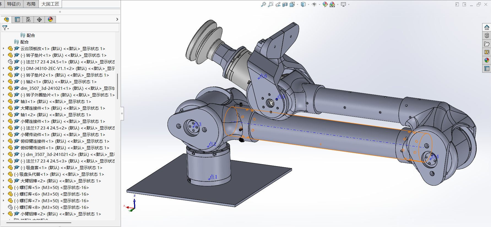
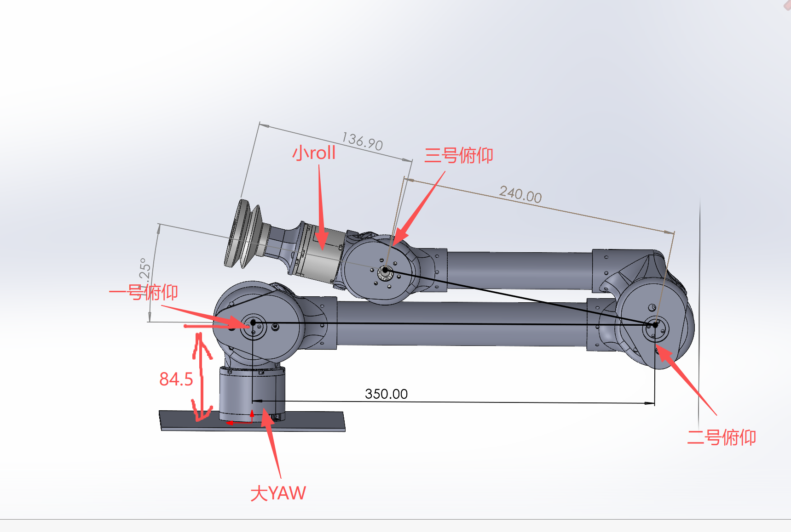
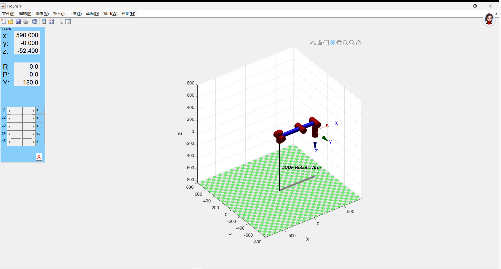
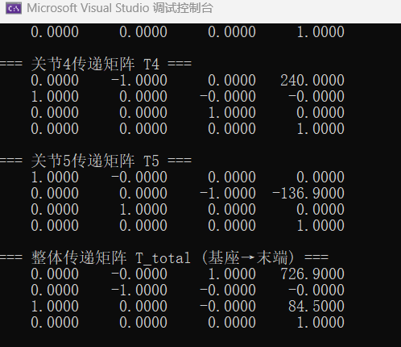
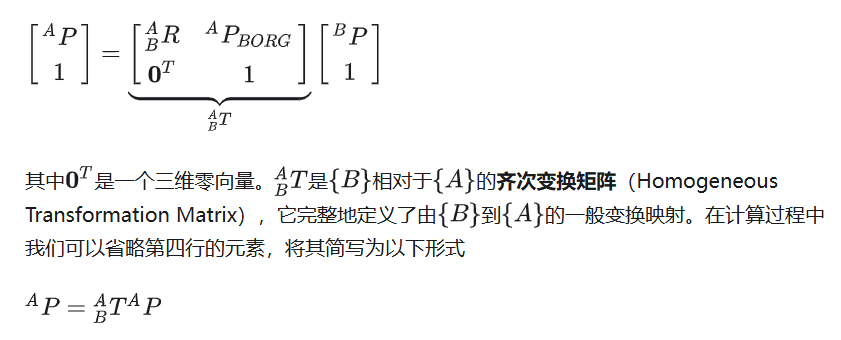
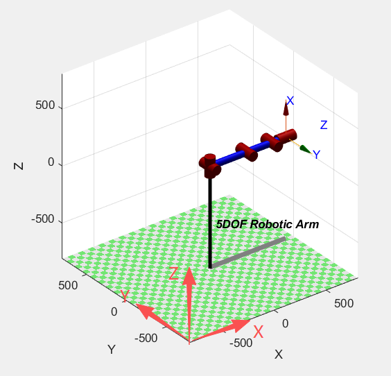
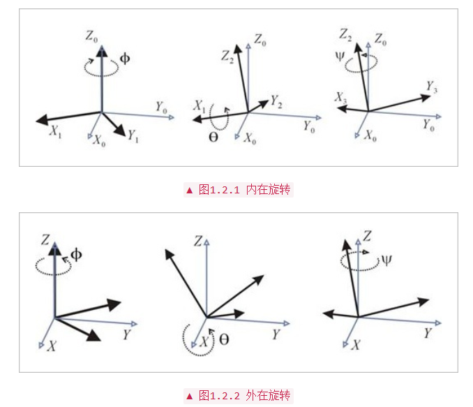
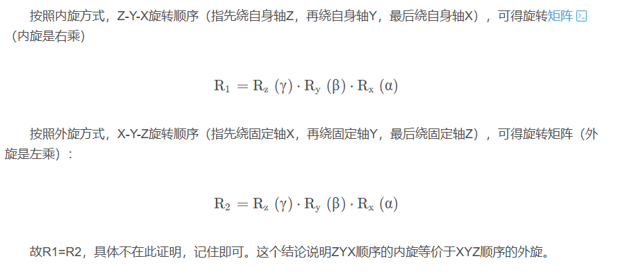
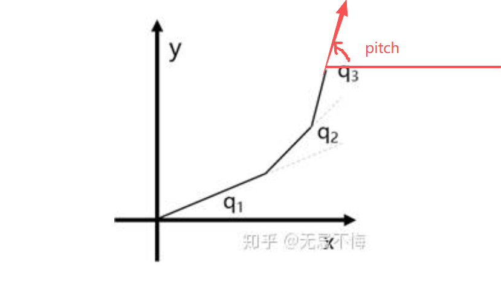
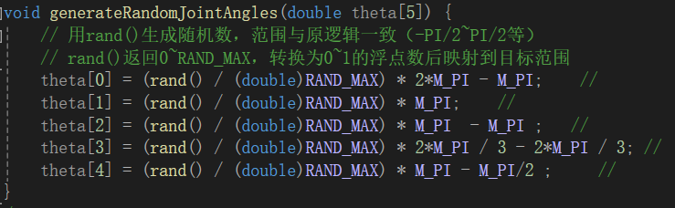

## 解算层

### 机械臂构型

第二版机械臂为五轴结构，一个大 YAW 轴，三个俯仰轴和与末端吸盘连接一个小 roll 轴。

摄像头固定在第三个俯仰轴上，不随 roll 转动。





### DH 参数模型

DH 参数（Denavit-Hartenberg 参数）是机器人学中用于标准化描述串联机械臂连杆与关节几何及运动关系的核心工具，通过 4 个参数（a、α、d、θ）构建相邻连杆坐标系间的齐次变换矩阵，为运动学建模、正逆解算、轨迹规划、动力学分析、标定与仿真提供统一数学基础。（来自豆包）

这里建立 DH 参数模型主要是为了获得吸盘和相机到底座的齐次变换矩阵。前者是机械臂的运动学正解，后者是相机的外参矩阵。

DH 参数模型有标准型和改进型两种，两种模型关节坐标系建立位置和参数的描述顺序不同。这里采用改进型，更加详细的信息可以从下面这篇博客了解学习：

[https://blog.csdn.net/qq_40851561/article/details/108923402](https://blog.csdn.net/qq_40851561/article/details/108923402)

使用 matlab 的 robotic toolbox 工具可以对 DH 参数模型进行快速的验证。如图为 DH 模型的初始姿态，这是我们的运动学原点。

```matlab
%% 机械臂建模
clear
clc
% 定义各个连杆以及关节类型，默认为转动关节
l1=84.5;
l2=350;
l3=240;
l4=136.9;

% 定义改进型DH参数 (Modified DH)
% 格式: Link([theta, d, a, alpha], 'modified')
% 注意: 在 Modified DH 中，参数顺序对应为 [theta_i, d_i, a_{i-1}, alpha_{i-1}]

L1 = Link([0,   l1,   0,    0],       'modified');
L2 = Link([0,   0,    0,    pi/2],    'modified');
L3 = Link([0,   0,    l2,   0],       'modified');
L4 = Link([0,   0,    l3,   0],       'modified');
L5 = Link([0,   l4,   0,    pi/2],    'modified');

robot=SerialLink([L1,L2,L3,L4,L5],'name','Irvingao Arm'); % 将五个连杆组成机械臂
robot.name='5DOF Robotic Arm';
robot.display();
view(3);
init_q = [0,0,0,pi/2, 0]; % 对应5个关节的弧度
robot.teach(init_q);
```

输出结果：


把 DH 参数丢给 AI 模型，生成 C++ 进行验证：

```cpp
#include "robot_arm_dh.hpp"
#include "planar_arm_ik.hpp"
#include "robot_arm_ik.hpp"
#include "cmath"
#define M_PI  acos(-1.0)

const float l1 = 84.5;
const float l2 = 350.0;   // 建议加.0，明确是浮点型，避免隐式转换
const float l3 = 240.0;
const float l4 = 136.9;

// 弧度转角度
double rad2deg(double rad) {
    return rad * 180.0 / M_PI;
}

double joint_angle[5];

int main() {
    // 1. 创建五自由度机械臂对象（传入连杆长度）
    FiveDOFRobotArm robot(l1, l2, l3, l4); //

    double theta2[5] = { 0,0,0,0,0};
    robot.updateJointAngles(theta2);
    robot.printAllMatrices();

    Matrix4d total = robot.getTotalMatrix();
    total.print("单独获取的整体传递矩阵");
}
```

输出结果：



齐次变换矩阵为一 4×4 矩阵，主要由一 3×3 的旋转矩阵和一个位置矢量组成，由旋转矩阵可以得到欧拉角，位置矢量即为末端（吸盘）原点在底座（世界）坐标系下的坐标。由输出得吸盘在笛卡尔坐标系下的位置（726.9，0，64.5），与 matlab 一致。



[https://zhuanlan.zhihu.com/p/1982935982358677016](https://zhuanlan.zhihu.com/p/1982935982358677016)

传递矩阵 T4 稍作变换即可得到摄像机相对于**相机坐标系相对于世界坐标系位姿**的齐次变换矩阵。当得到目标物相对于相机的坐标 p 后，使用 T4' 做乘 p 便可以得到目标物在世界坐标系下的坐标。

如果能获取目标物的姿态，便可以计算得到目标物相对于相机对其次变化矩阵 T'，使用 T4' 左乘 T'，便可以得到目标物相对于世界坐标系（也就是底座）的齐次变换矩阵。不但能得到目标物在世界坐标系下的坐标，还能计算得到欧拉角。

### 欧拉角

欧拉角是一个很常见的概念，但是它的定义却有点纷杂，建议阅读一下卓老师的这篇博客：

[https://blog.csdn.net/zhuoqingjoking97298/article/details/122259409](https://blog.csdn.net/zhuoqingjoking97298/article/details/122259409?ops_request_misc=%257B%2522request%255Fid%2522%253A%25221adf683590586e1f6159f852d4651136%2522%252C%2522scm%2522%253A%252220140713.130102334.pc%255Fblog.%2522%257D&request_id=1adf683590586e1f6159f852d4651136&biz_id=0&utm_medium=distribute.pc_search_result.none-task-blog-2~blog~first_rank_ecpm_v1~rank_v31_ecpm-1-122259409-null-null.nonecase&utm_term=%E6%AC%A7%E6%8B%89%E8%A7%92&spm=1018.2226.3001.4450)

摘录原文的一句话：

> 欧拉角的叫法不固定，跟坐标轴的定义强相关。
>
> 假设 X 是车头，Y 是车左方，Z 是车上方，那么绕 X 轴旋转得到的是 roll，绕 Y 轴旋转得到的是 pitch，绕 Z 轴得到的是 yaw。
>
> 假设 Y 是车头，X 是车右方，Z 是车上方，那么绕 X 轴旋转得到的是 pitch，绕 Y 轴旋转得到的是 roll，绕 Z 轴得到的是 yaw。



故我们定义绕 Z 轴旋转为偏航，绕 X 轴旋转为横滚，绕 Y 轴旋转为俯仰。

顺带一提，我们的坐标系是右手系。拇指指向坐标轴正方向后，四指的旋向为旋转的正方向。

下一个比较重要的概念是内旋和外旋：

- 每次旋转是绕固定轴（一个固定参考系，比如世界坐标系）旋转，称为外旋。
- 每次旋转是绕自身旋转之后的轴旋转，称为内旋。





我们采用内旋的定义，研究吸盘相对于底座的旋转。机械臂第一个关节带来的旋转运动为偏航，第二、三、四个关节为俯仰，末端电机的旋转为横滚。



定义第一个电机从上往下看逆时针旋转为正向，则第一个电机的转角即为偏航角；在运动学零点从 y 轴负向看去 xz 平面中记电机逆时针旋转为正，俯仰角即为三个俯仰电机转角之和（由于 DH 参数模型初始姿态三号俯仰电机并非水平，所以此处应该有 90 度的补偿）（叠甲: 我并没有研究清楚 DH 模型的初始姿态是有什么决定的，感觉可能是由参数 theta 决定的，由于电机是旋转关节，旋转关节中 theta 为自变量，所以在 DH 参数模型中所有 theta 初始都取为零了）；横滚角为最后一个电机的转角。

### 旋转矩阵（by 豆老师）

**内旋定义**：每次旋转的参考坐标系是**前一次旋转后的本体坐标系**，旋转顺序为 $Z \to Y \to X$，对应的转角分别为 $\alpha$（绕 Z 轴）、$\beta$（绕 Y 轴）、$\gamma$（绕 X 轴）。

#### 1. 第一步：绕本体 Z 轴旋转 $\alpha$

旋转前本体坐标系与世界坐标系重合，绕 Z 轴旋转的矩阵为：

$$
\mathbf{R}_z(\alpha) =
\begin{bmatrix}
\cos\alpha & -\sin\alpha & 0 \\
\sin\alpha & \cos\alpha & 0 \\
0 & 0 & 1
\end{bmatrix}
$$

旋转后，本体坐标系姿态由 $\mathbf{R}_z(\alpha)$ 描述。

#### 2. 第二步：绕旋转后本体 Y 轴旋转 $\beta$

此时的旋转轴是**第一步旋转后的本体 Y 轴**（记为 $Y_1$），需将世界坐标系下的旋转矩阵转换为本体坐标系的旋转操作，本质是**共轭变换**：

$$
\mathbf{R}_{y1}(\beta) = \mathbf{R}_z(\alpha) \cdot \mathbf{R}_y(\beta) \cdot \mathbf{R}_z^{-1}(\alpha)
$$

其中世界坐标系下绕 Y 轴的旋转矩阵为：

$$
\mathbf{R}_y(\beta) =
\begin{bmatrix}
\cos\beta & 0 & \sin\beta \\
0 & 1 & 0 \\
-\sin\beta & 0 & \cos\beta
\end{bmatrix}
$$

代入计算后，两步旋转的总矩阵为：

$$
\mathbf{R}_{zy} = \mathbf{R}_{y1}(\beta) \cdot \mathbf{R}_z(\alpha) = \mathbf{R}_z(\alpha) \cdot \mathbf{R}_y(\beta)
$$

展开结果：

$$
\mathbf{R}_{zy} =
\begin{bmatrix}
\cos\alpha\cos\beta & -\sin\alpha & \cos\alpha\sin\beta \\
\sin\alpha\cos\beta & \cos\alpha & \sin\alpha\sin\beta \\
-\sin\beta & 0 & \cos\beta
\end{bmatrix}
$$

#### 3. 第三步：绕旋转后本体 X 轴旋转 $\gamma$

同理，旋转轴是**第二步旋转后的本体 X 轴**（记为 $X_2$），总旋转矩阵为三步旋转矩阵的乘积（内旋的核心性质：本体坐标系下的旋转序列等价于世界坐标系下旋转矩阵按顺序左乘）：

$$
\mathbf{R}_{zyx}(\alpha,\beta,\gamma) = \mathbf{R}_z(\alpha) \cdot \mathbf{R}_y(\beta) \cdot \mathbf{R}_x(\gamma)
$$

其中世界坐标系下绕 X 轴的旋转矩阵为：

$$
\mathbf{R}_x(\gamma) =
\begin{bmatrix}
1 & 0 & 0 \\
0 & \cos\gamma & -\sin\gamma \\
0 & \sin\gamma & \cos\gamma
\end{bmatrix}
$$

#### 4. 最终旋转矩阵展开

将三个矩阵依次相乘，得到 **Z-Y-X 内旋总旋转矩阵**：

$$
\mathbf{R} =
\begin{bmatrix}
\cos\alpha\cos\beta & \cos\alpha\sin\beta\sin\gamma - \sin\alpha\cos\gamma & \cos\alpha\sin\beta\cos\gamma + \sin\alpha\sin\gamma \\
\sin\alpha\cos\beta & \sin\alpha\sin\beta\sin\gamma + \cos\alpha\cos\gamma & \sin\alpha\sin\beta\cos\gamma - \cos\alpha\sin\gamma \\
-\sin\beta & \cos\beta\sin\gamma & \cos\beta\cos\gamma
\end{bmatrix}
$$

---

### 二、从旋转矩阵反求转角（$\alpha,\beta,\gamma$）

设已知世界坐标系下的旋转矩阵 $\mathbf{R}$ 为：

$$
\mathbf{R} =
\begin{bmatrix}
r_{11} & r_{12} & r_{13} \\
r_{21} & r_{22} & r_{23} \\
r_{31} & r_{32} & r_{33}
\end{bmatrix}
$$

将 $\mathbf{R}$ 与上述总旋转矩阵对比，通过元素对应关系求解转角。

#### 1. 求解 $\beta$（绕 Y 轴转角）

观察总矩阵的第 3 行第 1 列元素：

$$
r_{31} = -\sin\beta
$$

因此：

$$
\beta = \arcsin(-r_{31}) = -\arcsin(r_{31})
$$

**取值范围**：$\beta \in [-\frac{\pi}{2},\frac{\pi}{2}]$，若需覆盖全姿态（$\beta \in [0,\pi]$），可结合 $r_{33} = \cos\beta$ 符号判断。

#### 2. 求解 $\alpha$（绕 Z 轴转角）

观察总矩阵的第 1 行第 1 列和第 2 行第 1 列元素：

$$
\begin{cases}
r_{11} = \cos\alpha\cos\beta \\
r_{21} = \sin\alpha\cos\beta
\end{cases}
$$

当 $\cos\beta \neq 0$（即 $\beta \neq \pm\frac{\pi}{2}$）时，两式相除得：

$$
\tan\alpha = \frac{r_{21}}{r_{11}}
$$

因此：

$$
\alpha = \arctan2(r_{21}, r_{11})
$$

**取值范围**：$\alpha \in [-\pi,\pi]$，$\arctan2$ 可直接确定象限。

#### 3. 求解 $\gamma$（绕 X 轴转角）

观察总矩阵的第 3 行第 2 列和第 3 行第 3 列元素：

$$
\begin{cases}
r_{32} = \cos\beta\sin\gamma \\
r_{33} = \cos\beta\cos\gamma
\end{cases}
$$

当 $\cos\beta \neq 0$ 时，两式相除得：

$$
\tan\gamma = \frac{r_{32}}{r_{33}}
$$

因此：

$$
\gamma = \arctan2(r_{32}, r_{33})
$$

**取值范围**：$\gamma \in [-\pi,\pi]$。

#### 4. 特殊情况：$\cos\beta = 0$（$\beta = \pm\frac{\pi}{2}$）

此时旋转矩阵出现**奇异性**，$\alpha$ 和 $\gamma$ 无法唯一确定，二者合并为一个自由度：

- 当 $\beta = \frac{\pi}{2}$ 时，$\tan(\alpha+\gamma) = -\dfrac{r_{12}}{r_{22}}$
- 当 $\beta = -\frac{\pi}{2}$ 时，$\tan(\alpha-\gamma) = \dfrac{r_{12}}{r_{22}}$

---

### 运动学逆解（正解由状态转移矩阵求得）

刚体在三维空间中完整位姿（位置 + 姿态）的参数集合，包含 **3 个位置自由度** 和 **3 个姿态自由度**，共计 6 个独立变量。

用笛卡尔坐标系下的 **x, y, z** 表示，描述刚体参考点在世界坐标系中的三维位置，用欧拉角描述刚体相对于世界坐标系的朝向。

由于我们的机械臂只有五个自由度，我们无需考虑姿态中的末端偏航。

在我们的机械臂构型中，使用柱坐标系比笛卡尔坐标系更有优势，所以我们使用 $( r , \theta, z, \text{pitch}, \text{roll} )$ 来描述机械臂末端位姿。其中：

$$
r = \sqrt{x^2 + y^2}
$$

$$
\theta = \arctan\left(\frac{y}{x}\right)
$$

还等于第一个电机的转角。

pitch 等于第二、三、四个电机的转角之和。

roll 等于最后一个电机的转角。

由圆柱坐标系五个参数理论上可以唯一确定机械臂的角度姿态。

第二、三、四电机的位姿由 $(r, z, \text{pitch})$ 决定，为一平面三连杆问题。

平面三连杆的运动学解知乎上这篇文章讲的非常清楚：

[https://zhuanlan.zhihu.com/p/161348413](https://zhuanlan.zhihu.com/p/161348413)

解算代码如下：

```cpp
#include "planar_arm_ik.hpp"

// ------------------- 二连杆逆解实现 -------------------
Planar2LinkArmIK::Planar2LinkArmIK(double link1, double link2)
    : l1(link1), l2(link2) {
    if (l1 <= 0 || l2 <= 0) {
        throw std::invalid_argument("连杆长度必须大于0");
    }
}

std::vector<Vec2d> Planar2LinkArmIK::computeIK(double x, double y) {
    std::vector<Vec2d> solutions;
    double r_sq = x * x + y * y;
    double r = std::sqrt(r_sq);

  // // 检查可达性：末端距离必须在 |l1-l2| ≤ r ≤ l1+l2 范围内（加小容差避免浮点误差）
  // if (r < std::abs(l1 - l2) - 1e-6 || r > l1 + l2 + 1e-6) {
  //     throw std::runtime_error("末端点不可达：超出机械臂工作空间");
  // }

    // 计算q2（连杆2的关节角，弧度制）
    double cos_q2 = (r_sq - l1 * l1 - l2 * l2) / (2 * l1 * l2);
    // 限制cos_q2在[-1,1]范围内，避免数值误差导致acos报错
    cos_q2 = std::max(-1.0, std::min(1.0, cos_q2));
    double q2_1 = std::acos(cos_q2);       // 正解（肘上构型）
    double q2_2 = -std::acos(cos_q2);      // 负解（肘下构型）

    // 计算q1（连杆1的关节角，弧度制）
    // 公式推导：q1 = atan2(y, x) - atan2(l2*sin(q2), l1 + l2*cos(q2))
    double alpha_1 = std::atan2(y, x);
    double beta_1 = std::atan2(l2 * std::sin(q2_1), l1 + l2 * std::cos(q2_1));
    double q1_1 = alpha_1 - beta_1;

    double beta_2 = std::atan2(l2 * std::sin(q2_2), l1 + l2 * std::cos(q2_2));
    double q1_2 = alpha_1 - beta_2;

    // 添加两组解
    solutions.emplace_back(q1_1, q2_1);
    solutions.emplace_back(q1_2, q2_2);
    return solutions;
}

// ------------------- 三连杆逆解实现 -------------------
Planar3LinkArmIK::Planar3LinkArmIK(double link1, double link2, double link3)
    : l1(link1), l2(link2), l3(link3), two_link_ik(link1, link2) {
    if (l3 <= 0) {
        throw std::invalid_argument("连杆3长度必须大于0");
    }
}

std::vector<Vec3d> Planar3LinkArmIK::computeIK(double x, double y, double theta) {
    std::vector<Vec3d> solutions;

    // 步骤1：反向推导前两连杆的末端目标点（x', y'）
    // 第三连杆末端是(x,y)，因此前两连杆末端 = (x - l3*cosθ, y - l3*sinθ)
    double x_prime = x - l3 * std::cos(theta);
    double y_prime = y - l3 * std::sin(theta);

    // 步骤2：调用二连杆逆解得到q1, q2
    auto two_link_sols = two_link_ik.computeIK(x_prime, y_prime);

    // 步骤3：计算q3 = 末端姿态theta - q1 - q2
    for (const auto& sol : two_link_sols) {
        double q1 = sol.x;
        double q2 = sol.y;
        double q3 = theta - q1 - q2;
        solutions.emplace_back(q1, q2, q3);
    }

    return solutions;
}
```

平面三连杆可以得到两组解，我们选择手肘向上，即 q2 < 0。

至此，如果有了圆柱坐标系下的 $( r , \theta, z, \text{pitch}, \text{roll} )$ 五个坐标，我们的机械臂便可以求得唯一解。

如果有 $(x, y, z, \text{pitch}, \text{roll})$，可以简单变换为圆柱坐标系再进行求解。

如果有状态转移矩阵，也可以先求出欧拉角，再把笛卡尔坐标转成圆柱坐标再求解。

### 验证

随机生成角度：



进行正解得到齐次变换矩阵，算出欧拉角后在圆柱坐标系下求逆解，将逆解得到的电机角度再次进行正解，比较与原始数据的正解结果计算误差：

```cpp
// --------------- 核心稳定性验证函数 ---------------
/**
 * @brief 验证单组关节角的正逆解闭环一致性
 * @param input_theta 输入关节角（5个）
 * @param case_name 测试用例名称
 * @return 是否通过验证（true=稳定）
 */
bool verifyClosedLoop(const double input_theta[5], const std::string& case_name) {
    bool is_stable = true;

    // 1. 正解：输入关节角 → 齐次矩阵 → 圆柱坐标
    FiveDOFRobotArm robot(l1, l2, l3, l4);
    robot.updateJointAngles(input_theta);
    Matrix4d total_mat = robot.getTotalMatrix();
    CylindricalTarget target = matrixToCylindricalTarget(total_mat);

    // 记录原始位姿（提前保存，失败时需要用到）
    double original_d = target.d;
    double original_z = target.z;
    double original_yaw = target.yaw;
    double original_pitch = target.pitch;
    double original_roll = target.roll;
    double joint_angle[5] = { 0 };  // 初始化关节角数组，避免未定义
    double d_error = 0, z_error = 0, yaw_error = 0, pitch_error = 0, roll_error = 0;

    // 仅在全量模式下打印成功案例的头部信息
    PRINT_SUCCESS("\n===== 闭环验证：" << case_name << " =====\n");
    PRINT_SUCCESS("原始位姿（圆柱坐标）：\n");
    PRINT_SUCCESS("d=" << original_d << "mm, z=" << original_z << "mm\n");
    PRINT_SUCCESS("yaw=" << rad2deg(original_yaw) << "°, pitch=" << rad2deg(original_pitch) << "°, roll=" << rad2deg(original_roll) << "°\n");

    // 2. 逆解：圆柱坐标 → 关节角
    try {
        target.robot_arm_ik(joint_angle);  // 调用逆解函数

        // 仅在全量模式下打印逆解结果
        PRINT_SUCCESS("\n逆解得到的关节角：\n");
        for (int i = 0; i < 5; ++i) {
            PRINT_SUCCESS("θ" << i + 1 << ": " << rad2deg(joint_angle[i]) << "° (原始：" << rad2deg(input_theta[i]) << "°)\n");
        }

        // 3. 正解：逆解得到的关节角 → 齐次矩阵 → 圆柱坐标（验证闭环）
        robot.updateJointAngles(joint_angle);
        Matrix4d loop_mat = robot.getTotalMatrix();
        CylindricalTarget loop_target = matrixToCylindricalTarget(loop_mat);

        // 4. 计算误差
        d_error = fabs(loop_target.d - original_d);
        z_error = fabs(loop_target.z - original_z);
        yaw_error = fabs(rad2deg(loop_target.yaw - original_yaw));
        pitch_error = fabs(rad2deg(loop_target.pitch - original_pitch));
        roll_error = fabs(rad2deg(loop_target.roll - original_roll));
    } catch (const std::exception& e) {
        PRINT_ERROR("逆解失败，异常信息：" << e.what() << "\n");
        is_stable = false;
        return is_stable;
    }
```

测试结果：


在某些角度下会失效，可能涉及到万向锁死，不过由于机械臂自身碰撞，这些角度也可能根本不会出现（等待后续实物继续优化）。
