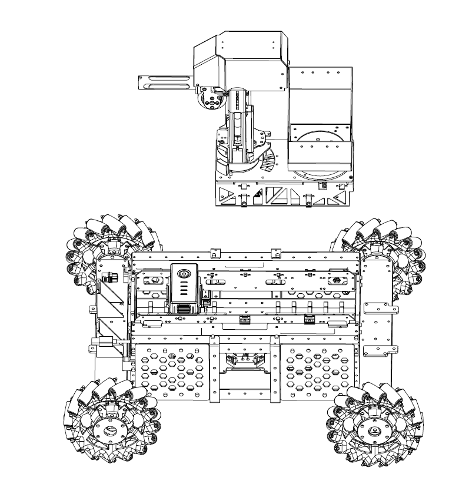
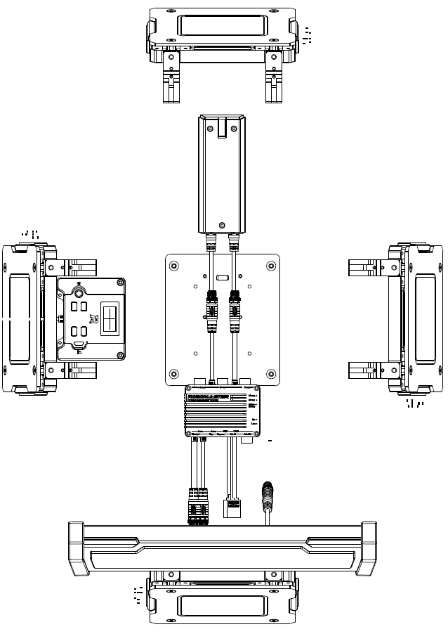
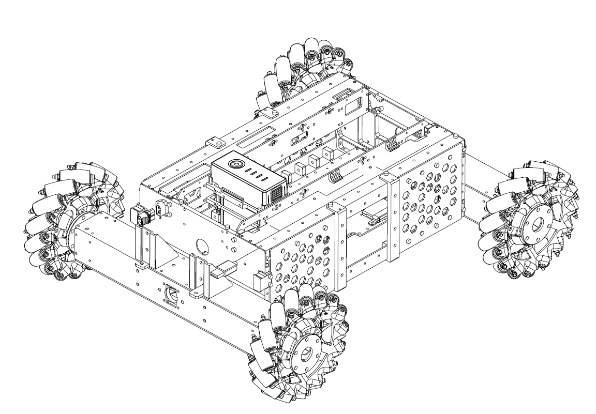
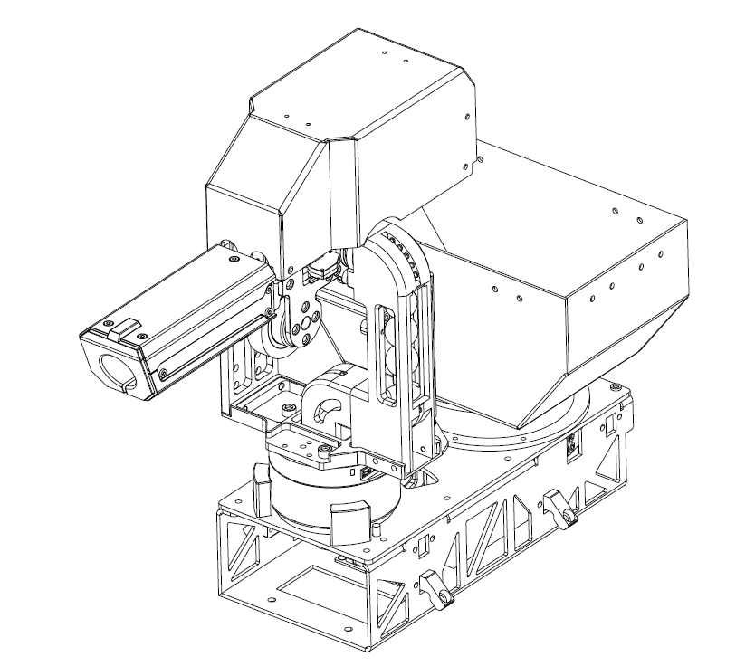
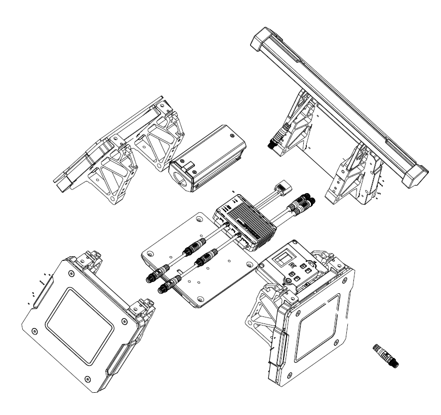

# RoboCon 机械组学习与开发文档

!!! green "提示"
    这是一篇示例文档。

## Structural Composition

整个平台采用模块化设计，支持快速拆装，每个部件都可以单独编程和测试。

如图所示，平台主要由三个模块构成。

1. 底盘模块（Chassis Module）

- 采用 Mecanum 万向轮，实现全方向运动灵活机动。

- 由 RoboMaster 的 M3508 P19 无刷直流齿轮电机和 C620 电调（ESC）驱动。

- 控制核心使用 RoboMaster A 型开发板（STM32F427 MCU）。

2.云台模块（Gimbal Module）

- 使用双轴云台，支持俯仰与偏航自由度旋转。

- 负责支持和发射 17mm TPU 弹丸的机械装置。

- 云台运动由 GM6020 无刷电机（带电调）驱动；弹丸供给由 M2006 P36 无刷电机驱动；发射则由 DJI Snail 2305 竞速电机驱动。

- 同样使用 RoboMaster A 型开发板（STM32F427）作为 MCU。

3. 裁判系统模块（Referee System Module）

一个集计算、通信和控制于一体的电子判罚系统，仅用于竞赛中。开发者可通过软件接口获取比赛进程和机器人状态信息。

裁判系统包含机器人上的车载端、以及 PC 上安装的服务器与客户端软件。

车载子模块包括：装甲模块（Armor Module）、主控模块（Main Control Module）、速度监测模块（Speed Monitor Module）、RFID 交互模块和电源管理模块。

详细规格请参考“裁判系统规范手册”（Referee System Specification Manual）。

此外，机器人平台配备有 DT7 遥控器 和兼容的智能 LiPo 6s 电池（如 Matrice 100 TB47D 或 TB48D）及其充电器，作为配件提供。

平台还支持多种传感器与计算设备，可灵活适应科研需求并扩展开发。官方支持安装 DJI Manifold 2 作为车载计算设备，也兼容 Intel NUC、Nvidia Jetson（TX1/TX2/Xavier）等，前提是使用相应的载板。传感器安装支架可适配工业单目相机、LiDAR、UWB 定位套件、深度相机等设备，极具扩展性与灵活性。

## 硬件参数（Hardware Parameters）

| Structure                  |                       |
| :-------------------- | :-------------------- |
| Overall size                      | 600 x 450 x 460 mm    |
| Weight (Including battery)        | 16.6 kg               |
| **Performance**                  |                       |
| Maximum forward Speed            | 3 m/s                 |
| Maximum Pan Speed                | 2 m/s                 |
| Gimbal Pitch axis rotating angle | -20° ~ 20°            |
| Gimbal Yaw axis rotating angle   | -90° ~ 90°            |
| Maximum launching frequency      | 10 projectiles per second              |
| Maximum launching speed         | 25 m/s                |
| Remote Controller              | 200 projetiles                |
| **Battery**                      |                       |
| Model                           | DJI TB47D / DJI TB48D |
| Type                            | LiPo 6s               |
| Voltage                         | 22.8v                 |
| Battery capacity              | 4500 mAH / 5700 mAH   |
| **Remote control**            |                       |
| Model                         | DJI DT7               |
| Firmware upgrade              | 2.4 GHz               |
| Charing port                    | Micro USB             |
| **Communicating port**          |                       |
| Port type                    | Micro USB             |
| Communication mode              | STM32????         |
| Baud rate                        | 921600                |

