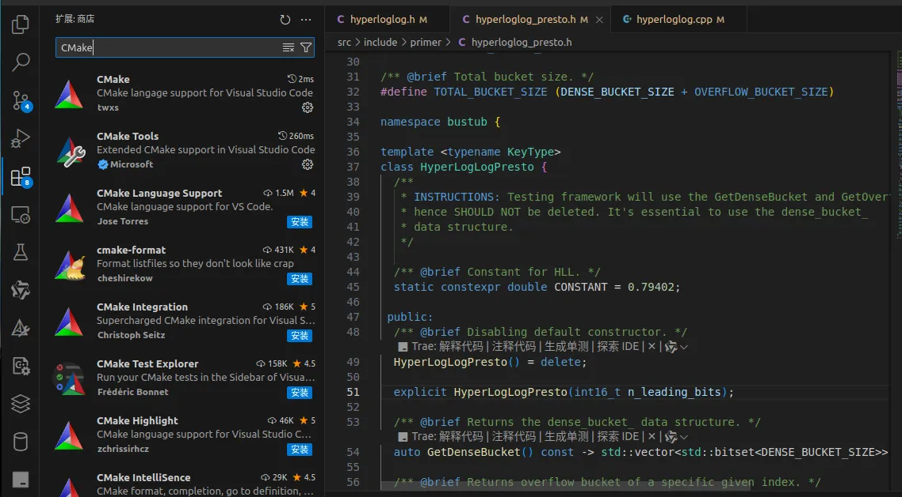
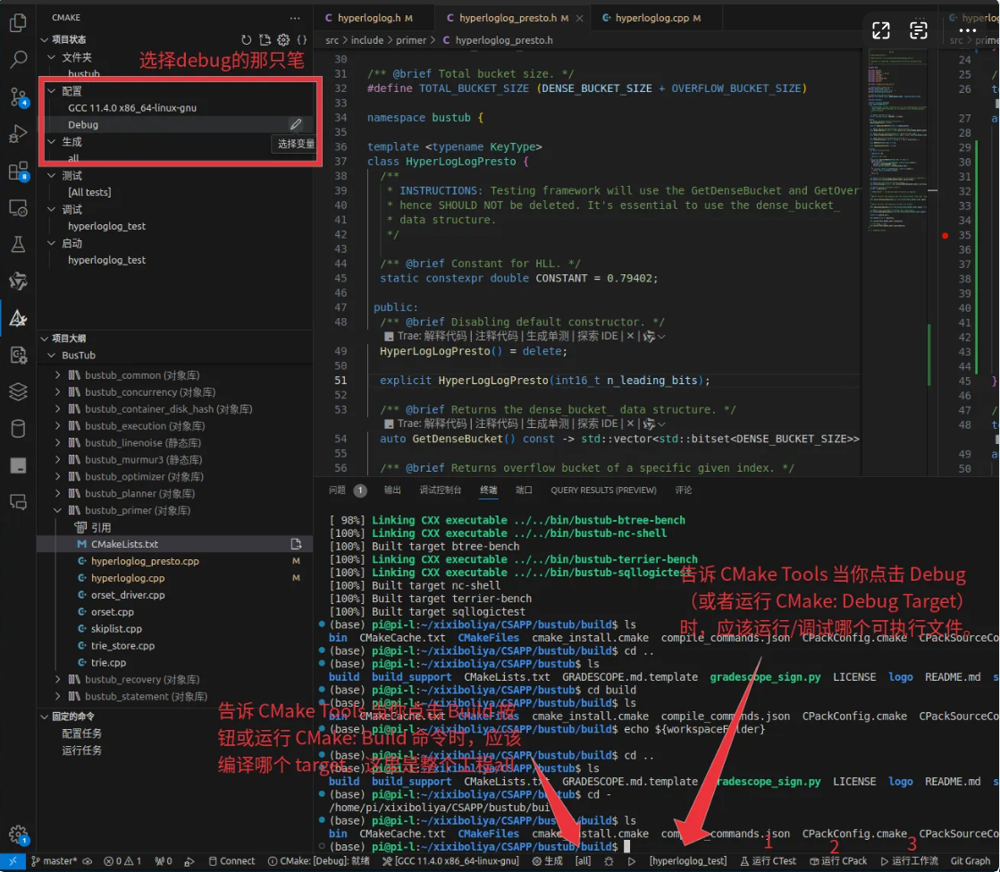
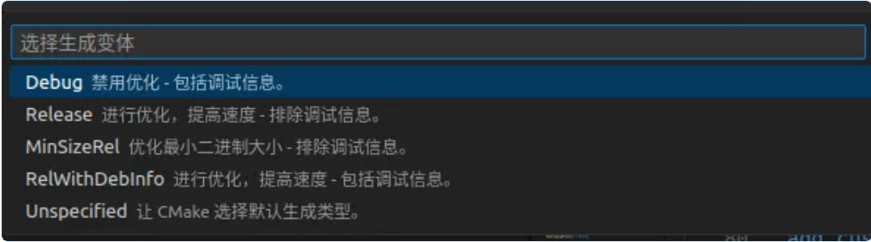
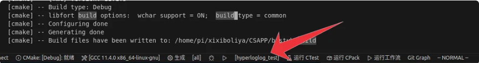

# CMake Debug

!!! red-warning "警告"
    这是一篇暂未完成的文档，需要添加相关步骤甚至重构，但意思是需要掌握 CMake 多线程调试的相关知识。


在你的项目目录下：
```bash
mkdir build
cd build
```
# 安装CMake
vscode插件搜索CMake并且下载。

接着在vscode的左侧栏中找到CMake。

# 调试步骤
首先，请确保你的项目有CMakeLists.txt并且能够通过build target阶段，也就是大概这样的：
```bash
cd build
cmake ..
make -j`nproc`  # nproc代表逻辑核数目，也可以是线程数这样的
```

这里chat老师对图片中标注123位置的解释：

### 1. “运行 CTest” (Run CTest)
● 图标：通常是一个小的测试管道或锤子＋齿轮图标。
● 功能：调用 ctest 去执行你的 CMake 项目里通过 enable_testing() + add_test() 注册的所有单元测试。
● 典型用例：
  ○ 你把 hyperloglog_test、buffer_pool_test 等测试都写好并在 CMakeLists 里 add_test(...) 了，
  ○ 点它就会自动在 build 目录下运行 ctest --output-on-failure（或你配置的等价命令），
  ○ 在输出面板里看到每个测试的通过／失败详情。

### 2. “运行 CPack” (Run CPack)
● 图标：一个打包盒子或带箭头的包裹图标。
● 功能：调用 cpack 去把你项目打成二进制安装包或源代码包（.tar.gz、.zip、.deb、.rpm、NSIS 安装程序等等，取决于你在 CMakeLists.txt 中用 include(CPack) 配置的包类型）。
● 典型用例：
  ○ 项目整合好了可执行、库、头文件等之后，
  ○ 点它会自动执行 cpack，然后在 build 目录下产出 .tar.gz、.deb、.msi 等安装包文件。

### 3. “运行工作流” (Run Workflow)
● 图标：一个三角形加流水线或齿轮的组合，表示“工作流”或“多阶段流程”。
● 功能：执行你在 .vscode/cmake-variants.json 或 CMake Tools 配置里定义的自定义工作流（workflow）。
● 典型用例：
  ○ 你可以在 CMake Tools 的设置里定义一个 workflow，比如按顺序跑：
    ⅰ. Clean
    ⅱ. Configure
    ⅲ. Build
    ⅳ. Test
    ⅴ. Package
  ○ 然后点 “Run Workflow” 就一口气把这几步按配置顺序全部跑完，类似 CI/CD pipeline。

| 图标 | 触发命令 | 做什么 |
|------|----------|--------|
| 运行 CTest | `ctest` | 执行所有 CMake 注册的单元测试 |
| 运行 CPack | `cpack` | 根据 CPack 配置生成安装包（Deb、RPM、TGZ、ZIP 等） |
| 运行工作流 | 自定义 Flow | 按你在 CMake Tools/Variants 中定义的多步流程跑完 |

回到本文，接下来点击配置中的debug：并且选择第一个，接下来你的vscode中的下方状态栏中会显示`CMake:[Debug]:ready`。




# 生成launch.json
如果你的工作空间内没有`.vscode/launch.json`的话，会在接下来的debug阶段报错`launch:program '/home/pi/xixiboliya/CSAPP/busthub/build/test/hyperloglog_test' does not exist.`，所以新建一个`.vscode/launch.json`文件。

接着，选择你要调试的对象，该对象是add_executable的target，接着点击旁边的小虫子：

