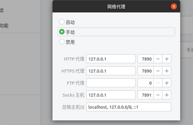
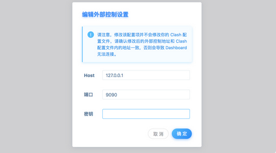

## Ubuntu 22.04 clash VPN 配置教程

---

ubuntu 版本不同其实差别不是很大，本文的教程适用于 ubuntu 22.04，架构为 x86_64.

#### 步骤一：建立 clash 文件夹并导入安装包

```bash
mkdir clash
cd clash
```

目前 clash 的站点名称叫做[clash site](https://ikuuu.de)，您需要登录并且注册账号，点击左侧栏的“下载和教程”——“linux”，找到“下载客户端”字样的链接。

之后在其仓库下载`clashpremium-release-linux-amd64-v3.tar.gz`导入到`<你的路径>/clash`路径下，换言之，就是将安装包放置在`clash`文件夹里面，之后解压该文件，使用`mv ClashCore clash`修改命名为`clash`。

```bash
tar -xzvf clashpremium-release-linux-amd64-v3.tar.gz
```

!!! red "注意"
    不同 release 版本的 clash 安装包的名称不同，截至 2025-11-18，其 linux-86_64 版本的安装包为`clashpremium-release-linux-amd64-v3.tar.gz`。amd64 是 x86_64 的另一种叫法。之后随着更新，您或许需要自行修改一下安装包的名称。

#### 步骤二：配置 VPN 参数文件

```bash
wget -O config.yaml "https://cqd4w.no-mad-world.club/link/JMdr9H6ofZOHDvJO?clash=3"
```

当然，若上述链接不行的话你也可以在这里复制 wget 命令：


#### 步骤三：执行配置命令实现启动 clash 和 VPN 代理

```bash
chmod +x clash
./clash -d .
```

执行效果图如下所示：


#### 步骤四：购买机场提供的稳定 VPN,并修改设置网络参数

机场链接[IKUUU VPN](https://ikuuu.one/user/tutorial?os=linux&client=clash##)

在这个机场里面选择 VPN 网络包,效果如下图所示

以 Ubuntu 20.04 为例，打开系统设置，选择网络，点击网络代理右边的`设置`按钮，选择手动，填写` HTTP` 和 `HTTPS` 代理为 `127.0.0.1:7890`，填写 `Socks` 主机为 `127.0.0.1:7891`，即可启用系统代理

修改图如下所示



之后点击`clash`链接[clash board](https://clash.razord.top/#/proxies)

clash 界面如下图所示



点击确定，之后便可享用 VPN 了

最终 clash 效果图如下所示：


外网游行--`Youtube`展示:


### 平日开启 VPN 的方法

在终端中`cd`到`clash`的文件夹下，输入`./clash -d .`或者`./ClashCore -d .`启动 clash，启动完之后一般不要使用`ctrl+c`或`ctrl+z`打断运行，否则再次输入`./clash -d .`运行会出现端口占用，如果打断了就只能：

```bash
ps aux | grep clash
kill -9 [端口号]
```

在浏览器中打开 ikuuu 的[dashboard](https://clash.razord.top/#/proxies)，里面可以配置代理和节点。

如果您不想每次开机都进行`clash -d .`,您完全可以将 clash 创建为系统服务。参考[clash 知识库](https://clash.wiki/introduction/service.html)
