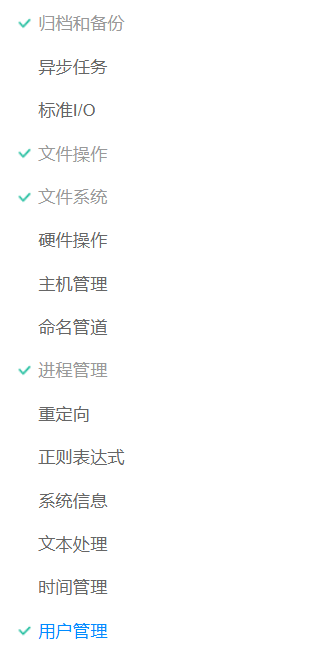
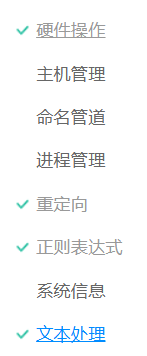
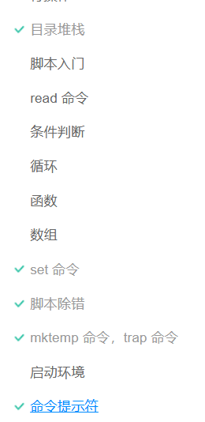

!!! green "阅读教程"
    忘了差不多了……不过请阅读：[阮一峰的bash教程](https://www.bookstack.cn/read/bash-tutorial/docs-intro.md)

打的章节指的是提到的章节，即需要掌握的章节。

## 核心概念强化

已经初步会用 shell ，对这些概念有一定印象的同学非常建议去读。初见的同学可能不会一下子就醍醐灌顶，但是也要去看一看！

包含以下章节：

有一些东西会忘记，比如我经常记混算数运算的几个 `(()) []` 是啥意思，该怎么用，背一下试试。

## 常用命令

必会操作（这些部分应该初学者更加熟悉）

快捷键

高级操作（会看到，遇到）

## 编写一个 shell 脚本，实现自动化

作为基础，这些是你首先需要掌握的：

这些部分不是必须的，但是知道了能够使你能够编写更好的脚本

