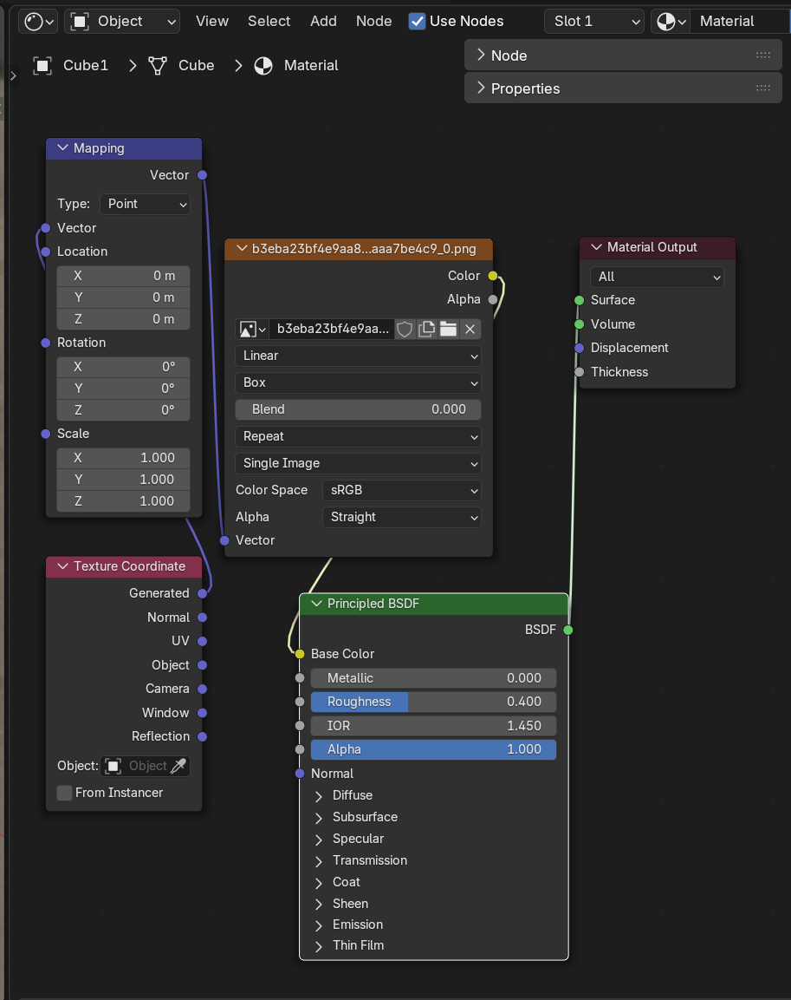
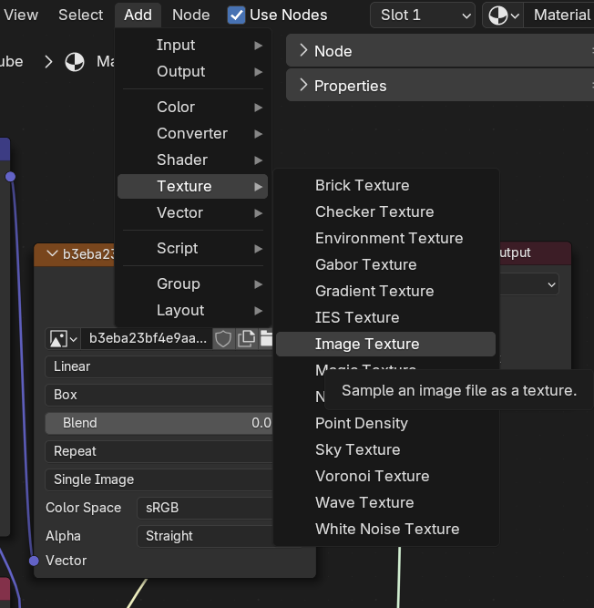
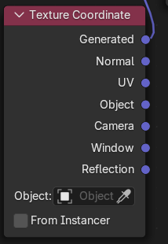
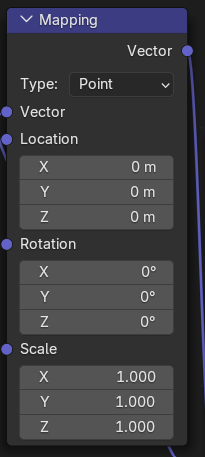
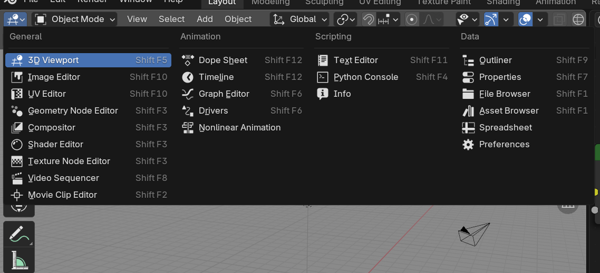
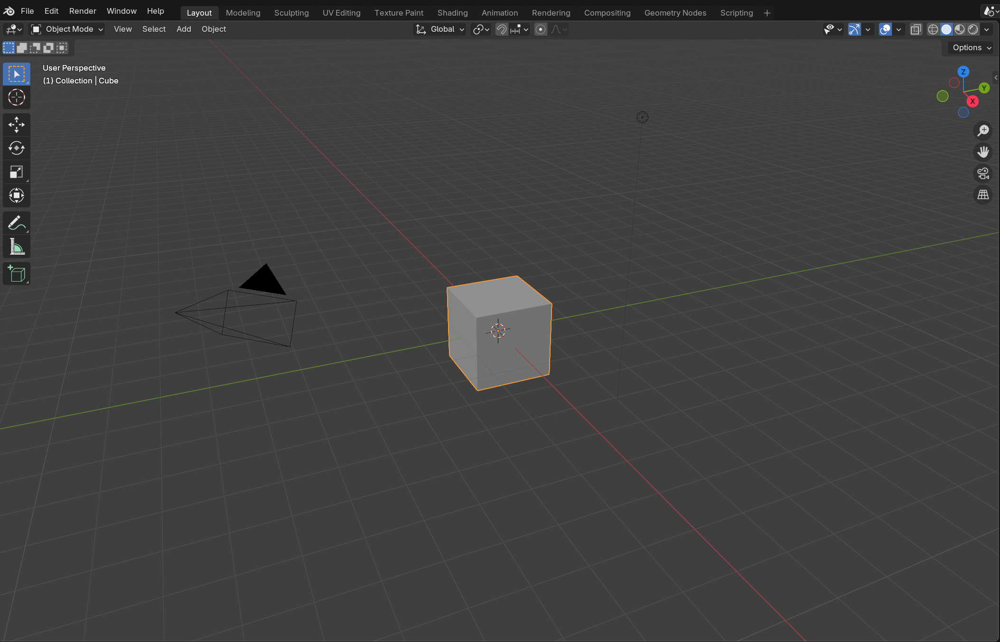
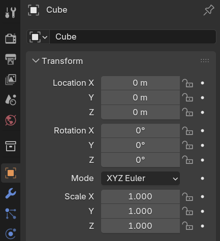
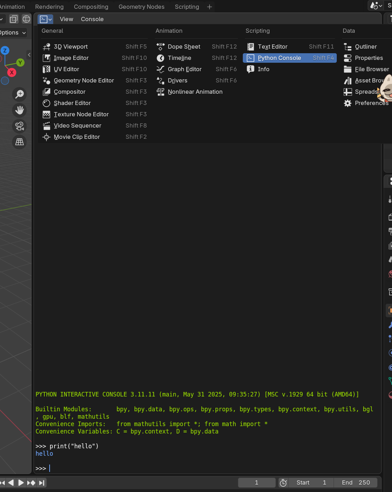
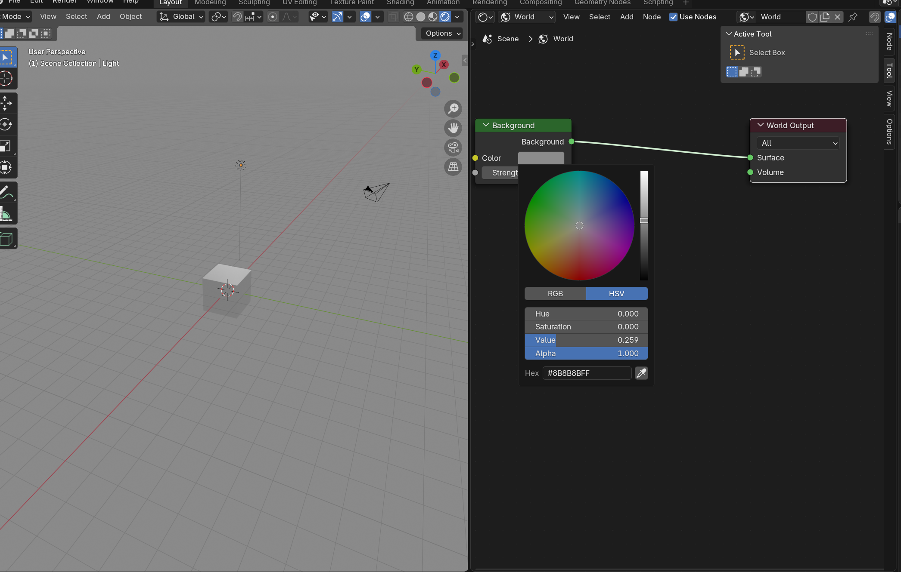
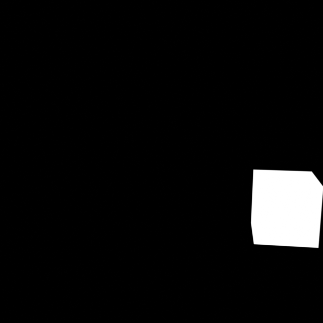

# Blender 数据集生成完整指南（完善版）

本指南面向 **熟悉编程但不熟悉 Blender** 的用户，帮助你在 Windows / Ubuntu 环境下，使用 Blender + Python 自动化生成数据集。文档已经对你提供的内容进行了补全、标准化，同时修复了逻辑不严谨的地方，并补全了 Blender API 中常用对象的属性、数据格式说明。

---

# 目录

1. 环境配置
2. blender 的运行逻辑
   - 2.1 关于 blender 的基本概念
   - 2.2 blender 进行编辑的窗口和控制逻辑
3. 构建模型
   - 3.1 创建基础模型
   - 3.2 UV 贴图（含 Python 实现）
4. 录制 Blender 动画
   - 4.1 进入相机视角
   - 4.2 录制关键帧
5. 光照与背景
   - 5.1 环境光 HDRI（含 Python 自动导入）
   - 5.2 发光物体（用于 mask 渲染）
6. Python 自动化 Blender
   - 6.0 调用 blender 的方式
   - 6.1 初始化 Scene
   - 6.2 遍历动画帧
   - 6.3 物体姿态、矩阵与坐标转换
   - 6.4 渲染 Mask（自动遮挡其他物体）
   - 6.5 更换纹理
   - 6.6 渲染图片 + 写标签
7. 常见 Blender API 数据格式说明
8. 修改项总结

---

# 1 环境配置

这是我的操作系统与 Blender 版本：

- Windows 11 / Ubuntu 22.04
- Blender 4.5
- GPU：RTX 5080 Laptop

确保可通过命令行运行 blender：

```bash
blender -v
```

---

# 2 blender 的运行逻辑

这个章节用于讲解 blender 渲染的逻辑以及场景的组成。如果感觉不够形象，或者是给出太多概念（就犹如亲爱的高数和线代），可以先看后面的应用示例，再回来对应，加深理解。

## 2.1 关于 blender 的基本概念

Blender 是“数据块 Data-Block”系统，每个元素都是数据，可以被引用、共享、复用。
blender 中有 5 个核心对象类型：

```bash
Scene
├── World（天空、环境光）
├── Camera（相机）
├── Light（灯光）
└── Collections（物体集合）
└── Object
├── Mesh（顶点/面）
├── Material（材质节点）
└── Transform（位移/旋转/缩放）
```

#### Scene（场景）

###### 定义

Scene 是 Blender 中的 **最高级容器**，代表一个完整的动画或渲染场景。

##### Scene 包含什么？

- 所有的 Collections
- 所有 Objects（通过 Collection 存储）
- Camera（主相机）
- Light（主灯光）
- World（背景环境）
- 时间轴（Frame Start/End）
- 渲染设置（Render、Sampling、Color Management）
- 单位、重力、物理系统等

##### Scene 的功能是什么？

- 作为项目的“总舞台”
- 描述一次完整的渲染内容
- 管理动画时间轴和物理模拟

#### World（世界环境）

##### 定义

World 是 Scene 的环境设置，控制 **背景、天空、环境光、体积雾**。

##### World 影响什么？

- 渲染背景色或 HDRI 天空
- 环境光照强度
- 环境反射
- 环境体积效果（体积雾/空气）

#### Object（物体）

##### 定义

Object 是你可以在 3D 场景中放置、移动、缩放、旋转的实体。

##### Object 可以是什么类型？

- Mesh（网格模型，例如立方体）
- Light（灯光对象）
- Camera（相机对象）
- Curve（曲线）
- Armature（骨骼）
- Empty（空物体）
- Volume（体积对象）
- Text（文本对象）
- Surface（表面对象）
- MetaBall（元球）等

##### Object 包含什么

Object = 变换属性 + 数据：

- Transform（位置、旋转、缩放）
- 数据（mesh/curve 等）
- Material 材质
- Modifier（修改器）
- Constraint（约束）

#### Camera（相机）

##### 定义

Camera 是一种特殊的 Object，用来决定 Blender 渲染最终看到的角度和视野。

##### Camera 的属性

- 焦距（Focal Length）
- 光圈（Depth of Field）
- 传感器尺寸
- 变换（位置、旋转）

##### Camera 能做什么？

- 控制渲染图像的构图
- 决定远近虚化（景深）
- 定义画面边界（视椎体）

##### Camera 属于何处？

- 是 Object（具有位置、旋转）
- 属于 Scene（Scene 必须指定一个主相机）

#### Light（灯光）

##### 定义

Light 是一种发出光的 Object，用于照亮场景中的模型。

##### Light 类型

- Point（点光）
- Sun（太阳光）
- Spot（聚光灯）
- Area（面光源）

##### Light 的属性

- 亮度（Power）
- 颜色（Color）
- 半影（阴影柔和度）
- 变换（位置、旋转）

##### Light 的作用

- 决定阴影、亮面和暗部
- 决定材质反射效果
- 决定空间氛围

#### Frame（帧）

##### 定义

Frame（帧）是 Blender 动画系统中的时间单位。  
它表示动画中的某一个独立时间点。
Blender 动画是通过一帧一帧依次播放而形成的。

##### Frame 的作用

在每一帧上，你可以：

- 记录物体的位置、旋转、缩放（关键帧 Keyframe）
- 控制材质变化
- 控制镜头移动
- 控制光照变化
- 控制形变动画（骨骼、形状键）

Blender 会在帧与帧之间自动补间（Interpolation），形成平滑动画。

### 2.2 blender 进行编辑的窗口和控制逻辑

目前，由于我面临的场景大多不需要动画，或者骨骼之类的，也还不需要物理属性。所以，我现在先将讨论局限于位置和贴图的处理上。同时，blender 使用 node，这在其他的图形编辑软件，建模软件，游戏引擎（如 UR,Unity,原神的千星奇域)，甚至 AI 软件（comfyui）中都比较常见。
如果有兴趣加深了解，请自行查阅官方文档：[Blender Python API](https://docs.blender.org/api/current/?utm_medium=www-footer)
或者是更加完整的：[Blender Documentation - blender.org](https://docs.blender.org/)

##### 移动与 transform

Blender 中有三种 transform：

1. **Object transform**
   - 旋转控制
   - 移动整个物体（不动网格）
2. **Mesh transform**
   - 这个层级直接操作网格数据：
   - 移动顶点、边、面
   - 挤压（Extrude）
   - 倒角（Bevel）
   - 合并（Merge）
   - 切割（Loop Cut / Knife）
   - 细分（Subdivision）
   - 注意，只有在 Edit Mode 中才动顶点
3. **Local vs Global space（局部坐标 vs 世界坐标）** - Blender 所有矩阵变换都基于此 - `matrix_world` → 把本地转到世界 - `matrix_local` → 在局部空间
   比如，前文所述，在 collection 中有多个 object，每个又有多个属性。对于每一个 object 来说，其操作有：位置（location），旋转（rotation），缩放（scale）而真正的顶点、边、面的数据存在 Mesh（网格数据）。**你在 3D 视图移动一个立方体，移动的是 Object 的 transform，而不是 Mesh 的顶点。** 这是 Blender 最容易误解的部分，也是后文我们在处理顶点时需要进行一次相对于中心的 TF 的原因，同时这样也可以大幅增加数据复用的效率。

##### **外观与渲染操作（材料相关）**

一个物体的“视觉表现”通过材质决定：

###### （1）材质本身（Material）：

- 基础 BSDF（为反射和折射函数） 参数（金属、粗糙度、透明度）
- 法线 Normal
- 发光 Emission
  在 Blender Python API 中，材质核心对象是：
  `bpy.types.Material`
  主要属性（这是属性，其中包含的纹理方法有很多，不一一展示）：

| 属性               | 类型               | 说明                     |
| ------------------ | ------------------ | ------------------------ |
| name               | string             | 材质名称                 |
| use_nodes          | bool               | 是否使用节点系统         |
| node_tree          | bpy.types.NodeTree | 节点树（包含节点和连线） |
| diffuse_color      | tuple(R,G,B,A)     | 基础颜色（非节点模式）   |
| alpha              | float              | 透明度（非节点模式）     |
| specular_intensity | float              | 高光强度（非节点模式）   |

###### （2）材质内部的节点（Shader Nodes）

节点操作包括：

- Color 节点
- Texture 图片节点
- Mapping 坐标节点
- Mix 混合节点
- Bump / Normal Map
- Displacement 位移
  这些通过节点系统（Node Tree）实现
- **Node 编辑模式**是 Blender 提供的一种可视化“编程”方式，用于编辑材质、世界环境或贴图。
- **Node Mode 不改变 Mesh 或 Object 的结构**，只改变材质数据的计算方式。
  

  Node 核心概念：

- **节点（Node）**：功能模块，比如颜色、纹理、数学运算
- **Socket（插口）**：节点的输入/输出接口
- **连线（Link）**：把一个节点输出的数据给另一个节点的输入
  **流程**：
  `Texture → Color → Shader → Material Output`
- Texture：图片或程序纹理
- Shader：BSDF 节点（如 Principled BSDF）
- Material Output：材质输出节点（最终渲染结果）
  Node 类型：

| 节点类型    | 作用                                                        |
| ----------- | ----------------------------------------------------------- |
| **Shader**  | 定义光学特性，如 Principled BSDF、Diffuse BSDF、Glossy BSDF |
| **Texture** | 图像纹理 Image Texture，或程序纹理 Noise、Voronoi           |
| **Color**   | RGB、Mix、Hue/Saturation 等                                 |
| **Vector**  | Mapping、Texture Coordinate，用于控制纹理坐标               |
| **Math**    | 对数值进行运算，如加、减、乘、除                            |
| **Output**  | 材质输出、世界输出、顶点颜色输出                            |


常用节点组合示例
**目标**：让物体表面显示木纹材质并带一点凹凸感

1. Image Texture → Color → Principled BSDF → Material Output
2. Image Texture → Normal Map → Principled BSDF（Normal）
3. Mapping → Texture Coordinate → Image Texture
   这样可以控制：

- 木纹颜色
- 木纹凹凸效果
- 木纹缩放、旋转、平移

纹理与坐标映射(在上文的节点大图中有所展示):
材质节点中常配合两个节点使用：

1. **Texture Coordinate** - 提供贴图坐标： - UV（最常用，以物体顶点为基准，适合如规则 cube 的每一个面贴图的任务） - Generated（自动生成） - Object（基于物体） - Camera（投影）
   
2. **Mapping**
   - 控制纹理位置、旋转、缩放
   - 用法：Mapping Node 接 Texture Coordinate，再接 Texture



##### 模式（Mode）

Blender 的所有操作都依赖“模式”，也可以理解为不同的”编辑窗口“，在 API 中是不同的对象。
Mode 决定 API 可访问的数据集合，切换模式时，Blender 会切换内部数据上下文

| 模式           | 控制逻辑                        |
| -------------- | ------------------------------- |
| Object Mode    | 操作 Object 外壳（移动、旋转…） |
| Edit Mode      | 操作 Mesh 数据（顶点、边、面）  |
| Sculpt Mode    | 雕刻形状                        |
| Texture Paint  | 绘制纹理                        |
| Weight Paint   | 权重编辑                        |
| Shader Editor  | 材质节点编辑                    |
| Geometry Nodes | 几何节点创建程序化模型          |

这个模式可以在左上角打开，或者是顶部的菜单栏。

**你能不能编辑某类数据，取决于你所处于的模式。** 不然，可能会出现你本想拖动一个方块，却只拖动其一个顶点的现象。

# 3 构建模型

## 3.0 blender 的可视化界面的使用

推荐观看 up 主 KurTips 的视频以进行深入了解建模
链接如下：[【Kurt】Blender 零基础入门教程 | Blender 中文区新手必刷教程(已完结)\_哔哩哔哩\_bilibili](https://www.bilibili.com/video/BV14u41147YH/?spm_id_from=333.337.search-card.all.click&vd_source=0602723d2fa6ae76fcf6451fc6e70abd)


## 3.1 创建基础模型

- Blender 默认文件中会包含一个立方体。
- 若你删除了，可通过：
  - GUI 菜单：`Add → Mesh → Cube`
  - 或快捷键：**Shift + A → Mesh → Cube**

### 位置 / 旋转 / 缩放调整

在右侧 **Object Properties（蓝色图标）**：

- **Location**: 物体在世界坐标的位置
- **Rotation**: 欧拉角（默认 XYZ）
- **Scale**: 缩放



或使用 Python：

```python
obj.location = (1.0, 2.0, 3.0)
obj.rotation_mode = 'XYZ'
obj.rotation_euler = (math.radians(45), 0, math.radians(90))
obj.scale = (1.0, 2.0, 1.0)
```



## 3.2 纹理贴图

这一个操作是用于进行方块表面的纹理（平面）进行处理。这里的操作有些复杂，较为详细的基础知识在前文中有所提及，在 blender 的图形界面里面的实现可以参照 KurTips 的视频里材质篇有关 UV 纹理绘制的部分。


#### Blender API 操作材质

```python
#创建材质
import bpy
# 创建材质（可以已经存在材质）
mat = bpy.data.materials.new(name="MyMaterial")
#如果已经存在材质
mat = obj.active_material #或
if mat_name in bpy.data.materials:
	mat = bpy.data.materials[mat_name]
mat.use_nodes = True  # 使用节点系统，也意味着禁用其他的修改方式
#获取节点树
nodes = mat.node_tree.nodes
links = mat.node_tree.links
# 获取 Principled BSDF
bsdf = nodes.get("Principled BSDF")
if bsdf is None:
    bsdf = nodes.new('ShaderNodeBsdfPrincipled')
#添加图片纹理节点
tex_image = nodes.new('ShaderNodeTexImage')
#如果已经有图片纹理节点
for node in nodes:
    if node.type == 'TEX_IMAGE':
        tex_image = node
tex_image.image = bpy.data.images.load("C:/textures/wood.jpg")
# 连接纹理颜色到 BSDF 的 Base Color
links.new(tex_image.outputs['Color'], bsdf.inputs['Base Color'])
#添加 Mapping 节点
mapping = nodes.new('ShaderNodeMapping')
#如果已经有节点
for node in nodes:
    if node.type == 'MAPPING':
        mapping = node
#对于coord同理
for node in nodes:
    if node.type == 'TEX_COORD':
        coord = node
coord = nodes.new('ShaderNodeTexCoord')
# 连接 Texture Coordinate → Mapping → Image Texture
# 先清除可能存在的旧链路（防止叠加）
for link in bsdf.inputs['Base Color'].links:
    links.remove(link)
for link in tex_image.inputs['Vector'].links:
    links.remove(link)
links.new(coord.outputs['UV'], mapping.inputs['Vector']) links.new(mapping.outputs['Vector'], tex_image.inputs['Vector'])`
#给物体赋材质
obj = bpy.context.object
if obj.data.materials:
	obj.data.materials[0] = mat
else:
	obj.data.materials.append(mat)
```

#### 材质操作注意事项

1. **Object vs Mesh**
   - Object 是材质的引用者
   - Mesh 本身不直接保存材质
2. **节点树是材质唯一入口**
   - 一旦 `use_nodes = True`，直接修改 `diffuse_color` 不再生效
3. **多个材质插槽**
   - 一个物体可以有多个材质
   - 通过 `obj.data.materials` 管理
   - 每个材质对应一定的面（Polygon）索引
4. **UV 贴图配合材质**
   - Image Texture 一般使用 UV 坐标
   - 如果没有 UV，需要 Mapping + Generated
5. 在 Blender 中：

| 节点类别        | `node.type` 的值    |
| --------------- | ------------------- |
| 图片纹理节点    | `'TEX_IMAGE'`       |
| 噪声纹理节点    | `'TEX_NOISE'`       |
| 环境纹理节点    | `'TEX_ENVIRONMENT'` |
| Mapping 节点    | `'MAPPING'`         |
| 纹理坐标节点    | `'TEX_COORD'`       |
| Principled BSDF | `'BSDF_PRINCIPLED'` |

对于多个同种类节点，区分的方法（以 image texture 为例）：
新建时的语句默认名字都一样：都是 `Image Texture`\*\*
例如：

```python
n1 = nodes.new("ShaderNodeTexImage")
n2 = nodes.new("ShaderNodeTexImage")
n3 = nodes.new("ShaderNodeTexImage")
```

在 Blender 中它们会显示为：
`Image Texture Image Texture.001 Image Texture.002`
Blender 会 **自动给重名节点增加数字后缀**，所以不会冲突。
区分方式包括：
**① 节点实例本身（即 Python 对象的引用）**
即：`n1 is not n2`两个节点永远是不同对象。
**② 节点的自动名称（带编号）**
`Image Texture Image Texture.001 Image Texture.002`
你可以通过：`node.name`查看到实际名字。
**③ 可以手动命名，得到完全可控的“区分方式”**

```python
n1.name = "BaseColor"
n2.name = "NormalMap"
n3.name = "RoughnessMap"
```

或者由图片文件名自动命名：

```python
tex = nodes.new('ShaderNodeTexImage')
tex.image = bpy.data.images.load(path)
tex.name = f"Image_{tex.image.name}"
```

**④ 放到不同位置（常见于 Blender 官方材质）**
通过设置不同的 location：
`n1.location = (-600, 200) n2.location = (-600, -200)`
节点在视觉上自然分开，易于理解(这是在图形化界面里面的位置，所以实际上比较鸡肋的,因为节点名称并没有改变)。
**⑤ 使用 node.label（不会改变 name）**
`tex = nodes.new('ShaderNodeTexImage') tex.label = "Roughness"`
`label` 只影响界面显示，不影响 Python 内部名字。

---

# 录制 Blender 动画

## 4.1 进入相机视角

- 选中相机 → 小键盘 0
- 没有小键盘：`View → Cameras → Active Camera`（左上角菜单）

进入“飞行模式”：**Shift + ~**（波浪线）

## 4.2 录制关键帧

- 打开底部的 **Timeline**
- 点击红色圆点启用自动关键帧
- 在飞行模式下移动相机会自动记录位置和旋转


---

# 光照与背景

## 5.1 环境光 HDRI

GUI/图形化界面操作：

1. 右上角 viewport 的“圆球按钮”进入材质预览
2. 取消勾选 Use Scene World
3. World 节点中添加 Environment Texture
   

在上述操作中，我关掉了 scene world，是因为我只是想要预染我的环境光，并不想对其他参数进行更加细致的修改。或者说，我只需要一个已经包含背景贴图和环境光的 HDIR 渲染，即可达到我想要的“背景复杂，光照复杂，真实”的数据标记效果。因此不用做更进一步的修改。如果有需要，如想加入雾气等效果，可以在 shader editer 里面对 world 进行更加细致的编辑。

如果想要使用 Python 自动导入 HDRI：

```python
def enable_hdri(hdri_path):
   world = bpy.data.worlds["World"]#对world进行编辑，因为这里不是预览模式，是进行正式渲时的world
    world.use_nodes = True
    nodes = world.node_tree.nodes
    links = world.node_tree.links

    # 清除已有环境贴图
    for n in nodes:
        if n.type == "ENVIRONMENT_TEXTURE":
            nodes.remove(n)

    env = nodes.new("ShaderNodeTexEnvironment")
    env.image = bpy.data.images.load(hdri_path)

    links.new(env.outputs["Color"], nodes["Background"].inputs["Color"])
```

---

## 5.2 发光物体

使用发光材质，让物体变成纯白，背景变成纯黑，目前可以用于生成 mask。注意，这不是一个指令，是一系列操作。

---

# Python 自动化 Blender

## 6.0 调用 blender 的方式

由于目前我已知的 blenderAPI 里只有对 python 的支持，因此使用 python 进行代码实现。
可以使用两种方式：1.在 blender 中直接在使用 text editor 进行脚本编写，或者是在命令行中使用语句。2.在 VScode 等编辑器里面打好代码后使用 blender 运行。这两种方法实际上都是在 blender 里运行 python（注意，blender 中的 python 并没有 numpy，opencv 等库，注意使用，或者将其下载到 blender 的 python 环境中）。显然，在 VScode 中的编辑的体感更好，因此以下示例使用 VScode 视角。
当在编辑器里面编辑好后，打开命令行输入：
Windows:

```bash
E:blender/blender.exe -b scene.blend -P script.py
```

Ubuntu 相似形式。

---

# 6.1 初始化 Scene

```python
scene = bpy.context.scene
camera = scene.camera
W = scene.render.resolution_x
H = scene.render.resolution_y
```

设置渲染参数：

```python
scene.render.engine = 'BLENDER_EEVEE_NEXT'
scene.render.resolution_x = 1920
scene.render.resolution_y = 1080
```

---

# 6.2 遍历动画帧

```python
frame_start = scene.frame_start
frame_end = scene.frame_end

for frame in range(frame_start, frame_end + 1):
    scene.frame_set(frame)
    bpy.context.view_layer.update()
```

---

# 6.3 物体姿态、矩阵、坐标转换

## 物体对象的常见属性

| 属性                      | 数据类型        | 说明                      |
| ------------------------- | --------------- | ------------------------- |
| `obj.location`            | Vector((x,y,z)) | 世界坐标                  |
| `obj.rotation_euler`      | Euler           | 角度制：弧度              |
| `obj.rotation_quaternion` | Quaternion      | 四元数姿态                |
| `obj.matrix_world`        | Matrix(4x4)     | 世界变换矩阵              |
| `obj.data.vertices`       | 顶点数组        | 每个 vertex.co 是局部坐标 |
| `camera.matrix_world`     | Matrix          | 相机姿态矩阵              |

相关代码实现：

```python
# 获取物体：
obj = bpy.data.objects[name]
## 顶点 → 世界坐标
coords_world = [(obj.matrix_world @ v.co) for v in obj.data.vertices]
## 世界坐标 → 相机空间
coords_cam = [camera.matrix_world.inverted() @ p for p in coords_world]
## 相机空间 → 图像平面
uv = world_to_camera_view(scene, camera, world_point)
```

返回：`Vector((x, y, z))`：

- x: 0..1 左到右
- y: 0..1 下到上
- z: 深度（z < 0 通常视为在相机前方）

注意：Blender 相机朝向 **-Z 轴**。

---

# 6.4 Mask 渲染（遮挡其他物体）

1.可以通过之前获得的顶点数据进行计算得到

2.通过给方块赋予发光属性对其进行渲染得到轮廓，在后期通过边缘检测函数得到 mask 边界，以下是其步骤：

1. 创建白色发光材质
2. 创建黑色 World
3. 隐藏非目标物体
4. 渲染
5. 恢复所有设置

```python
# 创建白色发光材质
mask_mat = bpy.data.materials.new(name="MaskMat")
mask_mat.use_nodes = True
nodes_mask = mask_mat.node_tree.nodes
links_mask = mask_mat.node_tree.links
nodes_mask.clear()
emission = nodes_mask.new(type='ShaderNodeEmission')
emission.inputs['Color'].default_value = (1,1,1,1)
output_node = nodes_mask.new(type='ShaderNodeOutputMaterial')
links_mask.new(emission.outputs['Emission'], output_node.inputs['Surface'])

# 创建黑色背景 World
original_world = bpy.context.scene.world
mask_world = bpy.data.worlds.new("MaskWorld")
mask_world.use_nodes = True
nodes = mask_world.node_tree.nodes
links = mask_world.node_tree.links
nodes.clear()
bg = nodes.new(type='ShaderNodeBackground')
bg.inputs['Color'].default_value = (0,0,0,1)  # 黑色
bg.inputs['Strength'].default_value = 0.0
output_node_world = nodes.new(type='ShaderNodeOutputWorld')
links.new(bg.outputs['Background'], output_node_world.inputs['Surface'])

```

应用这个 world：

```python
# 保存原始 World
original_world = bpy.context.scene.world
# 应用临时 World
bpy.context.scene.world = mask_world
old_mats = cube.data.materials[:]
cube.data.materials.clear()
cube.data.materials.append(mask_mat)

# 隐藏其他对象
hidden_objs = []
for ob in bpy.data.objects:
	if ob.name != cube_name:
		hidden_objs.append(ob)
		ob.hide_render = True

mask_path = os.path.join(mask_dir, f"{img_id:04d}_mask.png")
bpy.context.scene.render.filepath = mask_path
bpy.ops.render.render(write_still=True)

# 恢复材质和隐藏状态
cube.data.materials.clear()
for m in old_mats:
	cube.data.materials.append(m)
for ob in hidden_objs:
	ob.hide_render = False

# ------------------ 恢复原始 World ------------------

bpy.context.scene.world = original_world
```

这是我的个人比较生草（即不优美，不高效，但能跑）的代码，仅供借鉴。


---

# 6.5 更换纹理

使用 Image Texture 节点替换纹理即可。
其中，texture_dir 是指放置纹理图案的文件位置

```python
texture_files = sorted([f for f in os.listdir(texture_dir) if f.lower().endswith(('.png','.jpg','.jpeg'))])
# 获取材质中的 Image Texture 节点
    mat = cube.active_material
    nodes = mat.node_tree.nodes
    tex_node = None
    for node in nodes:
        if node.type == 'TEX_IMAGE':
            tex_node = node
            break
    if tex_node is None:
        raise ValueError("没有找到 Image Texture 节点！")
    for tex in texture_files:
        tex_path = os.path.join(texture_dir, tex)
            # 替换纹理
            tex_node.image = bpy.data.images.load(tex_path)
```

---

# 6.6 渲染图片 + 写标签

```python
# ========= 渲染 =========

img_path = os.path.join(image_dir, f"{img_id:06d}.jpg")
scene.render.filepath = img_path
bpy.ops.render.render(write_still=True)
# ========= 写标注 =========
label_path = os.path.join(label_dir, f"{img_id:06d}.txt")
with open(label_path, "w") as f:
	for obj in cube_all:
		bbox = compute_yolo_bbox(obj)
		if bbox is None:
			continue
		cls_id = cube_to_class[obj.name]
		x, y, w, h = bbox
		f.write(f"{cls_id} {x:.6f} {y:.6f} {w:.6f} {h:.6f}\n")

img_id += 1
```

需要强调：

- 渲染前必须 `bpy.context.view_layer.update()`
- compute_yolo_bbox()是我自己写的一个函数，输入对象，输出其在相机视野内的 bbox 同时用于检查顶点是否全部在相机后方。

---

## 7. Blender 常用 API 说明

### 7.1 Object（物体）API

- `obj.location`: Vector，物体在世界坐标的位置
- `obj.rotation_euler`: Euler 角（弧度制）
- `obj.rotation_quaternion`: Quaternion 四元数旋转
- `obj.scale`: 缩放
- `obj.matrix_world`: 4×4 世界变换矩阵
- `obj.data.vertices`: mesh 顶点（局部坐标）
- `obj.bound_box`: 局部包围盒顶点
- `obj.to_mesh()`: 获取用于计算的 mesh 数据

### 7.2 Camera（相机）API

- `camera.location`: 相机位置
- `camera.rotation_euler`: 欧拉角旋转
- `camera.matrix_world`: 世界矩阵
- `camera.data.lens`: 焦距（mm）
- `camera.data.sensor_width/height`: 传感器尺寸
- `camera.data.type`: 相机类型 PERSP / ORTHO
- `camera.data.ortho_scale`: 正交相机大小

如果大家使用的是 D435I 相机的话，那么焦距是 4.16mm，底片大小是 5.76mm。不过，大家也可进行更准确的标定。

世界 → 相机矩阵转换：

```python
p_cam = camera.matrix_world.inverted() @ p_world
```

### 7.3 world_to_camera_view API

将世界坐标映射到相机 UV：

```python
uv = world_to_camera_view(scene, camera, p_world)
```

返回：

- `uv.x`: 0~1 水平映射
- `uv.y`: 0~1 垂直映射
- `uv.z`: 深度（near→far 0~1）

### 7.4 Matrix（矩阵）API

- `M @ v`: 矩阵乘点
- `M.inverted()`: 求逆矩阵
- `M.to_3x3()`: 取旋转部分

矩阵结构：

```
| R R R Tx |
| R R R Ty |
| R R R Tz |
| 0 0 0  1 |
```

### 7.5 Euler（欧拉角）API

```python
Euler((x, y, z), order='XYZ')
euler.to_quaternion()
euler.to_matrix()
```

### 7.6 Quaternion（四元数）API

```python
Quaternion((w, x, y, z))
q.to_euler()
q.to_matrix()
q1 @ q2  # 组合旋转
```

### 7.7 Mesh 顶点与法线 API

- `v.co`: 顶点坐标（局部）
- `v.normal`: 顶点法线

世界法线：

```python
normal_world = obj.matrix_world.to_3x3() @ v.normal
```

### 7.8 Scene API

- `scene.render.resolution_x/y`: 分辨率
- `scene.camera`: 当前相机
- `scene.frame_set(f)`: 设置帧

## 写在最后的话

这是我对 blender 的一点小开发，还有很多引擎以及软件可以使用（如 unity 之类的游戏引擎），blender 也可以用于开发更加复杂的场景。希望大家多多学习。
