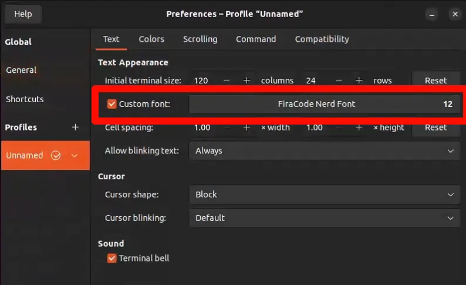

# 常用命令汇总

!!! note "前言"
    任何人都可以完善这一篇博文。

由于不想一直 gpt 询问或者搜索一些很基础的命令，所以这里总结一下。

## 基础编译套餐

```bash
sudo apt install -y build-essential clang cmake make git curl wget unzip zip
sudo apt install -y vim tree htop tmux

# git lfs
curl -s https://packagecloud.io/install/repositories/github/git-lfs/script.deb.sh | sudo bash
sudo apt-get install git-lfs
git lfs install
```

## 开启 ssh service

```bash
sudo systemctl enable ssh
sudo systemctl start ssh
sudo systemctl status ssh #查看状态
```

## miniconda

以下命令不需要加上`sudo`，因为我们需要将 conda 安装在用户目录下。

```bash
x86_64：
wget https://repo.anaconda.com/miniconda/Miniconda3-latest-Linux-x86_64.sh
chmod +x Miniconda3-latest-Linux-x86_64.sh
./Miniconda3-latest-Linux-x86_64.sh  # not sudo
接着一路ENTER...
```

`arrch64`例如树莓派 Jetson 系列：

```bash
arrch_64:
wget https://repo.anaconda.com/miniconda/Miniconda3-latest-Linux-aarch64.sh
chmod 776 Miniconda3-latest-Linux-aarch64.sh
./Miniconda3-latest-Linux-aarch64.sh
# 取消开机自启动
conda config --set auto_activate_base false
```

换源：

```bash
vim ~/.condarc
```

在里面粘贴中科大镜像源：

```bash
channels:
  - defaults
show_channel_urls: true
default_channels:
  - https://mirrors.ustc.edu.cn/anaconda/pkgs/main
  - https://mirrors.ustc.edu.cn/anaconda/pkgs/r
  - https://mirrors.ustc.edu.cn/anaconda/pkgs/msys2
custom_channels:
  conda-forge: https://mirrors.ustc.edu.cn/anaconda/cloud
  msys2: https://mirrors.ustc.edu.cn/anaconda/cloud
  bioconda: https://mirrors.ustc.edu.cn/anaconda/cloud
  menpo: https://mirrors.ustc.edu.cn/anaconda/cloud
  pytorch: https://mirrors.ustc.edu.cn/anaconda/cloud
  simpleitk: https://mirrors.ustc.edu.cn/anaconda/cloud
```

## zsh 或者 oh-my-zsh

```bash
sudo apt update
sudo apt install zsh
sh -c "$(curl -fsSL https://raw.github.com/ohmyzsh/ohmyzsh/master/tools/install.sh)"
```

为了兼容主题，接下来安装字体:

```zsh
wget https://github.com/ryanoasis/nerd-fonts/releases/download/v3.3.0/JetBrainsMono.zip -O JetBrainsMono.zip
unzip JetBrainsMono.zip -d JetBrainsMono
mkdir -p ~/.local/share/fonts/JetBrainsMono
cp JetBrainsMono/*.ttf ~/.local/share/fonts/JetBrainsMono/
fc-cache -fv
```

安装完插件之后就可以修改命令行中的字体选项了，找到安装的字体并设定。

安装插件：

```zsh
git clone https://github.com/zsh-users/zsh-autosuggestions ${ZSH_CUSTOM:-~/.oh-my-zsh/custom}/plugins/zsh-autosuggestions
git clone https://github.com/zsh-users/zsh-syntax-highlighting.git ${ZSH_CUSTOM:-~/.oh-my-zsh/custom}/plugins/zsh-syntax-highlighting
git clone --depth=1 https://github.com/romkatv/powerlevel10k.git ${ZSH_CUSTOM:-$HOME/.oh-my-zsh/custom}/themes/powerlevel10k
```

修改配置文件：

```zsh
ZSH_THEME="powerlevel10k/powerlevel10k"
plugins=(z git zsh-autosuggestions zsh-syntax-highlighting)
```

## git

要修改全局的 Git 用户名和邮箱，可以使用以下命令：

```bash
git config --global user.name "新的用户名"
git config --global user.email "新的邮箱地址"
```

## Neovim

[安装 lazyvim](../lazyvim/index.md)

## docx 阅读器

```bash
sudo apt update
sudo apt-get install libreoffice # 安装 libreoffice 基础包
sudo apt install libreoffice-writer
libreoffice yourfile.docx  # 打开文件
```

## 鱼香 ros 一键安装脚本

```bash
wget http://fishros.com/install -O fishros && . fishros
```

# git lfs 安装

```bash
curl -s https://packagecloud.io/install/repositories/github/git-lfs/script.deb.sh | sudo bash
sudo apt-get install git-lfs
git lfs install
git lfs track "dev/rtd/models/*.trt"  # 添加示例文件
git add .gitattributes
```

## Google chrome 安装

```bash
wget https://dl.google.com/linux/direct/google-chrome-stable_current_amd64.deb
sudo apt install ./google-chrome-stable_current_amd64.deb
# 或者 sudo dpkg -i google-chrome-stable_current_amd64.deb
```

## kill 脚本

下面是一个强制 kill 某个进程的脚本，用于替代`ps aux | grep xxx | kill -9 <PID>`的繁琐操作，您可以将他保存起来。

```bash
#!/bin/bash
# Usage: ./kill.sh <pattern>

if [ $# -ne 1 ]; then
echo "Usage: $0 <pattern>"
exit 1
fi

PATTERN="$1"

# 以下命令列出所有进程，过滤出包含 PATTERN 的行，排除 grep 本身和本脚本，然后取 PID 列并 kill -9
ps aux | grep -F "$PATTERN" | grep -v grep | grep -v "$0" | awk '{ print $2 }' | while read PID; do
if [ -n "$PID" ]; then
echo "Killing PID: $PID (matching "$PATTERN")"
kill -9 "$PID"
fi
done
```

如上所述,该脚本的用法是`./kill.sh <name>`。
