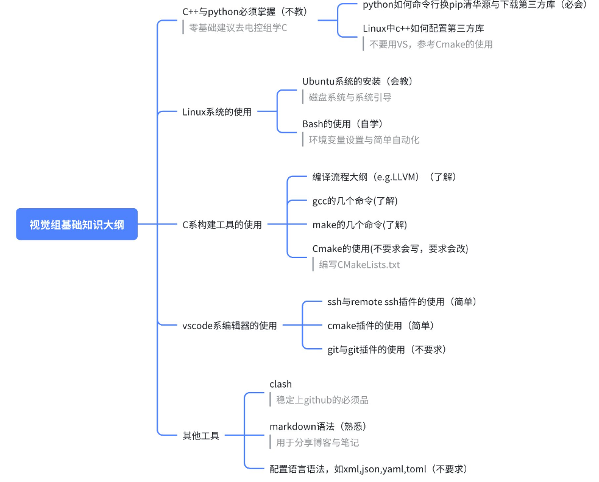

# 你好！

欢迎来到教学文档集合！这个集合是一个以“视觉/视觉组”为主题的 MkDocs 博客子栏目，存放了与 Robocon 视觉开发、环境配置及远程工作流相关的基础教程与资源。

!!! green "提示"
    本站的文档只能帮助您快速地速览相关工具的基础用法，并且有些许纰漏。

    如果您想详细学习，建议您参考相关工具的官方文档，官方文档和源代码永远是最权威的。

!!! warning "注意"
    以下内容为2024-2025年XJTURC的相关文档。有一些文档需要使用校园网访问RC服务器进行下载。

## Linux 入门

### 入门书：

首推 **《鸟哥的Linux私房菜》** 讲述的是CentOS7的系统。[[电子书网址]](https://wizardforcel.gitbooks.io/vbird-linux-basic-4e/content/15.html)，这本书从“什么是电脑”讲起，通俗易懂适合小白，其中视觉需用到的有：

  - 0-2章：计算机入门
  - 5-7章：Linux系统核心(kernel)功能
  - 11,12,(13),14章：操作Linux的各个工具：Bash与vim
  - （拓展）16,17章：程序与服务
  - 21章：软件安装与部署
  - （拓展）23章：X Windows图形系统
  - （不太可能会用到）24章：Linux核心的编译

### `Ubuntu` 的双系统安装：

所有的软件都是运行在操作系统的管理之下。选择 `Ubuntu` 作为系统是因为它是持续更新的系统，并且用户量比较大，社区支持比较好，教育通用，`debian` 系。

参考安装文档：**《Ubuntu双系统安装教程》**[[pdf下载地址]](https://115.154.129.4:5200/files/api/public/dl/J1gGccUv/public/Share/links/Ubuntu%E5%AE%89%E8%A3%85%E6%95%99%E7%A8%8B.pdf)

!!! blue-tip "潘羽涵"
    如果有安装在外置硬盘上的安装需求，可以参考：**《Ubuntu安装教程——磁盘分区设置》** [[pdf下载地址]](https://115.154.129.4:5200/files/api/public/dl/dJ32ey2v/public/Share/links/Ubuntu%E5%AE%89%E8%A3%85%E6%95%99%E7%A8%8B%E2%80%94%E2%80%94%E7%A3%81%E7%9B%98%E5%88%86%E5%8C%BA%E8%AE%BE%E7%BD%AE.pdf) 就是写的有点抽象（我写的），并且需要注意，有的电脑的UEFI/BIOS有特殊的地方：对于一个物理硬盘，只识别第一个ESP(EFI)分区，不识别后面的分区，那么就需要在安装完系统后，保证EFI分区在第一个，如果ventoy抢占了第一个，需要在windows中将ventoy分区格式化掉。此时不可以按照文章中提到的“小技巧”进行操作，而是需要反向操作，将ventoy装在后面，并且会有额外的好处：可以和后面的逻辑分区合并成一个更大的分区作为u盘使用。（该段话是否有表述不当？误会点？）

在安装Ubnutu系统时，我们可能会遇到一系列问题致使我们要重新安装Ubuntu系统，所以找了以下博客提供重新装系统时的一些帮助。[电脑双系统完美卸载Ubuntu_双系统卸载ubuntu-CSDN博客](https://blog.csdn.net/m0_37548216/article/details/123376311?sharetype=blog&shareId=123376311&sharerefer=APP&sharesource=2501_90812940)

《鸟哥的Linux私房菜》 有所涉及，但是安装的系统是比较老的`CentOS`

### Bash 学习：

`Bash` 是 `Ubuntu 桌面版` 的原生终端，`Linux` 里面的所有非基本的操作往往只能依赖于终端完成。

-  **《阮一峰的Bash教程》**——[bookstack电子书网址](https://www.bookstack.cn/read/bash-tutorial/docs-intro.md)

## About C++ Development

追求高效率以及合适的抽象层次，以及简单有利于初学者学习的特性，C++是一门广泛用于开发完整应用程序的语言，我们主要使用C++中的面向对象设计方法，辅以其他设计模式，加上C++11标准后添加的一些新的语法糖写出漂亮的代码。

除此之外，我们还会借助到中第三方编写的C++ 开源library进行工作，这大大拓展了我们的能力。

### 语法基础学习

- C语言基础：浙江大学翁恺教授的bilibili视频，MOOC等资料
- C++学习：
  - B站上：黑马程序员，翁恺老师
  - 《Essential C++》 C++ 特性的最小集合
  - 侯捷老师的视频
- C++写程序的额外注意点：[pdf book:《Effective C++》](https://115.154.129.4:5200/files/api/public/dl/c1IHQFQa/public/Share/links/C%2B%2B/Effective%20C%2B%2B%20%E4%B8%AD%E6%96%87%E7%AC%AC%E4%B8%89%E7%89%88.pdf)
- C++11新特性的小汇总：[pdf book:《morden C++》](https://115.154.129.4:5200/files/api/public/dl/zz4zJABW/public/Share/links/C%2B%2B/morden%20C%2B%2B%20%E6%95%99%E7%A8%8B%20%E4%B8%AD%E6%96%87%E7%89%88.pdf)

### 初等算法自学

《数据结构与算法》课程的参考资料。

### 编译过程的理解

- 知乎等其他网站，还没有找到更加深入浅出的资料 TODO

这里举一个例子：[一个例子](https://zhuanlan.zhihu.com/p/612556530)

### 构建工具学习

借助Cmake来进行C++的多单元编译，网上关于cmake的教程有很多，但是cmake版本更新比较快，一些以前的常用做法现在已经不推荐了。这里只推荐一个教程，比较新且详细

- **《Cmake CookBook 中文版》**——[bookstack电子书网址](https://www.bookstack.cn/books/CMake-Cookbook)

### 项目规范

- 一个cmake项目的“标准”结构——[github repository](https://github.com/kigster/cmake-project-template)
- C++编码规范：google编码规范——[线上文档网址](https://zh-google-styleguide.readthedocs.io/en/latest/google-cpp-styleguide/headers.html)
- commit message 规范
- Pull Request 规范——[图文并茂的开源教程](https://zhuanlan.zhihu.com/p/584834288)和[开源规范](https://github.com/TaleLin/lin-ui/wiki/Pull-Request-%E8%A7%84%E8%8C%83)

## 其他工具

### VSCode 介绍

你需要安装的插件有:

- CMake Tools
- C/C++ Extension Pack
- clangd
- CMake
- Git Graph
- Remote SSH
- Dev Containers
- Tabnine
- GitHub Copilot

### git学习与使用

**《git菜单(git-receipe)》**——[gitbook网址](https://selierlin.github.io/git-recipes/#/)

### 其他工具

- blog: ssh与remotessh插件的使用
- Cmake插件的使用
- git与git graph插件的使用

!!! quote "提示"
    这是一个引用框，用来做信息/通知类提示。
!!! success "成功"
    这是一个成功提示框，意思是人类你赢了。
!!! bug "错误"
    这是一个错误提示框，意思是你的操作错误。
!!! danger "危险"
    这是一个危险提示框，意思是操作迷人的最危险。
