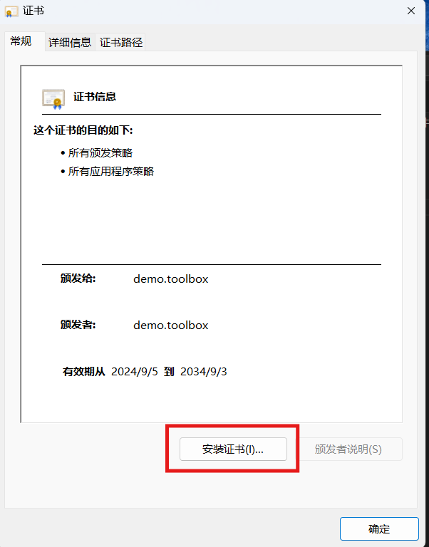
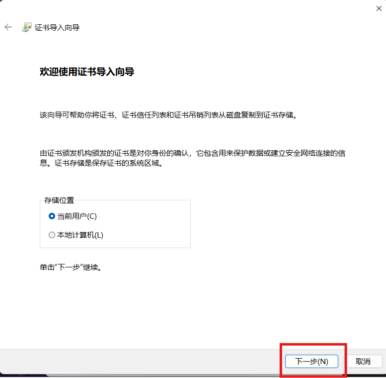
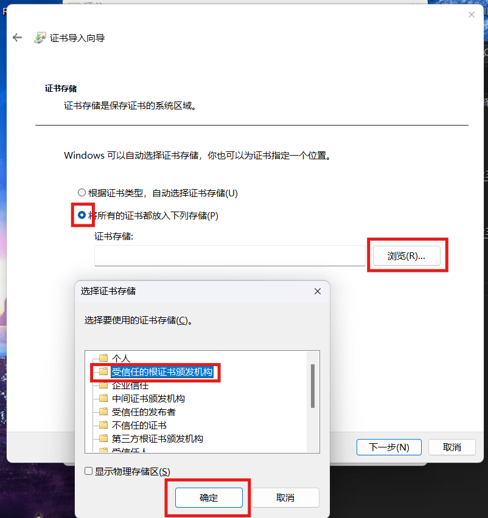
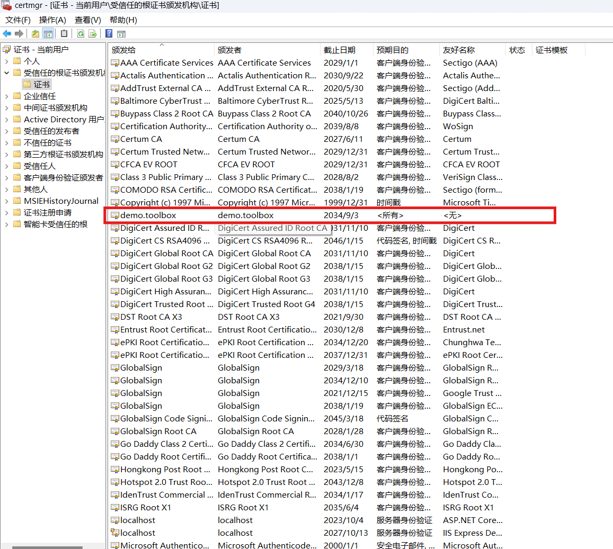

# 安装队内服务器证书

ca.crt 是服务器证书链的一部分，通常是 CA (Certificate Authority) 证书文件，扩展名为 .crt，用于验证 SSL/TLS 连接中的通信安全性。在 SSL/TLS 通信中，CA 证书用于证明服务器或客户端的身份，确保数据传输的加密和完整性。ca.crt 文件是用来验证服务器证书（例如 server.crt）的真实性和合法性的。

ca.crt的作用是：

-服务器身份验证：客户端（例如浏览器或 API 客户端）使用 ca.crt 来验证服务器证书是否由一个受信任的 CA 颁发。如果服务器证书是由一个不受信任的 CA 颁发的，客户端将发出警告或拒绝连接。

- 建立加密连接：在建立 SSL/TLS 连接时，ca.crt 用来验证与服务器建立安全通信的信任链，确保连接的机密性和完整性。

- 信任链：在 SSL/TLS 连接中，服务器证书通常会与一个或多个中间证书一起发送给客户端，ca.crt 就是包含这些证书的根证书或中间证书之一，确保客户端能够追溯到一个信任的 CA。

## Windows
双击下载好的 ca.crt 文件。

选择 "当前用户" ，然后选择 "下一步"。


选择证书存储位置，之后点击完成。


### 后续
win+R打开运行：输入certlm.msc，点击下方的确定按钮。
在程序“管理用户证书”中可以删除它。

点击选中并删除。

## Linux

```bash
sudo cp ${证书的绝对路径} /usr/local/share/ca-certificates/
update-ca-certificates
```

在弹出的窗口中选择新加入的证书，并且确认。

