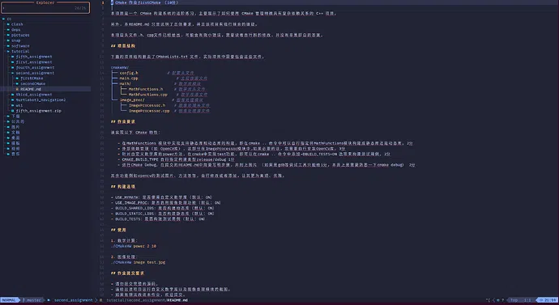

# LazyVim 安装
Neovim 是经典编辑器 Vim 的现代分支，以其强大的功能和灵活性赢得了广大开发者的青睐。LazyVim 是一个基于 Neovim 构建的插件管理和配置框架。通过模块化的设计理念，LazyVim 允许用户轻松地添加、移除或自定义各种插件，同时保持整个配置文件结构清晰简洁。



## 安装Neovim
```bash
wget https://github.com/neovim/neovim/releases/download/stable/nvim-linux-x86_64.tar.gz
tar -xzvf nvim-linux-x86_64.tar.gz
rm -rf nvim-linux-x86_64.tar.gz
cd /usr/local/bin
ln -s ~/<your_nvim_path>/bin/nvim  nvim
``` 
## 安装lazyvim

```bash
git clone https://github.com/LazyVim/starter ~/.config/nvim
rm -rf ~/.config/nvim/.git
```

### 解决图标乱码

到nerd网站中下载：https://www.nerdfonts.com/font-downloads，下面以选择`0xProto Nerd`字体。

```bash
# 进入下载目录（根据你的实际情况调整）
cd ~/Downloads
# 解压 .zip 文件 (实操下来应该是0xProto.zip压缩包，需要先解压拿到.ttf文件)
unzip "字体包名.zip"
cd <您解压后.ttf文件所在的文件夹路径>
# 把.ttf移动到系统级的fonts里面 实操发现如果选择用户级的fonts 后面终端设置字体时找不到我们下载的字体 不过还是贴出命令供您选择(二选一哦！)
用户级操作：mkdir -p ~/.local/share/fonts
          mv *.ttf ~/.local/share/fonts/
系统级操作：sudo mv *.ttf /usr/local/share/fonts/
# 加载字体
fc-list
fc-cache -fv
```

接下来在终端中设置字体：

- 打开 GNOME Terminal 的设置。你可以点击右上角的菜单图标 (☰)，然后选择 "Preferences" (首选项)。

- 选择配置文件。在弹出的窗口左侧，你会看到一个列表，通常包括一个名为 "Unnamed" 或 "Profile 1" 的配置文件。点击它。

- 找到字体设置。在右侧的面板中，向下滚动，直到找到 "Text Appearance" (文本外观) 部分。

- 更改字体。你会看到一个带有复选框的选项 "Custom font" (自定义字体)。

- 勾选 "Custom font" 复选框。

- 此时，复选框旁边的字体名称会变为可点击的按钮。点击这个按钮。

- 在弹出的字体选择器中，搜索并选择你刚刚安装的 Nerd Font，比如 "0xProto Nerd Font Mono"。你也可以在这里调整字体大小。

接着按照[lazyvim config](https://www.lazyvim.org/configuration#icons--colorscheme)，对`lua/plugins/core.lua`进行修改。


