# Roboflow数据集标注概览
!!! tip "提示"
    本文只是roboflow中很小的、会用的到的一部分小指南。

什么是Roboflow？ 它是一个面向计算机视觉开发者的一站式平台，提供数据集管理、标注、增强、格式转换、模型训练和部署等全流程服务，帮助用户快速从原始图像构建并部署目标检测、分类、分割等视觉模型，无需繁琐的本地环境配置。

首先，登录https://app.roboflow.com/，注册账号，在新手教程完 ~~甚至不需要新手教程~~，打开projects，你可以自己创建数据集标注项目，或者加入别人的工作项目。
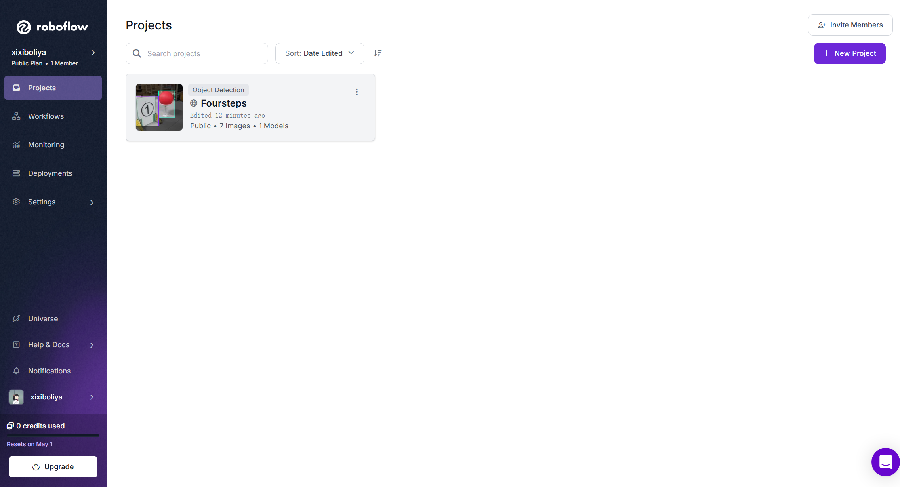
右上角创建项目，填写project name 和Annotation Group ，Annotation Group的意思是填写你正在标注的东西，你可以在project type中选择创建对应类型的项目：
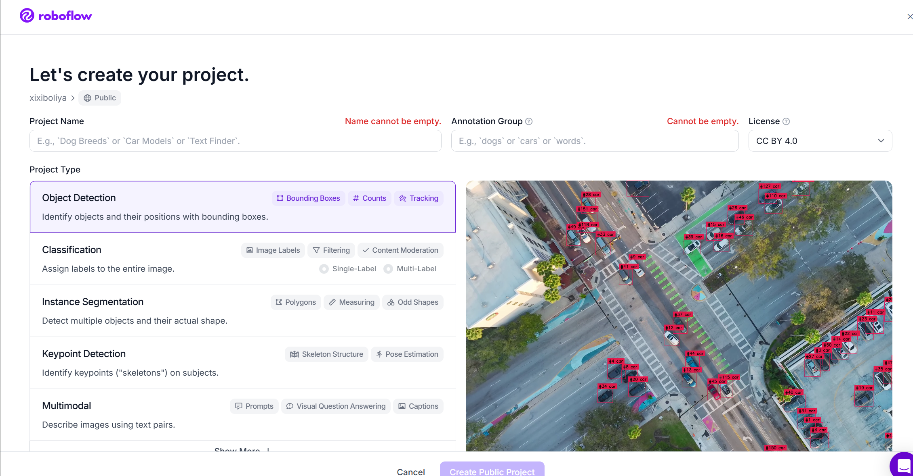
上传你的数据集，可以选择图片或者视频，上传视频的话会让你选择每一秒有几帧作为采样图片：
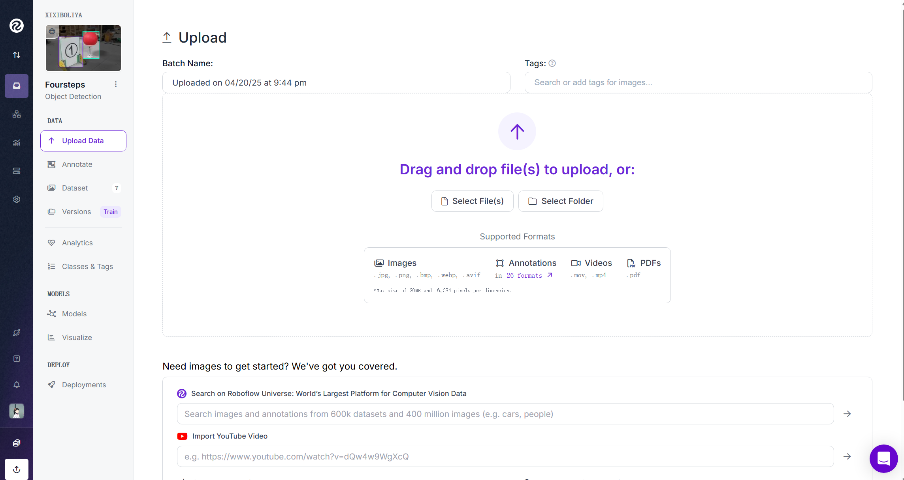

上传完之后，你可以在annotate看到对应数据集的状态，下图可以参考：

接下来，选择机器标注还是人工标注。下面分两个标题讲述。
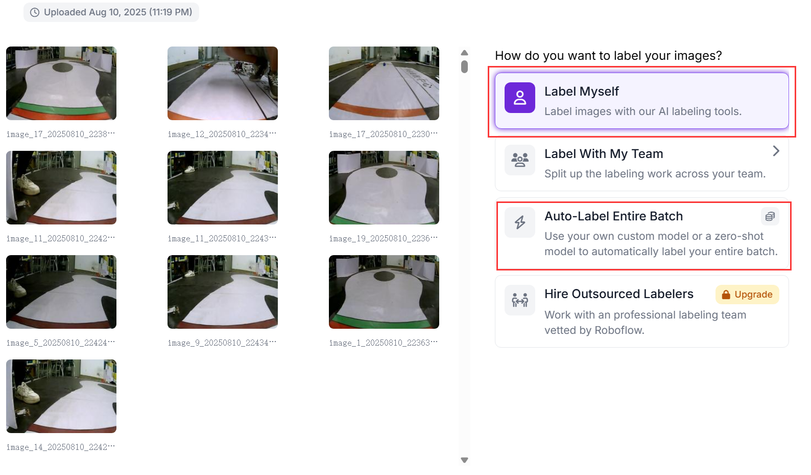
# 机器标注
这种情况下使用机器标注，每一百张将耗费1credit，普通用户每个月有30credits。

如下图所示，您可以添加不同的类名，并且给AI labeler一句话的描述：
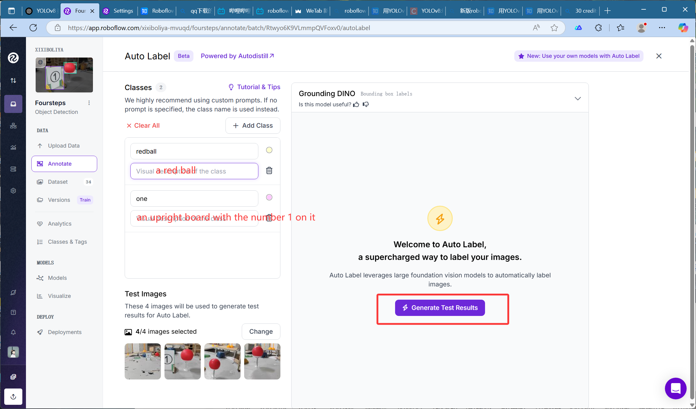

AI labeler会给你标注的预览图，效果不错的话可以直接开始让机器自动标注，标注完成之后最好自己一个一个地review过去。
# 人工标注
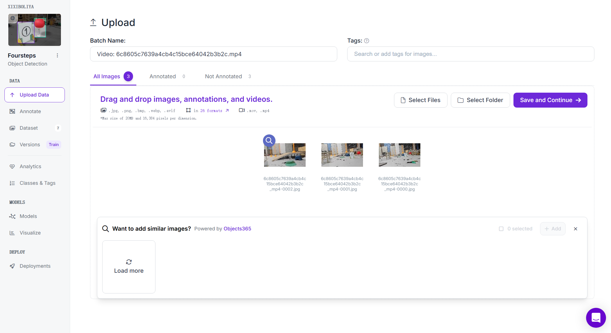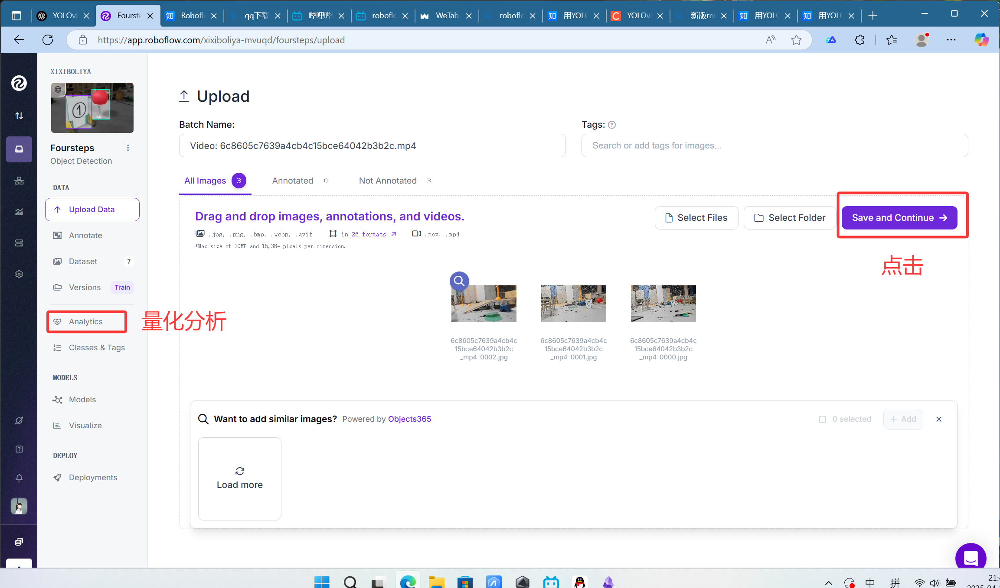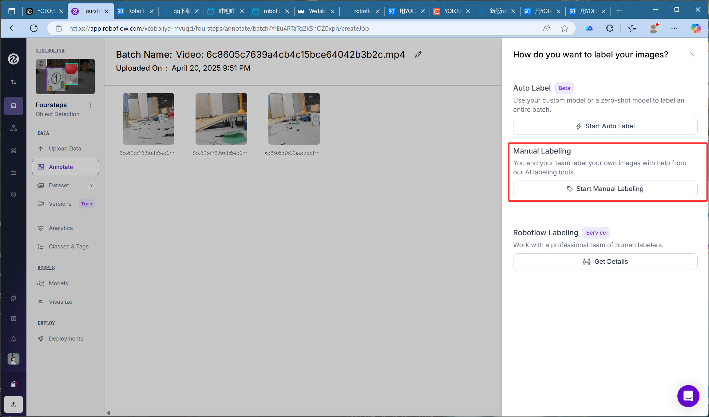
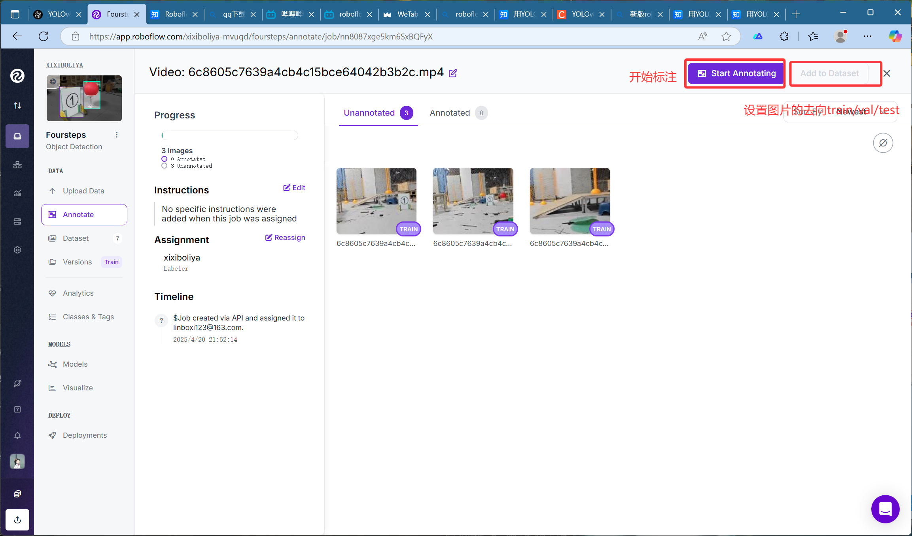

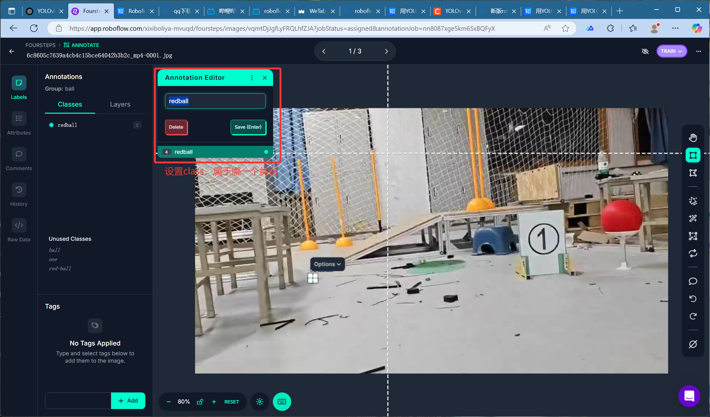
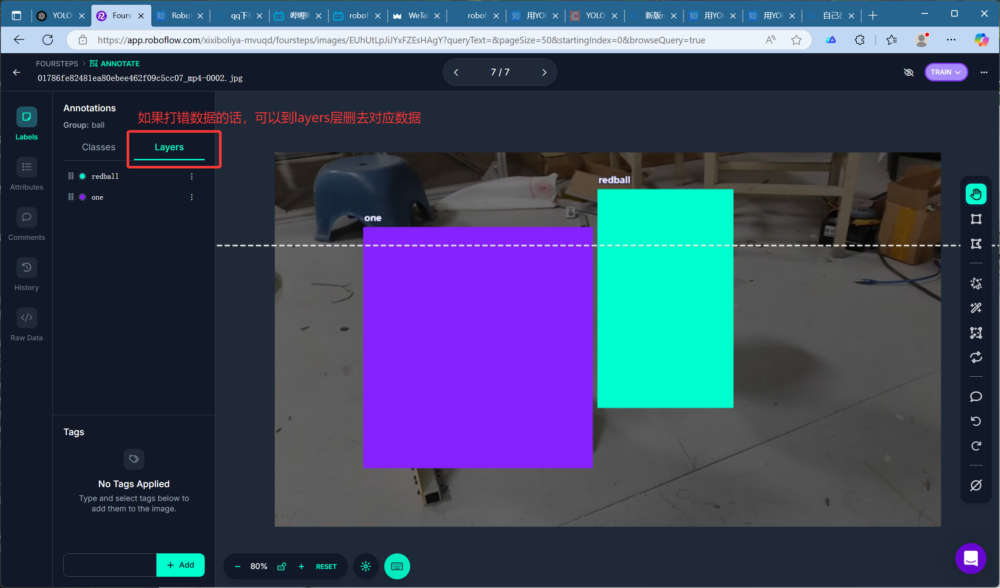
# 导出数据集
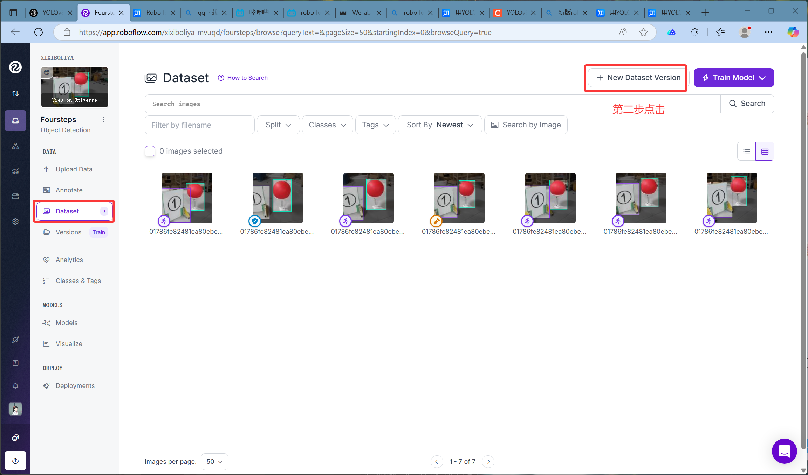
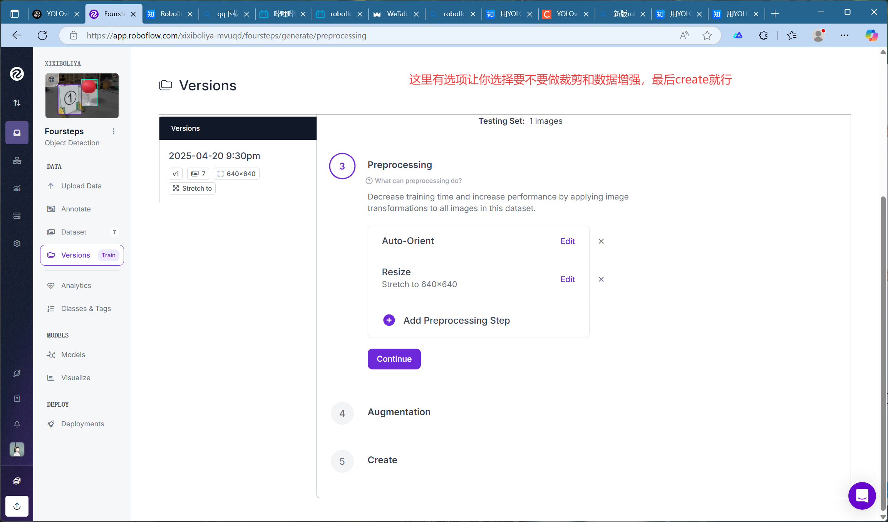
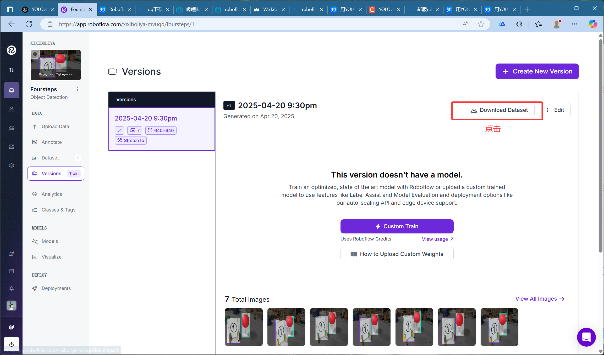
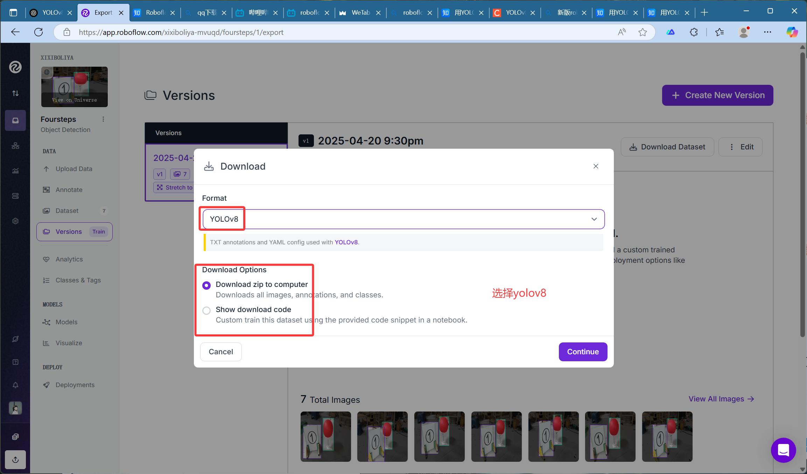
最后复制链接粘贴到浏览器中即可下载。
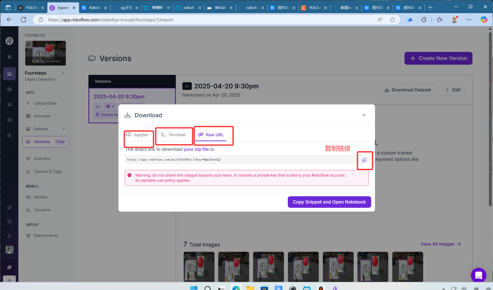