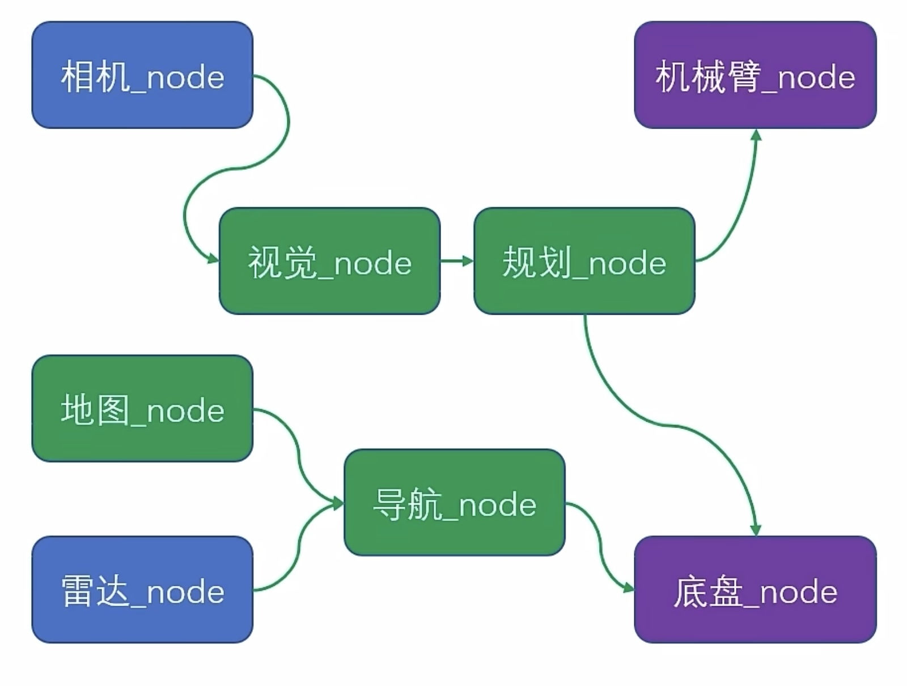
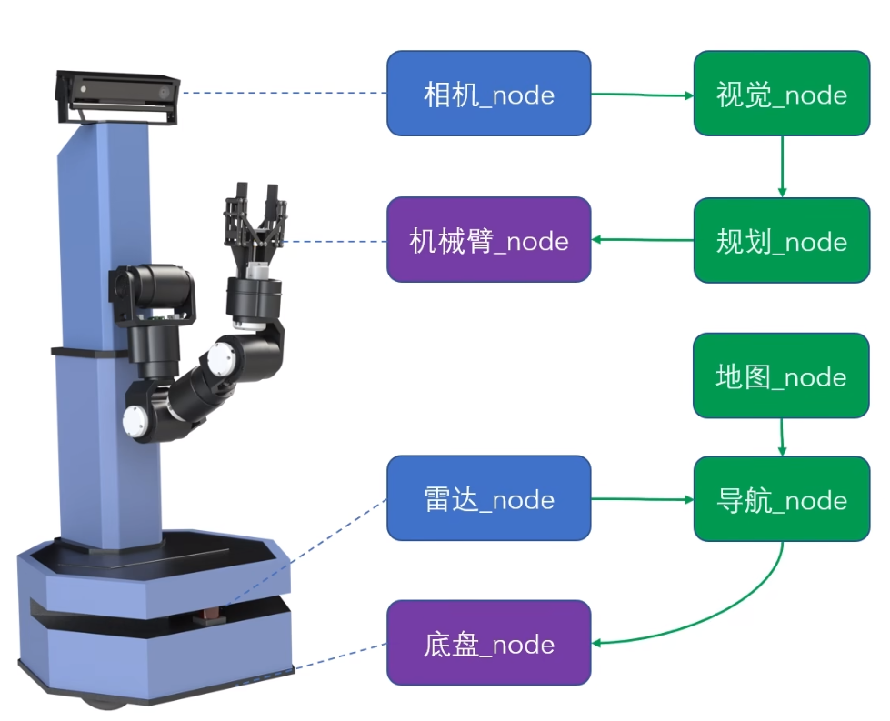
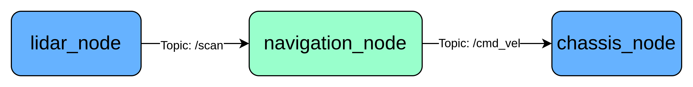
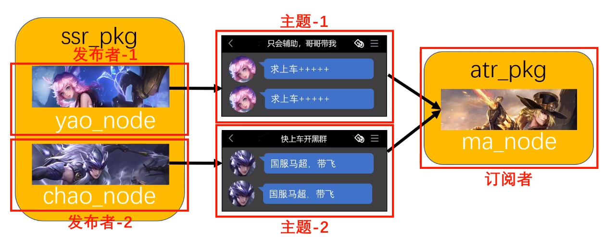
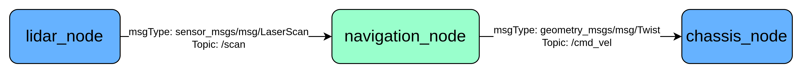
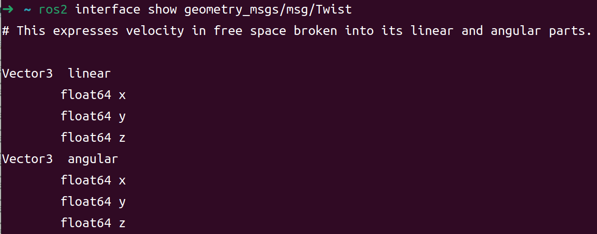
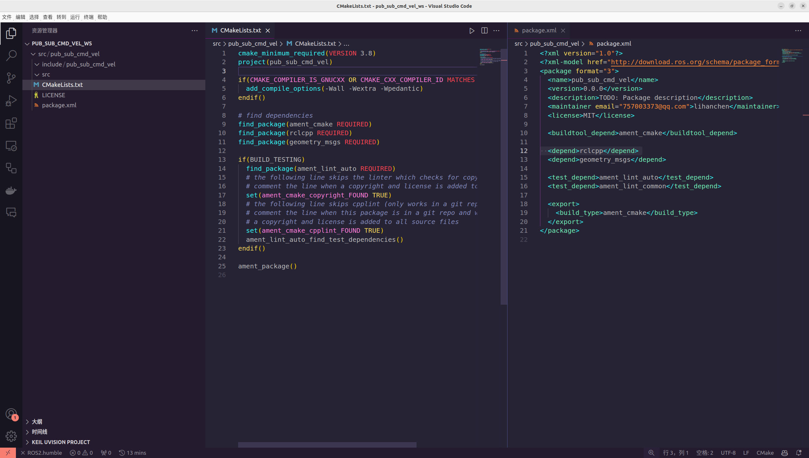

# ROS2 编程基础

!!! info
    ROS2内容之广，并非一篇教程能够覆盖所有内容，因此仅列出一些有用的入口以便参考、学习,并且配有了基本的概念解读。

# 学习教程
- [鱼香动手学ROS2](https://fishros.com/d2lros2/#/)，它的配套源码：[GitHub链接](https://github.com/fishros/ros2bookcode)，[Gitee链接](https://gitee.com/ohhuo/ros2bookcode)
- [小鱼ROS2 bilibili](https://www.bilibili.com/video/BV1GW42197Ck?spm_id_from=333.788.videopod.sections&vd_source=7bd9495d31281f143b7b2db3418d2f17)
- [小鱼ROS2 视频源代码](https://github.com/fishros/ros2bookcode)

# 节点 Node 和软件包 Package
## Node

一个 节点（node） 是 ROS 2 图中的参与者，它使用客户端库与其他节点进行通信。节点之间可以在同一进程内通信，也可以在不同进程，甚至在不同机器之间通信。节点通常是 ROS 图中的计算单元；每个节点应当完成一个逻辑功能。

节点可以通过向命名的话题（topic）发布数据来向其他节点传递信息，或者订阅命名的话题以从其他节点获取数据。它们还可以作为 服务客户端（service client），请求其他节点代为执行某些计算；或者作为 服务端（service server），为其他节点提供功能。对于需要长时间运行的计算，节点可以作为 动作客户端（action client），让其他节点代为执行；或者作为 动作服务端（action server），为其他节点提供长时功能。节点还可以提供可配置的 参数（parameter），以便在运行时调整其行为。

节点通常是 发布者、订阅者、服务端、服务客户端、动作服务端、动作客户端 的复杂组合，往往同时扮演多种角色。

节点之间的连接是通过 分布式发现机制 建立的。

上述解释来源于官方文档：[Node](https://docs.ros.org/en/humble/Concepts/Basic/About-Nodes.html#nodes)

ROS 和手机又很多相似之处，手机中的 APP 等同于 ROS 中的 Node。

## Package
虽然 ROS 程序的基础单元是节点，但我们并不能像手机安装 app 一样只安装单个节点，而是以 Package 为单位进行安装


ROS 采用的模块化的设计理念，强调功能的相互独立，所以造成单个节点的功能比较单一，要想实现一个完整的任务，通常需要几个节点的配合才能完成。


[bilibili Node节点与package包](https://www.bilibili.com/video/BV1MW4y1B7CF/)

**ROS package的框架，编程层面**:


# 话题 Topic 和消息 Message
## Topic->"频道"


`ros2 run <your-package>`之后，在终端输入rqt，你会看到类似下图的graph：


- 一个 ROS 节点网络中，可以存在多个话题
- 一个话题可以有多个发布者，也可以有多个订阅者
- 一个节点可以对多个话题进行订阅，也可以发布多个话题
- 不同的传感器消息通常会拥有各自独立话题名称，每个话题只有一个发布者
- 机器人速度指令话题通常会有多个发布者，但同一时间只能有一个发言人


# Message->"语言"
消息的作用是携带数据，从 Publisher 流动到 Subscriber。但不同数据的类型和容量都不一样，因此就需要提前指定数据类型进行传输


使用语言有两种方式:

- 使用别人以及定义好的通用 Message Type，例如：std_msgs/msg/String
- 欸，别人的都不太好用，我要自己独创一门方言 Message Type，专业点叫“自定义消息类型”
通用的 Message Type 也就是已经被 release 到 [ROS2 官方消息类型列表](https://index.ros.org/?search_packages=true) 的各种 ​​​​*_msg​​​​。也可以使用以下命令查看已经安装到本机的 Message Type:
```bash
ros2 interface show <type>
```


实际开发中也会遇到的,自定义消息类型参考文档:[Custom-ROS2-Interfaces](https://docs.ros.org/en/humble/Tutorials/Beginner-Client-Libraries/Custom-ROS2-Interfaces.html)

# 第一个Node
- [创建一个 ROS 2 包](https://docs.ros.org/en/humble/How-To-Guides/Developing-a-ROS-2-Package.html)
- [编写一个简单的 C++ 发布者和订阅者](https://docs.ros.org/en/humble/Tutorials/Beginner-Client-Libraries/Writing-A-Simple-Cpp-Publisher-And-Subscriber.html)

创建一个workspace:
```bash
mkdir -p ~/<your-ros-learning-folder>/ws
```
创建 src 文件夹并进入:

```bash
mkdir -p ~/<your-ros-learning-folder>/ws/src
cd ~/<your-ros-learning-folder>/ws/src   # 外层文件夹叫什么无所谓，但要保证当前你所在的是 src 文件夹
```
创建一个 Node，首先要创建一个 Package。


```bash
ros2 pkg create pub_sub_cmd_vel --license MIT --build-type ament_cmake --dependencies rclcpp geometry_msgs tf2_ros tf2_geometry_msgs
```

然后需要在/src 文件夹下创建源`pub_sub_cmd_vel.cpp`文件，这里您尝试引入头文件会发现 VSCode 并不能智能补全，找不到路径，于是您需要修改`CMakeLists.txt`文件，添加如下内容，具体在哪里添加、怎么添加，请自行GPT。:
```cmake
add_executable(pub_sub_cmd_vel src/pub_sub_cmd_vel.cpp)
ament_target_dependencies(pub_sub_cmd_vel rclcpp geometry_msgs tf2_ros tf2_geometry_msgs)
```
修改好之后，再次编译：
```bash
colcon build --symlink-install --cmake-args -DCMAKE_EXPORT_COMPILE_COMMANDS=ON
```
## 代码
```pub_sub_cmd_vel.cpp
#include <geometry_msgs/msg/twist.hpp>
#include <rclcpp/rclcpp.hpp>

class VelocityPublisher : public rclcpp::Node
{
public:
  VelocityPublisher() : Node("velocity_publisher")
  {
    // 创建一个发布器，发布 geometry_msgs::msg::Twist 类型的消息到 cmd_vel 话题
    publisher_ = this->create_publisher<geometry_msgs::msg::Twist>("cmd_vel", 10);

    // 创建一个定时器，每隔 1000 毫秒调用一次 publish_velocity() 函数
    timer_ = this->create_wall_timer(
      std::chrono::milliseconds(1000), std::bind(&VelocityPublisher::publish_velocity, this));
  }

private:
  void publish_velocity()
  {
    // 创建并初始化 Twist 消息
    auto message = geometry_msgs::msg::Twist();
    message.linear.x = velocity_.linear.x;
    message.angular.z = velocity_.angular.z;

    // 打印并发布消息
    RCLCPP_INFO(
      this->get_logger(), "Publishing: linear.x: '%f', angular.z: '%f'", message.linear.x,
      message.angular.z);
    publisher_->publish(message);

    // 更新线速度和角速度
    update_velocity();
  }

  void update_velocity()
  {
    // 更新线速度和角速度
    velocity_.linear.x += 0.2;
    velocity_.angular.z += 0.2;

    // 如果速度超过1，则重置为-1
    if (velocity_.linear.x > 1.0) {
      velocity_.linear.x = -1.0;
    }
    if (velocity_.angular.z > 1.0) {
      velocity_.angular.z = -1.0;
    }
  }

  // 发布器，用于发布 Twist 消息
  rclcpp::Publisher<geometry_msgs::msg::Twist>::SharedPtr publisher_;

  // 定时器，用于定时调用 publish_velocity() 函数
  rclcpp::TimerBase::SharedPtr timer_;

  // 速度
  geometry_msgs::msg::Twist velocity_;
};

int main(int argc, char * argv[])
{
  // initializes ROS 2
  rclcpp::init(argc, argv);

  // Starts processing data from the node, including callbacks from the timer
  rclcpp::spin(std::make_shared<VelocityPublisher>());

  rclcpp::shutdown();
  return 0;
}
```

CMakeLists.txt
```cmake
cmake_minimum_required(VERSION 3.8)
project(pub_sub_cmd_vel)

if(CMAKE_COMPILER_IS_GNUCXX OR CMAKE_CXX_COMPILER_ID MATCHES "Clang")
  add_compile_options(-Wall -Wextra -Wpedantic)
endif()

# find dependencies
find_package(ament_cmake REQUIRED)
find_package(rclcpp REQUIRED)
find_package(geometry_msgs REQUIRED)

add_executable(pub_cmd_vel src/pub_cmd_vel.cpp)  # 这里的文件夹名称需要修该
ament_target_dependencies(pub_cmd_vel rclcpp geometry_msgs)

if(BUILD_TESTING)
  find_package(ament_lint_auto REQUIRED)
  set(ament_cmake_copyright_FOUND TRUE)
  set(ament_cmake_cpplint_FOUND TRUE)
  ament_lint_auto_find_test_dependencies()
endif()

install(TARGETS
  pub_cmd_vel
  DESTINATION lib/${PROJECT_NAME})

ament_package()
```


除了上述方法之外，也可以模仿 ROS2 官方文档：[Writing-A-Simple-Cpp-Publisher-And-Subscriber](https://docs.ros.org/en/humble/Tutorials/Beginner-Client-Libraries/Writing-A-Simple-Cpp-Publisher-And-Subscriber.html)

# ROS2其他通信机制
- [Services](https://docs.ros.org/en/humble/Tutorials/Beginner-CLI-Tools/Understanding-ROS2-Services/Understanding-ROS2-Services.html)
- [Actions](https://docs.ros.org/en/humble/Tutorials/Beginner-CLI-Tools/Understanding-ROS2-Actions/Understanding-ROS2-Actions.html)
- [Topic Services Actions](https://docs.ros.org/en/humble/How-To-Guides/Topics-Services-Actions.html)

# 参考学习
- [阿杰的ROS视频教程](https://www.bilibili.com/video/BV1BP4y1o7pw/)

推荐这个系列视频的原因在于讲的非常生动有趣，但可惜是 ROS1 的。
ROS1 和 ROS2 在核心概念上是几乎相同的，都有 Node，Topic，Action, Launch...。但 API 几乎被完全更改，使用起来有非常大的不同。
可以看个概念，了解 ROS 中的每个部件是设计用来干什么的。

- [程序的生前死后](https://lapis-router-502.notion.site/6580ab34f0db4b10ab3750b47a403a4b?pvs=23)
- [Evolution of Make](https://lapis-router-502.notion.site/8e652fa1dff047c98d5dd74866923405)

开源工程：

- [rm_vision](https://gitlab.com/rm_vision)
- [Robomaster-oss](https://github.com/robomaster-oss/rmoss_core)