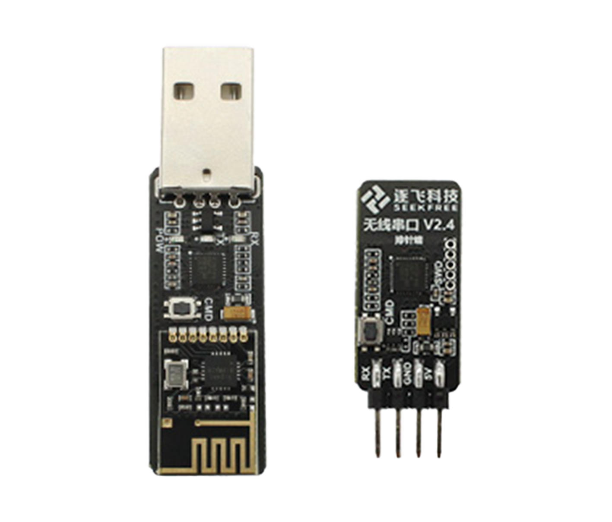

## 逐飞无线串口



### 基础参数

- 产品名称：无线模块套件
- 电源电压：3.3V-5V
- 无线频率：2.4GHz 频段
- 产品接口：无线转串口—双排 2X4P 插针式接口；无线转 USB-USB 接口
- 产品尺寸：无线转串口—32X10MM；无线转 USB-52X12MM
- 波特率范围：9600、57600、115200、230400、460800

逐飞科技无线串口透传模块资料: [产品链接](https://gitee.com/seekfree/Wireless_Uart_Product)

## SocketCAN

!!! blue-warning "这部分笔者也不是很清楚"
购买的时候，有些厂家售卖的 can 是 pcan （/dev/下 ls 发现是 pcan）（驱动与 socketcan 不一样似乎），有一些商家售卖的 CAN 是另一种（/dev/下 ls 发现是 can0），外观几乎没有区别。


### 参考链接

- [CSDN SocketCAN](https://blog.csdn.net/weixin_42350014/article/details/143811349)
- 购买链接:[京东](https://item.m.jd.com/product/10113851950323.html?gx=RnAomTM2PWGTnM5wysIzOhbfEQtJZg&gxd=RnAowWUKOmDcw5ARq9V0DuELZuVnU60&ad_od=share&utm_source=androidapp&utm_medium=appshare&utm_campaign=t_335139774&utm_term=QQfriends_shareid22cbd58844a3c4cd175464197464190079_shangxiang_none)

## Linux 上硬件设备的调试

### 命令： dmesg

demsg 是用于显示 linux 内核日志的命令，由于在插入 usb 或者其他硬件设备时，linux 内核会加载设备驱动，因此通过日志可以找到驱动加载的信息，换言之，如果没有相关日志，那么说明内核中没有对应的驱动，需要自己编译安装驱动。

具体使用

```bash

# 在最后20行查找usb
dmesg | tail -20 | grep -i usb

# 在最后20行查找can
dmesg | tail -20 | grep -i can

```

### 命令： lsusb

> https://zhuanlan.zhihu.com/p/142403866

lsusb 用于展示 usb 设备与属性，使用-v 选项展示详细内容

```bash

lsusb # 简要展示当前连接的所有设备描述
lsusb -v | grep usb # 详细展现设备的日志记录

```

### 设备文件夹 /dev

/dev 目录下的所有文件都是代表设备的文件描述符，被系统识别的设备会以一定规则生成这样的描述符，比如连接 usb-ttl 或者 usb-can 时，会生成一个可读可写的管道描述符，命名会以 `ttyUSB` ， `ttyACM` 或者 `ttyCOM` 开头。

在实际使用中，可以通过向该文件“读”“写”，来做到从硬件设备接受数据与发送数据的作用，比如`ttyUSB0`与`ttyUSB1`是一对连接好的 usb-ttl，向其中一边发送数据，另一端会接受到数据。

```bash
echo "hello world" >> /dev/ttyUSB0
cat /dev/ttyUSB1

```

### can 设备

```
sudo apt install can-utils
sudo ip link set can0 up type can bitrate 500000 # 波特率不一定是500000
sudo ip link set can0 up
sudo candump can0  # 终端进入监听can0模式
```
