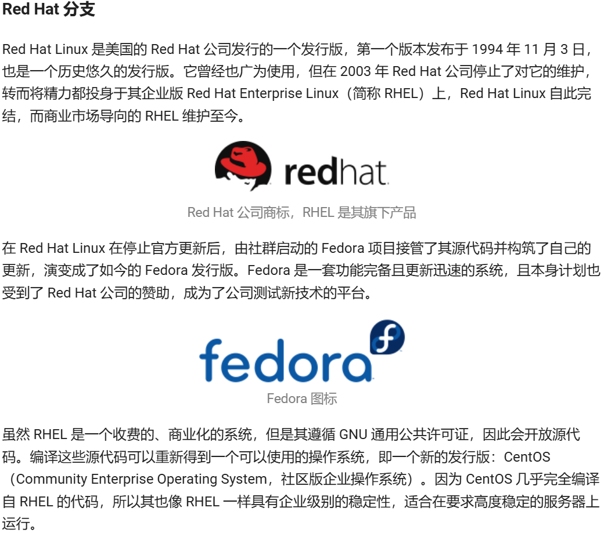
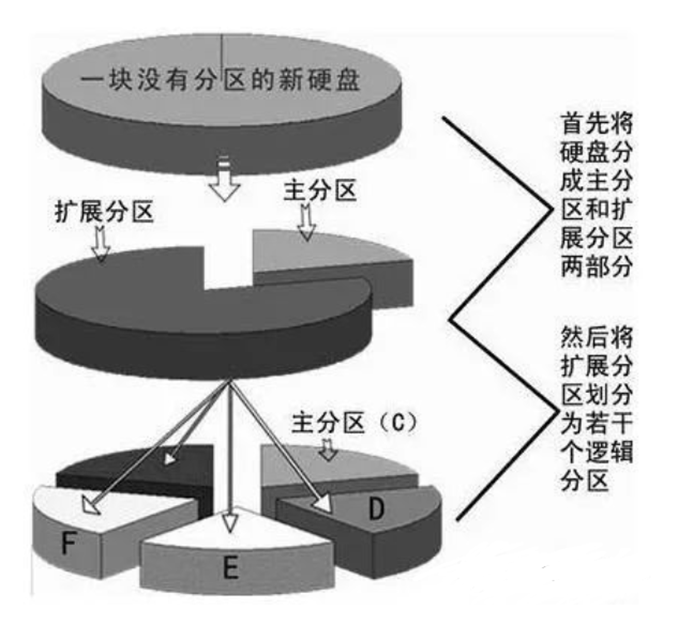
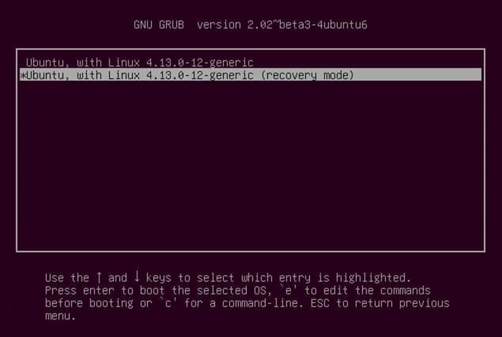

!!! info
    第一次培训的部分讲稿，后半部分并未给出。

# 什么是 Linux

操作系统（OS）位于**计算机体系结构/硬件之上**，位于**应用软件/用户程序之下**；它为上层应用提供统一的抽象与服务，同时管理下层硬件资源。

最早是美国贝尔实验室开发了 UNIX 操作系统，最初用于研究和教学，但随着其商业价值的凸显，贝尔实验室逐步将其闭源化，引起许多用户的不满。

之后是理查德·斯托曼在麻省理工学院发起了 GNU 计划，GNU 是一种类似 UNIX 的 OS，其目标是创建一个自由的操作系统，因此不会包含任何 UNIX 的代码。它的全称是(GNU is Not UNIX).。之后在这个计划中诞生了“GNU 通用公共许可证”，这份许可证把使用该许可的软件的所有权利授予任何使用它的人。

准确意义上的 Linux 代指 linux 内核，它由当时正在大学进修的 Linus Torvalds(林纳斯·托瓦兹)所编写而来，初衷是创建一个不受 MINIX 限制的操作系统内核。MINIX 是一个仅可用于教育但不允许商业用途的类 Unix 的操作系统内核。

回到刚刚的 GNU 计划，虽然其产生出了许多自由开源的组件和软件，但其核心的 GNU 操作系统却至今没有开发完成([初识 Linux - Linux 101](https://101.lug.ustc.edu.cn/Ch01/#linux-origin))。但是开发者们确实已经做了的是将各种组件添加到了 linux 内核之上，这才构建成了一个完整的 Linux 操作系统。

我们可以说 Linux 操作系统从来都不是指哪一种操作系统。取而代之地，为了指代某一个基于 Linux 内核构造出来的操作系统，我们通常都将其称之为“Linux 发行版”。

Debian 分支：是最早的发行版之一。其拥有庞大的用户群体和社区，您可以在社区网站上找到许多报错的解决方式。

## 为什么不使用虚拟机

Ubuntu 中的软件为 Ubuntu 而设计，而并非虚拟机，许多内容在虚拟机上进行配置需要额外的步骤，且网络的资料不多。

虚拟机会要求物理机分配一定的资源给虚拟机，之后其和 Windows 系统会一同运行，本质上是在 windows OS 的基础上再开出一块空间用于虚拟机的运行，并为其分配 CPU 的调度资源、线程，甚至可以访问独立显卡。但是虚拟机，准确而言，其运行时需要额外的虚拟化层开销，这会不可避免地带来性能损失，包括 CPU、内存和 I/O 性能，尤其是在图形和磁盘读写方面。系统则可以让你独占硬件资源，获得原生性能。

## Disk

这个图片上的内容非常古老，但是还是需要介绍一下。其实上来说，传统的磁盘是真就是以这种 CD 片的形式存在的。概念上有磁道 盘片 主轴 读写头这样的概念存在。(逐个介绍) ，柱面的概念。在机械硬盘的时代，为了提高读写效率，使用的是磁头组并行读写，减少寻道时间。

然后，更为现代化一点的是我们当今在使用的硬盘，硬盘读写的基本单位是扇区（通常为 512 字节或 4K）。操作系统和文件系统在此基础上抽象出块（Linux）或簇（Windows）的概念，作为文件存储和管理的最小单位，其大小在格式化时确定。

## MBR

早期的 Linux 为了兼容 PC/Windows 常用的磁盘格式，采用了与 PC BIOS/DOS/Windows 兼容的 **MBR（Master Boot Record）** 分区方案。 MBR 存放在 硬盘的第一个扇区（通常为第 0 扇区，扇区大小通常为 512 字节），并由三部分组成：

1. 启动引导代码（Bootstrap / bootloader）：446 字节，负责早期引导工作；
2. 主分区表（Partition Table）：4 个分区表项，每项 16 字节，总计 64 字节；
3. 签名 / 魔数（Boot signature）：2 字节，固定为 `0x55AA`，用于表明这是有效的 MBR。

因为主分区表只有 4 个表项，所以在 MBR 方案下最多只能直接定义 4 个主分区（primary partitions）。为了解决需要更多分区的场景，引入了 扩展分区（extended partition）的概念：

- 扩展分区 本身在主分区表中占用一个分区表项，充当一个容器或“占位”，它并不是用来直接格式化并作为文件系统挂载的分区。
- 在扩展分区内部，通过一系列的 扩展引导记录（EBR, Extended Boot Record） 以链式方式记录多个 逻辑分区（logical partitions） 的信息。每个逻辑分区有对应的 EBR，EBR 中通常包含指向下一个 EBR 的入口，从而串起多个逻辑分区。
- 传统 MBR 只允许在主分区表中存在 至多一个扩展分区条目（即“只能有一个扩展分区”），但这个扩展分区内可以包含多个逻辑分区。

因而您会看到以下的设备号：`/dev/sda1` ~ `/dev/sda4`：对应主分区表中的 1~4 号分区条目（其中某个可能被用作扩展分区）。 逻辑分区编号从 /dev/sda5 开始（即使你没有使用全部四个主分区条目，逻辑分区仍从 5 开始编号）。例如 `/dev/sda5`、`/dev/sda6` 等是扩展分区内的逻辑分区，才可以被格式化并挂载为文件系统。

## GPT

GPT 是新一代分区表（基于 UEFI 标准），更可靠、支持更大磁盘和更多分区。LBA0 中也有与 MBR 的那个 446Byte 相似的区块，储存了第一阶段的开机管理程序。而在原本 MBR 的分区表的那个记录 4 个主分区的记录区内，对于 GPT 而言，其放入了一个类型为 `0xEE` 的分区条目特殊标志的分区，用来表示这个磁盘为 GPT 格式，不知道 GPT 分区表的管理程序就不会认识这个磁盘，保护了磁盘。

LBA1 存放主 GPT 头（Primary GPT Header），LBA2 到 LBA33 通常为分区条目数组（默认每条 128 字节、128 条记录，一共等于 32 个 512byte 的扇区），记录每个分区的 GUID、起止 LBA、属性和名字；磁盘末尾还保存备份的分区表和备份 GPT 头，并用 CRC 校验提高可靠性。

# Grub

它是 Linux 发行版中最常见的引导程序  bootloader 。引导程序是计算机启动时运行的第一个软件。 那什么是 bootloader 呢？它是一个程序。这个概念在 BIOS 时代代指的是那个 446bytes 的程序，但在 UEFI 时代则不再是 MBR 上那段小小的启动代码，而是一个完整的 EFI 应用文件。这个文件通常以 `.efi` 结尾，会分多阶段（stage）存放在磁盘的不同位置，或者说以可执行文件的形式存在于 ESP（EFI System Partition）中。

总的来说，Grub 是一个 linux 中常见的 bootloader  程序。如果您查看 Grub 下的文件，你会发现一些`.efi`和`.cfg`结尾的一些文件。

## BIOS 启动

传统的 BIOS 比较低级，只读取指定磁盘最前面第一个扇区（MBR）里的代码，MBR 里面的引导代码（BootLoader）如何启动操作系统 BIOS 是一无所知的。

BIOS 固件是开机的时候计算机会主动执行的第一个程序，通常是以一个固定的地址存在。检测内存、CPU、显卡、键盘、基本外设，建立硬件表（ACPI、PCI 枚举等）。

BIOS 检测到第一个可开机设备的第一个扇区内的主要开机记录区块，含有开机管理程序。

### BIOS + MBR

**EFI**（Extensible Firmware Interface，可扩展固件接口）是由英特尔公司推出的一种替代传统 BIOS 的升级方案。

- 按下电源，主板通电，CPU 重置；
- 固化在主板 ROM 芯片里的 BIOS 程序就会被 CPU 加载到内存运行；
- BIOS 程序自检（POST）完毕以后加载 COMS 芯片里保存的参数；
- 通过 COMS 的参数，BIOS 程序加载指定（启动顺序）磁盘的第一个扇区（即主引导记录 MBR）到内存里运行；
- 引导代码（BootLoader）引导操作系统；
- 当引导文件运行后，操作系统内核就被加载运行，完成从 BIOS 程序（准确的说是 MBR）中接手的引导流程。

### UEFI + GPT

- 开机后，固化在 ROM 里的 UEFI BIOS 就会被加载到内存运行；
- UEFI BIOS 将引导 EFI 系统进行运行；
- 在 EFI 系统启动后，GUID 分区表就会被识别，之后 EFI 系统就会通过  `*.efi`  文件启动 Boot Loader 程序加载操作系统内核；

# Ventoy

Ventoy 的特性是，这是一个可以制作多系统启动盘的软件，安装在你的 U 盘之后，一切被拷入的系统配置文件都会被自动配置，在重启并按照正常安装系统流程操作的过程中会出现一个菜单界面（下图），供你选择你想要安装的系统，而同时这个 U 盘也可以用于常规的拷贝文件与储存。
