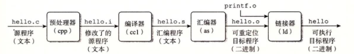
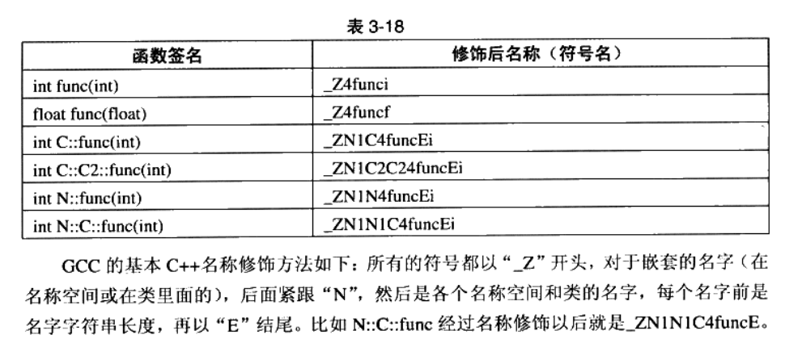

# 第二节课讲义

**课程信息**

- 年度：2025年秋
- 预定时间：第三周 9月22-9月26日
- 实际执行时间：第三周 9月22-9月26日
- 估计时长：4h

课程主题：C/C++项目构建常用工具原理简述与使用初步

课程目标：

1. 明确翻译各阶段原理，为了理解与解决C/C++编译常见错误。
2. 明确C/C++典型编译工具链的命令行使用，一些重要约定与典型报错信息格式。
3. 理解示例构建系统的建立初衷，运作方式，在C/C++项目中的使用方式。

课程大纲：

1. 认识编译语言与编译工具链——从高级语言到机器码
2. 代码复用的两种方式——C语言宏与函数
3. 目标文件，头文件
4. 链接与库
5. 管理构建行为：make的思想
6. 管理项目：cmake的使用

对听者/读者的要求：

1. 了解计算机基本组成
2. 会编写简单的C/C++代码
3. 不要求掌握汇编语言的任何知识
4. 有耐心听完/看完，最终要的是思考完整个内容
5. 这一份文档是一份特意删去大部分基础原理的解释，如果原本了解程度比较高，可对照细节查漏补缺，进一步学习需自学。

## 认识编译语言与编译工具链——从高级语言到机器码

CPU直接执行的是二进制形式的指令，这种语言我们称之为**机器语言**。这种语言不适合用于直接编写程序，于是经过一段时间的发展，出现了比其高一等级的**汇编语言**，与更高级的**高级语言**。

| 最基础                                     |                                                   | 最高级     |
| :----------------------------------------- | :------------------------------------------------ | :--------- |
| 机器语言                                   | 汇编语言                                          | 高级语言   |
| CPU直接执行的语言，每个型号的CPU都有所不同 | 分为x86,x64,arm 等系列的，对应于不同系列CPU的语言 | 机器无关的 |
| 0101001 ...                                | MOV reg1, reg2                                    | int a=b;   |

程序员编写的是汇编语言或高级语言，这两者都需要先转化成机器语言才能执行，在指定的平台上，源语言与目标语言之间有着对应的关系，这个过程被称为**翻译**。（当然，自然语言中的翻译指的是多种语言之间的相互转换，那么实际上，这三者之间的两两转换都能被称为翻译）。

---

当将高级语言翻译并执行时，我们有两种方式：

其一是*边翻译边执行*：这个过程是逐句或逐块地处理并执行，其本身可能很复杂，但通常缺乏对整个程序的全局优化，称为**解释**。

其二是*整体翻译后保存下来，需要时直接执行或者进一步翻译*，这个过程也称为**编译**。由于对于源文件是整体考虑进行翻译的，上下文信息更加丰富，可以支持更复杂的翻译行为，这种方式使得我们能够将抽象的，高级的语义，准确翻译为低级的基础的指令。

---

因此，某种程度上，那些拥有元组、函数、类、修饰器、模版等等更抽象的面向于程序员的语言特性的高级语言，为了实现这些复杂的语言特性并保证一定的执行效率，通常会采用先编译为中间代码的策略:

比如Python/java，其整体翻译过程可以表述为 `.py/.java =>(翻译).pyc/.class(python/java字节码) ->(解释)机器码`，是先编译，后解释的混合模式。将字节码解释为机器码的这后一部分操作，是由软件（虚拟机PVM/JVM）完成的，每运行一次，都需要现场解释一次。

比较特殊地，JavaScript这种语言采用了JIT技术，解释运行过程中会“发现”热点代码，并尝试通过编译手段进行优化。

---

接下来我们讨论C/C++，大体上，C语言需要先转换为汇编语言，然后转化为机器语言，才能在**目标平台**（指具体硬件，不论是开发板还是芯片）上运行。
对于第一个过程我们称之为 **编译(compilation)** ，由 **编译器(compiler)** 进行，后一个过程称为 **汇编(assembly)** ，由 **汇编器(assembler)** 进行。



显然，编译器与汇编器也是一个专门的程序，将一个C源文件转换为二进制文件，需要依次执行上面的步骤。可以想象，这些独立的步骤中的执行程序需要遵循相同的一套规则。完成这一系列工作的配套工具，被称为C语言的 **编译工具链** 。上面这张图中的各个框中的程序名称(cpp,cc1,as,ld)都是**GCC编译工具链**的组成部分。

在很多场合下会直接用GCC 编译器来指代整套GCC 编译工具链（而不只是cc1）；用编译指代上述的全部过程（而不特指编译器的工作）。

## 代码复用的两种方式——C语言宏与函数

**宏**：计算机科学里的宏是一种抽象，它根据一系列预定义的规则替换一定的文本模式。
在C语言中，宏在预编译时处理，将代码展开为代码。举个例子:

```c
#include<stdio.h>

// 这个宏没有参数，用于打印Hello World
#define HELLO printf("Hello World");

// 定义一个宏：打印n次"FOO"，这个宏有一个参数n
#define PRINT_FOO(n)       \
    for(int i = 0; i < n; ++i) { \
        printf("FOO");     \
    }                      \
    printf("\n"); // 最后换行

int main() {
    HELLO // 打印Hello World
    PRINT_FOO(3); // 打印3次
    PRINT_FOO(5); // 打印5次
    return 0;
}
```

---

### 宏分为定义与使用

#define 开头的一整行都是**宏定义**，`\` 是换行转义符，其效果相当于将所在行与下一行直接拼起来。

宏定义指定了**宏名称**，**宏的参数**（可以为空），以及替换后的**代码格式**。比如FOO(n)，其名称是FOO，参数是(n)，替换后的代码是...。

那么在使用时，就像在代入具体数值计算某个数学函数一样，用数值替换自变量，而这里是用具体的字符串替换宏参数。类比于函数，这个过程叫**参数结合**，即用实参（实际参数）代入（一一对应地替代）形参（形式参数）。

于是我们对FOO(3) FOO(5)手动进行参数结合，得到两段不同的代码。

> 我们推荐使用的是VSCode编辑器，也只会用这中编辑器来编辑演示代码，如果你使用其他现代编辑器，如Clion，Elispe，其也能找到相似的功能。VSCode中有很多插件，其中关于C/C++语言的插件，提供了大量辅助功能。

> VSCode CLanguage 插件在查看C宏时有一个小技巧，你可以把光标停留在宏的调用点，插件会自动展开宏。

---

### 宏的功用

宏实现了**代码复用**的功能，通过传递参数，可以相对灵活地调整展开后的代码功能，通过重复调用，实现了一份代码的多次使用。

但是这种复用发生在源码级别，这意味着同一个宏展开后的代码即使只有很小的不同，依然需要重新再调用的地方编译，产生了一些不必要的重复编译，也使得编译后的二进制中包含了一些重复的结果。在大量使用宏的场景中，这个问题会更加严重。

---

### 函数

函数通过直接复用编译后的二进制代码，解决了源码级复用带来的问题。

要实现这种复用，CPU必须能从主程序**跳转**到函数处执行，执行完后再返回。在此之前，我们简单介绍一下背景：

程序是顺序存放的许多指令（指令可以视作CPU工作的基本单元），当CPU会顺序读取这些指令并执行，CPU中专门有一个 `<u>`*游标* `</u>`（指令指针IP/程序计数器PC）记录CPU将要执行的下一个指令，更改这个*游标的位置*（指令指针IP指向的地址），可以让CPU从另一个地方开始执行命令。

函数调用的大致逻辑如下（这是一个高度简化的模型，忽略了很多细节）：

- 第一步：调用函数（由主程序完成）

0. 主程序顺序执行。
1. 主程序将 `<u>`传入函数的参数和函数执行完毕后需要返回的地址 `</u>`（即调用函数后需要执行的下一条指令的地址），按约定存放到一个特定的区域（通常是程序栈）。

- 第二步：执行函数（跳转到函数代码）

2. 主程序执行一条跳转指令，使CPU开始从 `<u>`**函数起始地址** `</u>`读取并执行指令。
3. 函数代码从约定位置读取参数，进行运算。

- 第三步：返回主程序（函数执行完毕）

4. 函数将返回值存放到另一个约定的位置。
5. 函数执行一条返回指令。这条指令会从约定位置取出第一步保存的返回地址，并跳转到那个地址。
6. CPU继续从主程序的下一条指令开始执行。

在这个过程中，第2到第5步的二进制指令（函数本身的代码和返回指令）对于每次调用都是完全相同的，实现了真正的二进制级复用。而变化的是每次调用时传入的参数和需要返回的地址，这些数据被单独存放和管理。

---

### 函数签名

接下来我们看一个函数的例子：

```c
#include<stdio.h>
// 定义了函数max, 实现了比大小的功能，输入两个int，返回一个int，为其中更大的一个
int max(int a, int b)
{
    if(a > b)
        return a;
    else
        return b;
}
int main()
{
    printf("%d", max(3, 4));
}
```

当调用这个max函数的时候，就需要满足两个要求：

1. 函数名称是max
2. 函数参数是(int, int)

因此如果编译器判定某处的调用是针对某个函数的，需要满足这两个条件：

1. 函数名称匹配
2. 函数的**参数列表**匹配

这是编译器区分不同函数调用的关键，再加上函数的返回值，这三个信息构成了C语言函数的**函数签名**。

由于复杂的历史原因，C++在引用函数前不一定需要定义函数，但是一定要提供声明。如下列代码所示：
可以看到，函数声明包含了完整的函数签名。

> 例1

```c
#include<stdio.h>
int max(int a, int b); // 函数声明
int main()
{
    printf("%d", max(3, 4)); // 函数调用
}
int max(int a, int b) // 函数定义
{
    if(a > b)
        return a;
    else
        return b;
}
```

## 目标文件，头文件

函数的单次编译保证了在同一源文件中，一个函数的多个调用只会生成一次代码。然而在实际开发的过程中，源码是经常被改动的，改动后编译器无法判断改动内容，只能全部重新编译，这促使我们产生一个想法：是否能够将那些不再改动的代码与经常改动的代码分开存放在多个源文件中，在改动后，仅仅编译改动的那部分。这样就实现了文件级别的**编译结果复用**（这种行为被称为**增量编译**）。

举一个例子，比如C++标准库，也就是提供了诸如printf,scanf这种函数的库，是被几乎所有程序所部分地使用的。标准库代码非常长，重新编译一次非常耗时，因此人们采用单独编译，需要用的时候进行*链接*的操作。

我们先不给出链接的具体过程，先展示使用时的整体流程。

回头看上面例1的代码，假如我需要将 max 函数保存到另一个文件中，单独编译，那么我将这样划分源代码：

```c
// main.c 的内容如下
#include<stdio.h>
int max(int a, int b); // 函数声明
int main()
{
    printf("%d", max(3, 4)); // 函数调用
}
```

```c
// `max.c` 的内容如下
int max(int a, int b) // 函数定义
{
    if(a > b)
        return a;
    else
        return b;
}
```

接下来，应该先把 `max.c` 与 `main.c` 分开翻译成二进制，形成的不完整的中间结果文件被称为**中间目标文件**/**重定位的目标文件**，简称**目标文件 (object[file])**，GCC对于这一种文件，会用.o文件后缀名来表示，即形成 `max.o`，与 `main.o`。
然后再将 `max.o` 与 `main.o` 合并链接成最终**可执行文件**(未指定名称的情况下，默认的输出为a.out)。

```
max.c ->(编译，汇编) max.o                        ...(1)
                            =>(链接) executable  ...(3)
main.c ->(编译，汇编) main.o                      ...(2)
```

我们上面说过，GCC是一整套工具，其中的编译器，汇编器，链接器都是互相独立的，可以独立调用各个模块。

```bash
gcc -c max.c -o max.o                              ...(1)
gcc -c main.c -o main.o                            ...(2)
gcc max.o main.o -o executable                     ...(3)
./executable      # executable文件可以被直接执行
4                 # 输出结果
```

> （如果需要，解释一下shell的参数输入约定）
> gcc 默认可以接收文件名称作为第一个参数，然后根据文件后缀(.c/.cpp, .i, .s, .o) 判断该文件是：源码，预处理后的源码，汇编码或是目标文件。
> -E/-S/-c/(NULL) 参数指定是生成：预处理后的源码，汇编码，目标文件或是可执行文件。
> -o xxx 参数指定了生成文件的名称。

那么当我之后改动 `main.c` 时，只需完成重新编译 `main.c` ，并链接就可以了。

---

如果我想将这个实现了 max 函数的目标文件 `max.o` 提供给别人使用，使得使用的人不用重新编译就可以使用，我还需要提供 `int max(int, int);` 的声明，因为他的程序在引用max前需要先声明max。

一般通过**头文件**的手段提供这个声明，原理是这样的：

`#include "xxxx"` 是一个预编译指令，其作用是在预编译阶段将xxxx（文本文件名/路径名）的文本内容插入替换到所在的这一行。

那么，我可以单独提供一个**头文件**(header.h)，其中包含函数声明，外部全局变量声明，结构体的定义等等诸如此类的代码。

对于这个例子，我创建一个头文件 `max.h`。`main.c` 的编写者可以通过在文件的最开始 `#include "max.h"` 来简单地引入max的声明，而无需亲自补充声明。

```c
// max.h
int max(int a, int b);
```

```c
// main.c
#include<stdio.h>
#include"max.h" # 此处引入声明
int main()
{
    printf("%d", max(3, 4)); // 函数调用
}
```

在实际使用中，往往函数提供者还会在函数的前后写上注释，描述这个函数的作用，如果描述足够详细，只需要通过阅读头文件就可以搞明白到底有哪些功能被提供了。

在基本的编译功能之外，往往库的作者可能会同时提供说明文档（包含库用法与部分实现原理，还会包含一些详细注释的示例代码(demo code)），构建配置文件（这个东西的用处下面会讲），工具程序。

## 链接与库

接下来我们需要解释链接的内部实现原理：

回忆一下函数调用的过程，*执行跳转到函数的起始地址*这一步骤要求我们在生成该段代码时就知道函数的起始地址，但是如果函数的**引用**与**定义**存在在两个分开的文件中，并且独立地编译汇编，显然无法在链接前明确地址，所以这个步骤被推迟到了链接时，在链接的过程中，我们需要将函数的所有引用与定义匹配起来，这个过程也适用于全局的变量。
如果要保证链接时能够完成匹配，那么每个函数与全局变量都需要一个独特的名字，这个名字被称为**符号**。

---

### 符号修饰与函数签名

在C语言中，函数不可以重载，函数名唯一，基本上本身可以直接作为符号，但是在C++中，函数名与参数列表（函数签名中只有返回值没有提到）一起确定一个唯一的函数，因此通过添加额外字符，将函数签名转化为符号名，这个过程被称为**符号修饰**。



---

### 两种常见链接错误

链接过程的第一步：将**符号**与对符号的**引用**相匹配。这里我们不讨论**弱符号**与**弱引用**相关情况。对库的使用者来说，最常见的两种错误是

1. 重复定义**强符号**
   ```
   Error:
   b.o: mutiple definition of (Symbolxxx) 
   a.o: first defined here
   ```
2. 引用未定义的符号
   ```
   Error:
   b.o: undefined reference to (Symbolxxx)
   ```

我们手动实现一下这两种错误:

1. 重复定义**强符号**
   1. 将前面的 `max.c` 复制一份 `max_copy.c`，然后编译链接成另一个目标文件 `max_copy.o`
   2. 链接 `max.o` `max_copy.o` `main.o`，产生可执行文件
   3. 链接器报错：
      ```
      max_copy.o:max_copy.c:(.text+0x0): multiple definition of `max';
      max.o:max.c:(.text+0x0): first defined here
      ```
2. 引用未定义的符号
   1. 链接 `main.o`，直接产生可执行文件
   2. 链接器报错：
      ```bash
      main.o:main.c:(.text+0x18): undefined reference to `max'
      ```

如果是c++呢？（将命令中的gcc替换成g++后执行），现代链接器（如果链接器版本较老，还是显示修饰后的符号）会将修饰后的符号转化为修饰前的函数签名（没返回值）直接呈现：

```
maincpp.o:main.c:(.text+0x18): undefined reference to `max(int, int)'
```

---

### 静态链接，动态链接*

静态链接与动态链接的详细过程不在这节课的范围之内，我们从特征上概括两者的区别：

**静态链接**完成后，形成的可执行文件中包含需要用到的所有的函数，符号的匹配与**重定位**等操作在链接时就已经执行完毕。即使两份程序使用了相同的函数，在运行时依然使用自己的那一份，即此时内存中存放两份同样的函数代码。

**动态链接**的链接时间被推迟到了**程序载入内存时**（程序开始执行前），程序载入内存时，动态链接器会向操作系统查询程序运行**所依赖**的动态库是否已经被载入内存的某个位置，如果有，则使其引用计数加一，如果没有，则向操作系统申请在内存中开辟并存放这一部分动态库，并且注册并使其引用计数加一（程序结束时将其引用计数减一，引用计数为0的动态库不被任何程序所使用，操作系统可以选择立即释放或延迟释放其所占的内存）。这样即使不同的可执行文件，只要使用了同一个动态链接库，那么会共享动态链接库中的几乎所有指令（数据等不共享），大大节省了内存占用（与存储程序本身的磁盘占用）。完成动态链接后，才将控制权转移给主函数。并且不像静态链接时对主程序中所有函数的引用都进行符号匹配与重定位，为了避免初始化时间太长，动态链接将不是选择在初始化时就完成所有的绑定工作，而是这一个步骤延迟到了运行时（延迟绑定PLT），只有某个未绑定的函数被第一次使用时，动态链接器才会对其进行符号匹配与重定位。

当然，动态链接的过程可以被进一步推迟到运行时，其原理类似，只不过是程序主动指定链接的对象，而不是由动态链接器决定要链接的对象。

### 静态库，动态库的生成方式

根据被用于链接时的链接方式是静态链接还是动态链接，库文件被分为两类：

- **静态库**(静态链接库)：一组目标文件的压缩(用ar工具压缩的)。

```shell
# 分别产生目标文件
gcc -c file1.c file1.o
gcc -c file2.c file2.o
# 压缩，解释见https://c.biancheng.net/view/7168.html
ar rcs libfile.a  file1.o file2.o
```

- **动态库**(动态链接库)

```shell
# -fPIC 生成位置无关代码
# -shared 创建动态库
gcc -fPIC -shared func.c -o libfunc.so
```

---

### 静态库与动态库的命名规约、指明、查找方式

windows 上与 linux 上对于两种库文件的命名有不同的规范：

| 特性           | Linux                                      | Windows                                      |
| :------------- | :----------------------------------------- | :------------------------------------------- |
| 静态库         | libNAME.a (Archive)                        | libNAME.lib (Library)                        |
| 动态库         | libNAME.so (Shared Object)                 | libNAME.dll (Dynamic Link Library)           |
| 动态库的导入库 | 不需要	需要配套的                          | .lib (导入库)                                |
| 版本控制       | 通过文件名后缀实现 (e.g., libfoo.so.1.2.3) | 通常通过不同文件名实现 (e.g., libfoo-v1.dll) |

---

GCC链接库文件的方式：

- 静态库：

```shell
ar rcs libmax.a  max.o # 生成静态库
gcc main.o -static -L. -lmax -o main # -static 强制进行静态链接
```

- 动态库

```shell
gcc -fPIC -shared max.c -o libmax.so # 生成动态库
gcc main.o -L. -lmax -o main  # 链接动态库
lld main # ubuntu 查看依赖的共享库与它们的位置
```

`-lmax`即为链接 libmax.a 或者libmax.so，搜索目录中同时存在两者时，选择动态库的那一个

`-L.`指定搜索库文件的路径为当前路径

---

GCC 静态链接时，库文件的搜索目录优先顺序：

- **链接阶段**搜索目录
  1. `-L` 选项指定的目录
  2. `LIBRARY_PATH` 环境变量指定的目录
  3. 系统默认搜索目录，`/usr/local/lib` `/usr/lib` `/lib`

对于动态库，动态链接器会按照顺序从以下路径搜索动态库：

- **运行时动态链接阶段**搜索目录

  1. RPATH(已弃用): 编译链接时通过 `-Wl,-rpath=<path>` 选项直接写入可执行文件中的搜索目录
  2. `LD_LIBRARY_PATH` 环境变量指定的目录
  3. RUNPATH: 同样是编译时写入的路径，使用 `-Wl,-rpath=<path> --enable-new-dtags` 编译选项
  4. `/etc/ld.so.conf` 配置文件中配置的目录，更改后需要 `sudo ldconfig`来更新缓存
  5. 系统默认搜索目录， `/usr/local/lib` `/usr/lib` `/lib`

对于动态链接的可执行文件，找不到库文件的错误情况**非常常见**，原因有二：

1. 动态链接发生在程序开始载入内存时，因此往往错误在运行时才暴露出来。你无法在运行前发现这个错误（虽然链接时可以进行符号匹配验证工作，但是就算如此，运行时的搜索路径也可能不同）。
2. 如果使用环境变量导入动态库目录，由于每个shell的环境变量都是独立的，导致某种情况下未被导入（比如IDE的集成终端不一定默认导入~/.bashrc）；或者单纯忘记在每次运行开始前导入环境变量，这种小错误非常隐蔽，和具体的报错信息有时毫无关系，难以发现。

具体报错可能长这个样子：

```shell
./a.out # 某个动态链接的可执行文件
could not find libxxxx.so: no such file or directory
```

---

### 由搜索目录引起的相似错误

相似地，这种由**搜索目录**引起的错误还会发生在别的地方，比如下面这个报错：

```
main.c:2:10: fatal error: null.h: No such file or directory
    2 | #include "null.h"
      |          ^~~~~~
```

分析：

信息：源文件 `main.c` 第一行中被include的文件 `null.h` 找不到

类型：预编译期错误

> 注意点：使用路径时，一定要使用 `/`，而不是 `\`或者 `\\`作为路径分隔符，因为前者通用于win&unix，而后者仅仅适用于特定平台。

使用 `#include"xxx.h"` 导入头文件时，可以选择：

1. 使用头文件的绝对路径（在会被移动位置的代码中不推荐，因为一旦头文件所在文件夹被移动，所有绝对路径需要被调整）
2. 使用头文件的相对路径，其相对的 “**基目录**” 不确定，会从下列目录中依次查找：

- `#include "xxxx.h"` 的优先级顺序
  1. ⭐当前源文件所在目录
  2. `-iquote` 指定的目录（quote即指双引号""）
  3. 按照#include <xxxx.h> 的优先级顺序查找
- `#include <xxxx.h>` 的优先级顺序
  1. ⭐ `-I` 选项指定的目录（按命令行顺序）
  2. `-isystem` 指定的目录
  3. ⭐环境变量指定的目录
  4. ⭐系统标准包含目录 `/usr/local/include` `/usr/include` `/include`
  5. `-idirafter` 选项指定的目录

其中环境变量包含：

1. `CPATH` 适用于C/C++
2. `C_INCLUDE_PATH` 仅仅在编译C时被用到
3. `CPLUS_INCLUDE_PATH` 仅仅在编译C++时被用到

系统标准包含目录，就是完全没有任何参数时运行下面命令的结果，一般包含了标准库头文件目录。

> ```shell
> # 这个命令可以查看某一条gcc/g++编译shell命令的头文件搜索目录
> gcc/g++ (原命令参数...) -E -x c/c++ -v -
> ```

<>号引用的头文件用于导入系统的外部的头文件，而""号引用的头文件用于导入项目内部的自己的头文件。

GNU对于cpp(GCC预编译器)的介绍：

> 如果有非常非常细节的疑惑，不要问AI，看这些官方文档

> https://gcc.gnu.org/onlinedocs/cpp/Invocation.html

> https://gcc.gnu.org/onlinedocs/cpp/Environment-Variables.html

---

运行可执行文件时，也有类似的查找顺序：

1. 由绝对路径或相对路径指定的可执行文件，直接执行
2. 不是文件路径，则在 `PATH` 环境变量中的目录中按照顺序寻找，取第一个
   可以通过 `which executeable` 来查看找到的可执行文件的绝对路径：

```
which ls
/usr/bin/ls
```

## 管理构建行为：make的思想

> make不是介绍的重点，一般情况下，我们使用cmake，但是了解make的思想有利于理解cmake的工作。

如果只有几个源文件，手动管理每个文件对应的目标文件，并且在每次源文件改动时处理更新也许不是一件特别难的事情。但是当文件数量变大时，文件之间的依赖关系变复杂时，对一个文件的改动可能会引起数个文件的更新，任意一环的缺漏都会导致难以发现的错误。因此，我们需要一个工具程序，帮助进行这种复杂的更新操作。make就是帮助进行这种操作的工具。

make是一个工具软件，有多种版本。在Linux上，最常用见到的版本是GNUmake，也就是GNU项目下的自由软件。下面介绍这种make的使用方式。

make依赖于**配置文件** `Makefile` 进行工作。**Makefile** 定义了一组**规则**

单个规则的格式：

```
目标: 依赖项(可以是一个或多个)...
	命令1
	命令2
	. . .
```

例子：

```makefile
max.o: max.c
    gcc -c max.c -o max.o
```

一组规则可以形成**树形**依赖关系。比如:

```
max.o: max.c # 独立编译
    gcc -c max.c -o max.o
main.o: main.c # 独立编译
    gcc -c main.c -o main.o
main: main.o max.o # 链接
    gcc main.o max.o -o main
```

三个 target 分别为 max.o main.o main，我们可以通过命令行 `make xxx(target)` 来更新该目标。

make 程序会递归地搜索该 target 的依赖项，它们是 max.o max.c main.o main.c。如果其中任意一个文件的最近修改时间比自己的target 的最近修改时间更加新，这说明该文件被手动修改过，所有依赖它的文件都需要按照规则重新更新过。这样所有的更新会依次执行，最终被反映到最初的 target 的更新上去。

make 大致实现了这种功能，它能够说明何时必要使用哪一条规则去更新哪些目标，规则的应用顺序是怎样的。但是具体的更新方式由我们自己说明—— `Makefile` 中每一条规则后都跟着数条（首行Tab缩进（不能是空格））的shell命令，这些命令正是执行更新的具体操作，比如编译汇编，链接等等。

由于 make 需要记录文件的更新时间这一类的信息，因此会在当前目录中产生一些辅助文件。

常见的命令解释：

- `make install`, `make clean`

不同于文件目标，install 与 clean 不是文件，它们通常不依赖于任何其他目标，仅仅实现一些固定的动作。

我们知道，编译，链接，执行软件程序的时候，那些被用到的头文件，库文件与可执行文件都需要放在特定的文件夹中才能被搜索到。因此，**安装(installation)** 在最简单的语义下仅仅是把对应的文件放到对应的文件夹中。那么 install 目标可能长这个样子(*是通配符)：

```
install:
    cp ./*.h /usr/local/include/
    cp ./*.a /usr/local/lib/
    cp ./*.so /usr/local/lib/
```

同样的 clean 指将生成的所有文件删除，可能长这个样子

```
clean:
    rm ./*.o
    rm ./*.a
    rm ./*.so
```

这些目标只会被用户使用作特殊的功能，每次在命令行中被指定为构建目标时，均需触发更新操作（即使没有任何依赖项），称为**伪目标**，用.PHONY标识：

```
.PHONY: install clean
```

- `make`

不指定任何 target 的默认情况下 `Makefile` 的第一个目标为默认目标。按照习惯，可以在最前面设置一个 all 伪目标，引用其他目标。

```
all: main
...(省略)
.PHONY: all ...
```

此时 `make` == `make all` == `make main`

往往将所有默认生成的的二进制目标作为all的依赖项，从而一次性完成所有编译。

- `-jn` 参数

-j 指定并行执行的线程数，比如-j8是8线程。线程数不应该超过多核CPU的逻辑线程总数。

## 管理项目：cmake的使用

对于一个C/C++项目，**构建**即是从源码系统性地生成目标文件的过程，我们之前提到的make能够完成这一步操作，但是注意到，这种操作是非常不灵活的，有不少缺点：

1. 难以通用于多个编译工具链：即使是相同的流程步骤，在gcc,clang,msvc（windows上的编译工具链）上使用的命令行参数也是不相同的
2. 难以通用于多个操作系统：windows与linux上有多个细节上的不同，比如cmd与bash脚本中的文件操作命令
3. 抽象层次低，灵活度低：几乎所有实际执行的代码都需要用户实现，无法自动生成

总的来说，我们需要一种更好的方式来配置项目的便宜，其中一种方式就是利用cmake。

推荐学习资料：

- 官方教程：https://cmake.com.cn/cmake/help/latest/guide/tutorial/index.html

> 初学者应当跟着这个教程操作，学习到“步骤 3：添加库的使用要求”即可满足大部分要求

- 《Modern CMake》： https://modern-cmake-cn.github.io/Modern-CMake-zh_CN/

> 在阅读《Modern CMake》 这种偏重于细节而不是引导的技术文档时，我们推荐使用跳读法，一个很通用的准则就是：当遇到完全不了解的东西时，由于你无法判断这一部分是重要的还是拓展性的，不妨先跳过去，记录那些你觉的有用的加以运用即可。

我们后面再学习项目时会讲解如何配置CMake引入第三方库，组织自己的项目结构，从CMakeLists.txt中了解分析他人的项目结构等等。

---

### cmake项目的思想
