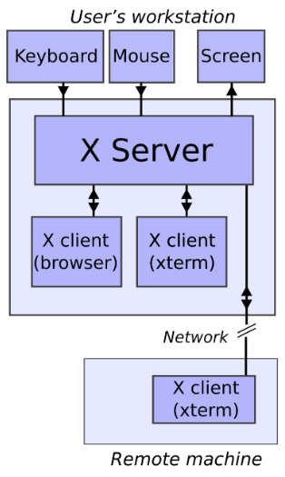

# SSH
`ssh` 是 `Secure Shell` 的缩写，是一种网络协议，也是一套工具，主要用于在不安全的网络中安全地访问远程计算机。

在vscode中，你可以通过“远程资源管理器”插件进行连接，你本地机器上关于`ssh`的config的目录在`C:\Users\name\.ssh\config`或者`C:\ProgramData\ssh\ssh_config`（windows）下；`ubuntu`则是在`~/.ssh/config`和`/etc/ssh/ssh_config`下，其中`~/.ssh/config`是用户的ssh配置目录，而`/etc/ssh/ssh_config`是系统的ssh配置目录。

```bash
Host NewLittleDog
  HostName 192.168.154.75
  User pi
Host NUC
  # HostName 192.168.3.100
    HostName 192.168.25.121
    User robocon
    ForwardX11 yes
    ForwardX11Trusted yes
    IdentityFile C:\Users\xixiboliya\.ssh\id_rsa 
```
注意 `SSH config` 没有提供密码配置，因为将密码存储在明文文件中是不安全的做法，请使用密钥登录。
## X11协议
一个常见于通过SSH转发远程主机上的图形化界面（例如rviz）的错误：
```bash
qt.qpa.xcb: could not connect to display 
qt.qpa.plugin: Could not load the Qt platform plugin "xcb" in "" even though it was found.
This application failed to start because no Qt platform plugin could be initialized. Reinstalling the application may fix this problem.


Available platform plugins are:...   
```
**X11**（X Window System 11 版本）协议是一种在Unix / Linux 等系统上用于客户端（应用程序）与 客户端上的X 服务器（显示系统 ）之间通信的图形协议，实现了在远程机器上运行由客户端编写好的程序，而在客户端与用户交互时显示实时的图形界面的转发，例如实时显示照片图像等。图中的X client便代指远端服务器。

为了方便阐述，我们以“现在有一台本地主机B和远端服务器A”进行举例。

在 Linux 操作系统中，本地的可视化都是建立在 X 的基础上实现的(尽管部分系统已逐步采用 Wayland)，而如果要使用 remote 传输：在远程服务器 A 中启动图形程序，在用户的本地主机 B 上可视化。就需要将服务器 A 上的 X 图形消息通过某种方式发送给 B。这种传输可通过多种方式实现，其中常见的是使用SSH 的 X11 转发（X forwarding），它通过加密隧道安全地传递 X 协议数据。



在整个图形显示过程中，远程主机 A 充当 X Client（即图形程序的运行方），而本地主机 B 充当 X Server（负责图形显示的设备端）。

如此一般的转发流程是：

- 用户在本地主机 B 上通过 `ssh -X`（或 `ssh -Y`）命令登录远程服务器 A。此时 SSH 客户端会在 B 上启动一个本地的虚拟 X11 监听端口（例如 `localhost:10.0`），并在远程环境变量中设置 `DISPLAY=localhost:10.0`。
- 当远程服务器 A 上的 X Client（图形应用）启动时，它会将图形输出发送至该 `DISPLAY` 地址。
- 远程的 SSH 守护进程（sshd）拦截该 X11 数据，并通过已建立的加密 SSH 隧道，将其安全地传输回本地主机 B。
- 本地主机 B 上的 SSH 客户端接收这些数据后，转发给本地的 X Server，由后者解析并渲染图形界面，实现可视化显示。

上述过程是双向的。这里需要说明两层“二向性”含义：一方面，X 协议本身就是双向的——X Client 向 X Server 发送绘制、资源请求等命令，X Server 则向 X Client 发送输入事件（键盘、鼠标）及其它回馈；另一方面，SSH 隧道也保持双向的数据通路，因此 X 协议在客户端与服务器之间的所有请求与响应都经由该隧道传输。

对于默认情况下，若两台机器之间通过TCP协议通信，X server 会监听机器上端口号 “6000 + 显示编号”的数据，并将其转发给SSH隧道进而通信。“显示编号”对应到linux的配置如下：
```bash
export DISPLAY=localhost:0.0  # [主机名]:显示编号.屏幕编号
```
显示编号的计算方式是：对应一个 TCP 端口号，计算方式是 6000 + 显示编号（例如，localhost:10.0对应 6010）。

在 SSH X11 转发情形下，`sshd` 会为远端会话提供一个代理 DISPLAY 接口（伪 DISPLAY），并在远端环境中将 `DISPLAY` 设置为类似 `localhost:10.0` 的值。具体机制可概括为：远端 X Client 连接到该伪造的 DISPLAY（该接口可以是远端由 `sshd` 创建的本地回环监听端口或 UNIX 套接字），`sshd` 将此连接对应的 X11 数据通过已建立的加密 SSH 信道转发到本地主机 B；本地主机上的 `ssh` 客户端接收后再将数据交给本地的真实 X Server（或对应的套接字）进行解析与渲染。整个链路在逻辑上等价于在远端与本地之间“打通了一条 X11 协议的双向隧道”。

在本地显示的情景下，显示编号一般是 0，即 DISPLAY=localhost:0.0，而在远程显示下，SSH 服务器使用 `X11DisplayOffset` 来避免与本地 X Server（如果存在，无论是本地机器还是远程机器）的端口冲突。

因而有如下配置：

远程主机A：
```bash
sudo nano /etc/ssh/sshd_config
# 配置如下
X11Forwarding yes # SSH支持发送X11协议的数据
X11DisplayOffset 10 # 配置DISPLAY偏移量 = 从localhost:10.0开始，也就是6010端口。
X11UseLocalhost yes # 确保X11 client通过localhost与SSH server通信。
```
本地主机B：
```bash
Host alias_A
    HostName ip_A
    User usr_A
    ForwardX11 yes
    ForwardX11Trusted yes
    ForwardAgent yes    
```
接着需要告诉主机 B 的 X server 是哪个端口发送过来了 X11 数据。这就需要在主机 B 上设置 DISPLAY 环境变量。因为前面也说过，在本地的显示一般默认 0 号端口，因此我们通常设置为：
```bash
export DISPLAY=localhost:0.0 # 本地 6000 端口
```

# Public Key & Private Key
(参考[只用10分钟，一次性搞懂公钥和私钥 - 知乎](https://zhuanlan.zhihu.com/p/698175888))

上述只是一个简要介绍。实际上，当你在校园网内用浏览器访问服务器的 `http(s)://<IP>:<port>` 时，服务器在 TLS 握手阶段会向客户端发送其 X.509 数字证书（证书包含服务器的公钥与身份信息，并由某个 CA 签名）。客户端使用该证书验证服务器身份（校验签名链、有效期、主机名/IP 是否匹配等），并要求服务器通过对应的私钥对握手数据进行签名以证明私钥所有权。只有在验证通过后，双方才通过密钥交换协商出对称会话密钥并开始加密的 HTTP 通信。若你把队里服务器的证书或相应的 CA 根证书安装到了客户端信任存储中，就等于告诉客户端“信任这个证书/这个 CA”，这会影响上面的验证过程。

我们的操作系统已经预装了大量受信任的CA的根证书。如果服务器发送的证书是由这些CA之一颁发的，你的系统会自动验证其签名和有效性，你不需要额外做任何事情。

但如果这个证书是自签名（没有CA的签名）或者是由一个不被你的系统信任的私有CA颁发的，你的浏览器会弹出警告甚至阻止访问。在这种情况下，你需要手动安装服务器的证书，告诉你的系统“我信任这个证书，请不要再警告我了”。

所以，让我们回到公钥和私钥上。常见的算法有如图示3种。不同算法支持与推荐的长度也是不一样的。但从应用来说我们并不关心这些，大多数情况下只需要将公钥复制粘贴到github账号、服务器和主机的`authorized_keys`中即可。

## ip
一个 IP，就好比一座房子的经纬度坐标，用于唯一标记网络上的一个位置。ip有ipv4和ipv6之分，其中ipv4为32bit,ipv6为128bit，之所以发展ipv6的原因之一是ipv4的地址资源紧张，不够使用。

按照TCP/IP协议，`ip`为二进制表示，为了方便使用，`ip`地址经常被写作4个8bit，中间用`.`隔开。

TCP/IP 协议需要针对不同的网络进行不同的设置，且每个节点一般需要一个“IP地址”、一个“子网掩码”、一个“默认网关”。这些可以手动设定，也可以通过动态主机配置协议（DHCP）给客户端自动分配一个地址。关于DHCP的内容这里暂且不作讨论。

由于分配不合理以及 IPv4 协议本身存在的局限，现在互联网的 IP 地址资源越来越紧张，这里需要提及一个叫 IANA（Internet Assigned Numbers Authority，互联网网络号分配机构）的组织，其工作内容的一部分便是划分了互联网五类ABCDE类地址，这里只介绍前三类ABC类，在这3种主要类型里，我们主要关注各自保留的3个作为私有地址的区域。

| 网络类别 | 保留IP 地址范围                   |     |     |
| ---- | --------------------------- | --- | --- |
| A 类网 | 10.0.0.0~10.255.255.255     |     |     |
| B 类网 | 172.16.0.0~172.31.255.255   |     |     |
| C 类网 | 192.168.0.0~192.168.255.255 |     |     |


## MAC 地址
MAC地址，也称为物理地址或硬件地址，是分配给网卡的唯一标识符。它是用来在局域网（LAN）中识别网络设备的。与IP地址不同，MAC地址是固化在硬件中的，一般不会改变。

##  子网掩码(Subnet Mask)
子网掩码（Subnet Mask）主要用于在计算机网络中用于确定 IP 地址的网络部分和主机部分，以达到划分子网的目的。

一种常见的表示方法是CIDR（无类别域间路由——一种无类别的 IP 地址分配方法）表示法，例如`192.168.1.0/24`，`/24`代表该网域的掩码是`255.255.255.0`，前24bit都是1。而`192.168.1.0`则是网络地址，它是将满足以其为前缀的主机们的 IP 归为同一组的标识符。在`192.168.1.0/24`的网域下，最多可以分配256个地址，去除`.0`和`.255`(广播地址)后，一共能分配254个不同的ip地址到各个主机。

当然，一种快速的辨识网络地址的方式是让主机的ip地址和子网掩码进行与（&）运算（虽然没有太大用处）。
## 广播地址
广播地址在 IP 地址中用于向同一网络内的所有设备发送消息或数据包。当报文发向广播地址时，子网内的每一台主机都会收到它。

```bash
robocon@rc-server:~$ ip addr show
2: enp3s0: <BROADCAST,MULTICAST,UP,LOWER_UP> mtu 1500 qdisc mq state UP group default qlen 1000
    link/ether e0:51:d8:15:1c:fd brd ff:ff:ff:ff:ff:ff
    inet 192.168.3.160/24 brd 192.168.3.255 scope global dynamic noprefixroute enp3s0
```
enp3s0 是一种在 Linux 系统中使用的以太网的接口名称，`UP`表示已被启用，`LOWER_UP`表示物理链路是连通的。`mtu`,`qdisc`等则定义了最大传输单元，队列调度等等信息，这里不展开解释。

`link/ether`表示链路层类型为以太网，`e0:51:d8:15:1c:fd`则表示了该接口的物理地址(MAC),`ff:ff:ff:ff:ff:ff`表示以太网的广播地址。 `inet 192.168.3.160/24`便是上文所讲的内容，`brd 192.168.3.255`表示子网的广播地址。

## 默认网关
默认网关（Default Gateway）是一个网络设备（通常是路由器、防火墙或三层交换机）的IP地址，它是本地网络中的设备访问其他网络（如外网、其他子网）时，数据报文的“第一站”。简单来说，当设备需要与非本网段的设备通信时，会自动将数据发送到默认网关，由其转发至目标网络。

需要指明的是。默认网关并不一定要是`192.168.x.1`,这只是常见习惯的设法。但需要遵循的是，默认网关的IP地址必须与你的计算机的IP地址处于同一个网段。

## 以太网
以太网是一种最广泛使用的、用于建立计算机局域网（LAN）的有线网络技术。一个以太网中的设备之间的连接方式有网线、光纤等。

### 无wifi连接 
在电脑、树莓派均没有连接Wifi的情况下，我们以网线直连举例，大概讲述ip地址的分配关系：

- 首先先引入网上的教程原理：在你**插上网线**连接树莓派**之前**，你需要打开你电脑控制面板下的"网络和Internet"=>" 网络连接"=>"右键点击你的以太网"=>选择属性=>"共享"=> 勾上"允许其他网络用户通过此计算机的internet连接来连接"  


理想情况下，在此步骤之后会发生什么呢？Windows 会自动配置其以太网卡，使其充当一个简易的DHCP 服务器，为windows的以太网卡分配一个本地ip，通常是`192.168.137.1`（可以修改 ）；插上网线接入树莓派之后，理想情况下会发起 DHCP 请求，请求windows分配一个ipv4给到树莓派。这是一种比较理想的情况。

但事实上在些许情况下并非如此，原因是多种多样的我们并不在这里展开讨论。一个更为保险的方法是为树莓派的`eth0`接口分配一个静态`ip4`例如`192.168.1.2`，同时将windows的以太网接口的`ip4`固定到与树莓派同一网段下的`192.168.1.x`，将子网掩码设置为`255.255.255.0`，如此在同一子网下，`windows`才能`ping`到树莓派。

## DHCP
DHCP（Dynamic Host Configuration Protocol，动态主机配置协议）是一种网络协议，用于自动为网络中的设备分配 IP 地址和其他网络配置参数（如子网掩码、默认网关等）。它的主要目标是确保设备能够快速、正确地接入网络并进行通信，而无需用户手动设置 IP 地址。一般是路由器提供DHCP服务。

例如我的笔记本连上网后向路由器发送DHCP discover，请求路由器分配一个ip地址，之后路由器再响应说“可以用 192.168.1.100，网关是 192.168.1.1，DNS 是 8.8.8.8”，接着笔记本再发送请求使用上述的ip，然后服务器最终确认并且规定相关租约。

# 多线程与并发编程
进程是操作系统进行资源分配和调度的基本单位。简单来说，一个进程就是一个正在执行的程序实例。例如一个word文档被启动时，操作系统会为其创建一个进程，得益于操作系统虚拟持久化的特性，每个进程都认为自己拥有整个CPU和内存。进程之间是相互隔离的，进程之间需要额外的机制实现通信。

线程，在计算机科学中，是操作系统能够进行运算调度的最小单位。它被包含在进程之中，是进程中的实际运作单位。它有一些核心的组成部分例如栈，上下文，寄存器等。

POSIX 线程是 IEEE POSIX 标准中定义的一组多线程编程接口（C API），用于在类 UNIX 系统上创建和管理线程。它规范了线程创建、同步、属性设置、线程局部存储等功能，以保证可移植性。其可以用`#include <pthread>`进行引入，也提供了一些常用的线程接口。

- 线程控制：`pthread_create()`, `pthread_join()`, `pthread_exit()`, `pthread_detach()`
    
- 互斥锁：`pthread_mutex_init()`, `pthread_mutex_lock()`, `pthread_mutex_unlock()`
    
- 条件变量：`pthread_cond_wait()`, `pthread_cond_signal()`
    
- 线程属性：`pthread_attr_init()`, `pthread_attr_setstacksize()`
    
- 线程局部存储（TLS）：`pthread_key_create()`, `pthread_setspecific()`
## Introduction

`join()`是 C++11 中 std::thread 类的一个重要方法，用于阻塞当前线程，直到被` join()` 的那个线程执行结束。这是线程同步中最常用的手段之一。

这里使用的头文件`thread`是C++11的标准库线程，有一些 RAII、异常和与 C++ 内存模型/同步原语集成这样的东西。
```cpp
# include <iostream>
# include <thread> 

int main(int argc,char* argv[])
{
  std::cout << "Hello from main thread " <<std::this_thread::get_id() << std::endl;
  std::thread t([](){
      std::cout << "Hello from new thread " <<std::this_thread::get_id() << std::endl;
    });
  // t.join(); 让主线程（或调用线程）等待子线程执行完毕后再继续往下执行。
  t1.detach();
  
  // if (t1.joinable()) t1.join();
  return 0;
}
```
假设t1是一个长时间运行的线程，我的主线程不想等待T1完成，因为它有自己的事务需要处理，使用`t1.detach()`,t1将与主线程分离，在后台运行且无终端关联，之后由c++ 的运行时将负责回收t1的资源。
```bash
rc@rc-MIX:~/tutorial/third_tutorial/build$ ./RCtutorial 
Hello from main thread 128708025471936
```
我们并没有看到t1的线程号。因为`t1.detach()`使得新线程与主线程分离，主线程不会等待新线程结束。由于主线程很快就执行到 return 0; 并退出进程，可能在新线程来得及输出 thread id 之前，整个程序就已经结束了。

通常情况下我们并无法确定哪个线程会运行得更快，除非使用一些同步机制。

可以通过`if (t1.joinable()) t1.join()`的方式进行调整。我们不能够对已分离（detach）或已 join 的线程再次调用 `join()`，否则程序会抛出`system_error`。一个好的方法是在添加`joinable()`进行判断。

## 线程管理
```c++
void Echo(std::string s) // save reference
{
  std::cout << "Hello from new thread " << std::this_thread::get_id() << std::endl;
}
int main(int argc,char* argv[])
{
  std::string s = "Hard Time comes again and never goes away";
  //   std::thread t(Echo,s);
  std::thread t(Echo , s);

  t.join();

  std::cout << "From main thread " << s << std::endl;
  if (t.joinable()) t.join();
  return 0;
}
```
因为参数是一个字符串，我们更想通过引用而不是值传递，因为这样可以节省很多副本的开销，所以我们将传参类型改为引用传递。但尽管如此，参数string s 仍然是通过值传递给线程t，因为线程的参数总是通过值传递的。`t.join()`确保主线程等待t运行完成。

```cpp
# include <iostream>  
# include <thread>

void Echo(std::string& s) // &  
{  
std::cout << "Hello from new thread " << std::this_thread::get_id() << std::endl;  
// std::cout << "From thread " << s << std::endl;  
s += " – modified by thread";  
}  
int main(int argc,char* argv[])  
{  
std::string s = "Hard Time comes again and never goes away";  
// std::thread t(Echo,s);  
std::thread t(Echo,std::ref(s));

t.join();

std::cout << "From main thread " << s << std::endl;  
if (t.joinable()) t.join();  
return 0;
```
输出：
```bash
rc@rc-MIX:~/tutorial/third_tutorial/build$ ./move  
Hello from new thread 129109080405568  
From main thread Hard Time comes again and never goes away
```
可以看到输出的字符串中并没有" - modified by thread"。

## RAII Intro 
RAII（Resource Acquisition Is Initialization,中文翻译为资源获取即初始化。资源的使用一般经历三个步骤a.获取资源 b.使用资源 c.销毁资源，但是资源的销毁往往是程序员经常忘记的一个环节。因而实现自动资源销毁成为了这个情形下的答案。例如一位懒惰的程序员不想费心管理各个线程的`join()`方法来等待线程结束释放资源，于是：
```cpp
# include <iostream>  
# include <thread>

class wrapper {  
public:  
explicit wrapper(std::thread& t) : t_(t) {}  
~wrapper() {  
if (t_.joinable()) t_.join();  
}  
wrapper(const wrapper&) = delete;  
wrapper& operator=(const wrapper&) = delete;  
private:  
std::thread& t_;  
};

void Echo()  
{  
std::cout << "Hello from t1 thread " << std::this_thread::get_id() << std::endl;  
}

int main(int argc,char_ argv[])  
{  
std::cout << "Hello from main thread " << std::this_thread::get_id() << std::endl;  
std::thread t1(Echo);  
wrapper w(t1); // RAII自动管理线程  
return 0;  
}
```
explicit 是一个修饰符，用于声明构造函数和转换运算符，以防止编译器进行隐式类型转换。`= delete`表示显式删除一个函数。这里表示禁用wrapper类的拷贝构造和赋值运算符。这样有利于防止您有意无意使用了多个wrapper管理同一个线程对象，避免重复导致异常。

`~wrapper()`是析构函数，用于`wrapper`类生命周期结束时自动调用。这里在`wrapper`类结束时尝试调用`t.join()`，使得`wrapper`类等待其所管理的线程结束，之后`wrapper`才进行析构。

# Data & Race

首先先引入信号量的概念，不严谨地说，信号量（semaphore）是用于进程/线程间同步的一个整数计数器，带有两种原子操作：**P（也叫 wait 或 down）** 和 **V（也叫 signal 或 up）**。信号量在创建时有一个初值（非负），每次 P 操作会检查计数器：若大于 0 则将其减 1 并立刻返回，若等于 0 则调用者被阻塞（或以其他方式等待）直到有其他线程执行 V 操作；每次 V 操作将计数器加 1，并在必要时唤醒一个或多个等待者。这样，信号量可以用来限制同时访问某类有限资源的线程数量或用作事件/顺序同步。
```cpp
# include <thread>
# include <iostream>
# include <mutex>
std::mutex mtx;
void sharedPrint(string msg,int id){
  mtx.lock();
  cout<<msg<<id<<endl;
  mtx.unlock();
}
void Counter(string id){
  for(int i=0;i<100;i++){
    sharedPrint(string("From t1: "),i);
  }
}

int main(int argc,char* argv[]){
  std::thread t1(Counter("t1"));
  for(int i=0;i<100;i++){
    sharedPrint(string("From main: "),i);
  }
  t1.join();
}
```
也就是说，当`main thread`占用`std::cout`的访问或者写操作时，`t1 thread`必须等待直到`main thread`释放其所持的`std::cout`的资源，这样保证了输出不会被多个线程交错，尽管`main`和`t1`仍然可能交替输出，但其条目是明晰的。

但是这样两次调用`mtx`信号量还是太容易忘记了，这时您可以使用`std::lock_guard<mutex> locker`，用于实现基于作用域的互斥。当这行代码执行时，构造函数会立即对传入的互斥量加锁；当 `locker` 离开作用域析构时，会自动解锁。

# Deadlock
死锁（Deadlock）是计算机科学里一个经典的问题，指的是两个或多个进程（或线程）在竞争资源时，因相互等待而进入一种僵持状态，导致它们都无法继续执行。
# conditional_variable
条件变量是利用线程间共享的全局变量进行同步的一种机制，主要包括两个动作：一个线程等待条件变量的条件成立而挂起;另一个线程使条件成立（给出条件成立信号）。为了防止竞争，条件变量的使用总是和一个互斥量结合在一起。
```cpp
void wait( std::unique_lock<std::mutex>& lock );
//Predicate是lambda表达式:
template< class Predicate >
void wait( std::unique_lock<std::mutex>& lock, Predicate pred );

std::mutex mtx;
std::condition_variable cv;

void worker() {
    std::unique_lock<std::mutex> lock(mtx);
    cv.wait(lock, []{ return ready; }); // 自动释放锁，等待ready
    // 唤醒时再重新获取锁，安全检查 ready
    std::cout << "Worker is running\n";
}
int main(){
	std::thread Worker(worker);
	// something that modifies ready to True ...
	cv.notify_one(); // 通知第一个进入阻塞或者等待的线程。
	cv.notify_all() //通知全部进入阻塞或者等待的线程 notify_all
}
```
下面这份代码实现了一个典型的多线程生产者-消费者模型，使用了互斥锁mtx保证队列操作的线程安全以及条件变量cv实现线程间同步和等待。
```cpp
#include <iostream>
#include <thread>
#include <mutex>
#include <queue>
#include <condition_variable>

std::queue<int> FakeDiskScheduler;
std::mutex mtx;
std::condition_variable cv;
bool done = false; 

void Producer(int number) {
    for (int i = 0; i < number; i++) {
        {
            std::lock_guard<std::mutex> lock(mtx);
            FakeDiskScheduler.push(i);
            std::cout << "Produced: " << i << std::endl;
            cv.notify_all(); // cv.notify_one() 的输出更为更为规律
        }
        std::this_thread::sleep_for(std::chrono::milliseconds(100));
    }
    {
        std::lock_guard<std::mutex> lock(mtx);
        done = true;
    }
    cv.notify_all();
}

void Consumer(std::string name) {
    while (true) {
        std::unique_lock<std::mutex> lock(mtx);
        cv.wait(lock, [] { return !FakeDiskScheduler.empty() || done; });  // true 才返回
        if (FakeDiskScheduler.empty() && done) {
            break;
        }
        if (!FakeDiskScheduler.empty()) {
            int value = FakeDiskScheduler.front();
            FakeDiskScheduler.pop();
            std::cout << name << " Consumed: " << value << std::endl;
        }
    }
}

int main() {
    int number = 10;
    std::thread producer(Producer, number);
    std::thread consumer1(Consumer, "Thread1");
    std::thread consumer2(Consumer, "Thread2");
    producer.join();
    consumer1.join();
    consumer2.join();
    return 0;
}
```
Producer（生产者）线程不断向队列FakeDiskScheduler中生产数据（push数字），每生产一个数据就通知所有等待的消费者线程（cv.notify_all），并休眠100ms。Consumer（消费者）线程不断等待队列有数据（cv.wait），一旦有数据就取出并消费（pop并打印），如果队列空且生产结束（done为true），则退出循环。

需要解释的一点是，`cv.wait(lock, [] { return !FakeDiskScheduler.empty() || done;`这句话的作用是，线程调用 `cv.wait(lock, pred)`时，先检查 `lambda`表达式的返回值，如果为`True`则直接不进入等待；若为`false`则释放`lock`持有的互斥量,将线程加入 `cv` 的等待队列，阻塞，直到被 `cv.notify_one()` / `cv.notify_all()` 唤醒，再次加锁。

