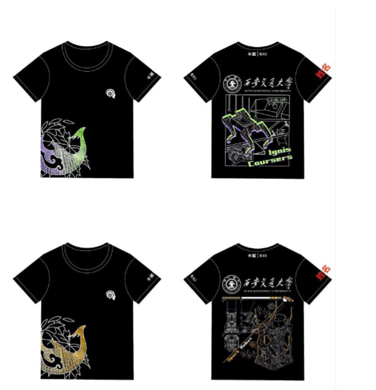

# ROBOCON 运营组指南
## 运营组简介
众所周知，机器人队俱乐部是一个面向竞赛的科技类社团，在开展备赛工作的同
时，团队的运营同样不容忽视。运营组的整体能力与水准，在很大程度上直接塑
造着团队在外的形象。
运营组分为项目管理与运营后勤，二者紧密协作、相互配合，共同为一年的备赛
工作筑牢坚实保障。
## 项目管理
- 监督检查队伍人员考勤
- 协助组长进行任务分配，辅助队长进行项目管理（即进行核实监督、反馈调整等工作）
- 每周例会内容的总结和记录，使用飞书进行管理工作

项目管理和其他队员一样需要遵从考勤制度，在队内核实队员的工作情况，考勤情况会纳入最后的贡献度
## 评定
运营后勤
- 进行队伍财务管理，统计整理发票
- 辅助社团和学校、赛务对接等工作
- 完成团队各类账号运营宣传

- 包括公众号、b站等社交媒体账号

- 周边文创及队服的设计
### 往年队服（感谢机械组ynjj的付出）

同时，运营组整体负责队员外出比赛时的后勤事务，如统一订饭、往返车票、安排住宿、

比赛期间的照片拍摄、视频录制等
##必备技能
对于项目管理的同学，若想更高效地跟进队内各项任务的进度，掌握各组的一些基础知识是不可或缺的。在培训阶段，项目管理同学会和各组同学共同参与培训，只需对各组的基础知识有所了解即可。

对于运营后勤同学，可以提前掌握诸如procreate、ps等平面设计软件的使用，以及视频剪辑等相关技术。

以下是其他学校rm的运营经验，希望对大家有所帮助：

https://bbs.robomaster.com/article/763726?source=1
