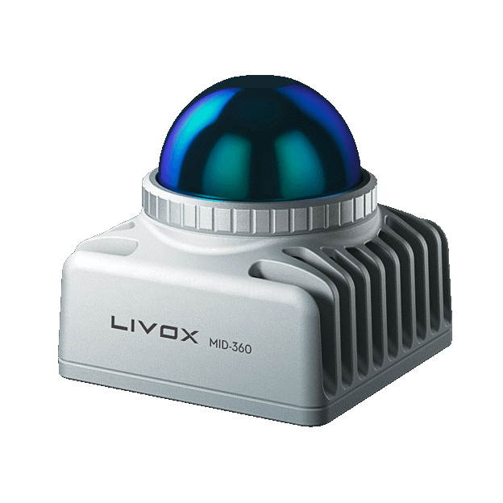
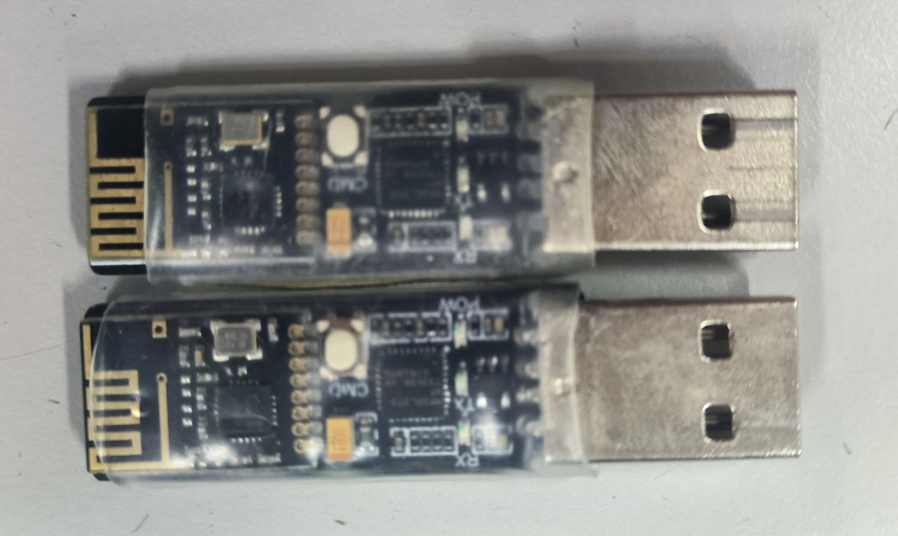
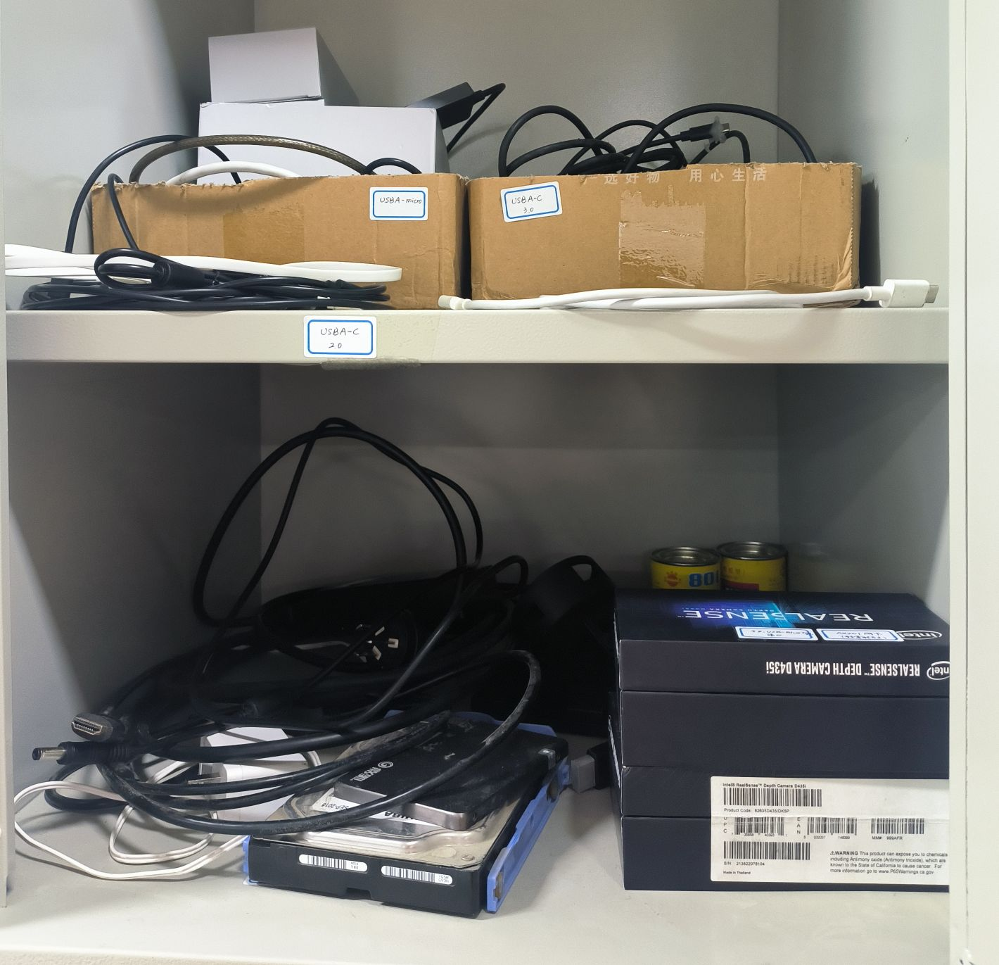

## 感知设备

### 摄像头

- 型号：Intelrealsense D435i
- 数量：6
- 简要参数：https://www.intelrealsense.com/depth-camera-d435i/
- 详细参数文件：https://www.intelrealsense.com/download/21345/?tmstv=1697035582
- SDK ：https://www.intelrealsense.com/developers/
- SDK文档：https://dev.intelrealsense.com/docs/docs-get-started
- 配件：USB3.0C-A数据线，USB3.0集线器(USB hub){Optional}

### 激光雷达

- 型号：Livox MID-360
- 数量：2
- 简要参数：https://www.livoxtech.com/cn/mid-360/specs
- 用户手册：https://www.livoxtech.com/cn/mid-360/downloads
- SDK：https://www.livoxtech.com/cn/sdk
- wiki：https://livox-wiki-cn.readthedocs.io/zh-cn/latest/
- 论坛：https://forum.livoxtech.com/
- 配件：[一分三线](https://store.dji.com/cn/product/livox-mid-360?vid=130851)，USB-网口转换器

## 通讯设备

### 串口

#### 有线串口

- 分类：USB-TTL
- 描述：USB端接电脑，另一端通过杜邦线接在板子的UART口上。
- 数量：？

#### 无线串口

- 品牌：逐飞科技
- 产品文档：?

  - 分类：USB-BlueTeeth ：USB接口 
  - 用途：用于与电脑连接，电控调试所用。
  

  - 分类：TTL-BlueTeeth ：TTL接线柱
  - 用途：常用与下位板端，与前者通信所用
- 额外注意：同一品牌的蓝牙无线串口可以互相配对，然后才能互相通讯。
- 配对方式：

### 网线

- 数量：N
- 用途：用于组建以太网连接，用于无wifi条件下的调试。

### 华为路由器

- 数量：1
- 用途：用于组建局域网连接，以供调试。
- 用法：华为路由器有一个网页可以对路由器设备进行管理，连接后访问网址http://192.168.3.1。

## 主机

### 雷神MIX

- 产品型号：雷神MIX G1362H026LD
- 规格：i7-13620H/16G/512G/RTX4060
- 供电：19.5V 11.8A 直流
- 数量：2
- 采购日期：2023年10月
- 配件：专用电源适配器，电源，(键盘，屏幕，鼠标，网线，USB Hub){Optional}
- 其他参数：？

### intel NUC

- 产品型号：Intel NUC 12 Pro Kit NUC12WSKi5
- 规格：i5-12代
- 数量：2
- 采购日期：2023年10月以前
- 状态：固定在优宝特狗与新狗上，拆卸需要机械组

- 产品型号：Intel NUC Performance MiniPC Kit
- 规格: i7-?? / iRIS Xe 显卡
- 采购日期：2023年10月以前
- 状态：目前没有使用，接上显示屏后可以看到Bios界面，但是进入启动后一直没有反应，也就是黑屏。

### Nvidia Jetson Nano

- 产品型号：Nvidia Jetson Nano
- 数量：2
- 描述：arrch64架构的计算资源，与树莓派4B差不多的计算资源，具有Nvidia JetPack支持，可以使用TensorRT加速推理。
- 状态：散装在桌上，目前积灰。

### 产品型号：Nividia Jetson Xavier NX
- 刷机教程 https://zhuanlan.zhihu.com/p/668191700
- 数量：2？
- 状态：2024.10.16出借中。更新于2025-08-08：有一个之前在四足优宝特（电机）狗上，现在卸下了。只有见到一个，另外一个不懂哪里去了。

### 树莓派4B

- 数量：4
- SD存储卡：1张32GB 可能有两张32GB的，存储卡体积小不好找。
- 描述：也是arrch64架构,树莓派4B是一个小型的单板计算机，适合用于各种嵌入式应用。可以使用Openvino加速推理。尽管树莓派的图形渲染（GPU相关）一直被诟病。

## 配件

### 便携屏

### 其他配件与耗材

- 视频数据线：HDMI-HDMI, VGA-USB
- USB线：USB2.0A-C USB3.0A-C USBA-micro USBC-C
- USB Hub：3个
- 其他电源适配器线

待补充：尺寸及CAD文件，主机的文档与参数
